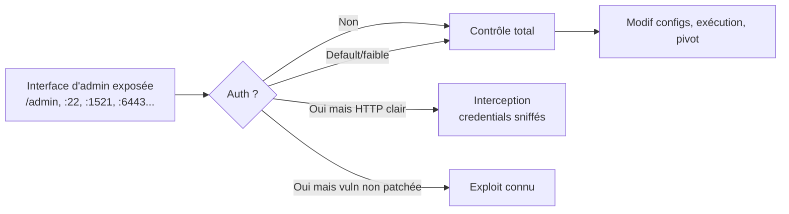

# Insecure Management Interface

> [!info] **En 1 phrase**
> Insecure Management Interface = une **interface d'administration** (web, SSH, DB, cloud) exposée et mal sécurisée — absence d'auth, credentials par défaut, HTTP en clair, accès public → prise de contrôle du système.
>
> Source principale : **[PayloadsAllTheThings (swisskyrepo)](https://github.com/swisskyrepo/PayloadsAllTheThings/blob/master/Insecure%20Management%20Interface/README.md)**

---

## Concept



> [!info] **Pourquoi ça marche**
> Ces interfaces contrôlent des réglages sensibles et ont un accès puissant aux configs. Souvent exposées sur Internet par erreur, avec auth absente/faible, **sans TLS**, ou avec des **vulns non patchées** → surface idéale pour un attaquant.

---

## Typologie des interfaces

| Type | Exemples | Ports/paths typiques |
|---|---|---|
| **Appareils réseau** | Routeurs, switches, firewalls | `:80/443`, `:23` (telnet), consoles |
| **Web apps** | Admin panels, CMS, Spring Boot Actuator | `/admin`, `/actuator`, `/console` |
| **Bases de données** | MySQL, MSSQL, Redis, MongoDB | `:3306`, `:1433`, `:6379`, `:27017` |
| **Conteneurs/Orchestration** | Docker API, Kubernetes | `:2375`, `:6443`, `:10250` |
| **Cloud/API** | AWS/GCP/Azure consoles, API endpoints | endpoints publics, rôles trop permissifs |

---

## Méthodologie

1. **Détection** : scan de ports + fuzzing de paths d'admin.
2. **Vérifier l'auth** : accessible sans identifiants ? identifiants par défaut ? brute-force ?
3. **Transport** : HTTPS ? (sinon interception des credentials).
4. **Patch level** : versions → recherche CVE (cf. [[CVE Exploits| CVE Exploits]]).

```bash
# Détection de default logins et panneaux exposés (nuclei)
nuclei -t http/default-logins -u https://example.com
nuclei -t http/exposed-panels -u https://example.com
nuclei -t http/exposures -u https://example.com

# Scan de ports
nmap -sV -p- TARGET
# Fuzzing de paths admin
ffuf -u https://target/FUZZ -w wordlist.txt
```

### Default credentials

```text
admin/admin        root/toor        admin/password
admin/123456       guest            postgres/postgres
redis (no auth)    docker (no auth)  mongodb (no auth)
```

---

## Exploits classiques

| Cible | Exploit |
|---|---|
| **Spring Boot Actuator** | Endpoints `/actuator/env`, `/heapdump`, `/jolokia` → fuite de config/secrets, voire RCE |
| **Kubernetes** | `kubelet` :10250 sans auth, Dashboard exposé, secrets cluster |
| **Docker** | API `:2375` → création de conteneur root → RCE sur l'hôte |
| **Redis** | Sans auth → webshell/cron via `CONFIG SET dir`, écriture clé SSH |
| **DB exposées** | MySQL/MSSQL accessibles depuis Internet → brute-force, dump complet |

> [!warning] **CAPEC-121**
> Les **interfaces non-production** (staging, dev, consoles de maintenance) sont souvent laissées accessibles : mêmes droits élevés, sécurité moindre → excellent point d'entrée pour un test.

---

## Détection & Défense

| Mesure | Détail |
|---|---|
| **Restreindre l'accès** | Interfaces d'admin uniquement sur VPN / IP allowlist, jamais en public |
| **Auth forte** | MFA obligatoire, interdiction des credentials par défaut, gestion de mots de passe |
| **Chiffrement** | TLS partout, jamais d'interface d'admin en HTTP clair |
| **Patch management** | Versions à jour, monitoring CVE des produits exposés |
| **Moindre privilège** | Comptes admin minimaux, rôles cloud permissifs réduits (IAM) |
| **Détection** | Scan régulier des ports/paths sensibles, alertes sur accès aux consoles |
| **Séparer prod/dev** | Interfaces non-production non accessibles depuis l'extérieur |

---

## Tips & Pièges

> [!tip] **Prioriser par criticité**
> Une interface DB ou orchestrateur exposée = **mise en danger quasi immédiate** (dump complet, RCE). Tester les interfaces sans auth d'abord, puis default creds, puis CVE.

> [!warning] **Pièges**
> - Le **403** sur `/admin` n'est pas une protection : les assets statiques/JS de l'admin restent souvent lisibles → fuite de fonctionnalités et d'endpoints.
> - **HTTP clair** : un login HTTPS après une redirection HTTP peut fuiter le token dans l'historique/référents.
> - Les **services non-web** (`:22`, `:3306`, `:6379`, `:2375`) se détectent au **scan de ports**, pas au fuzzing web — ne pas oublier cette étape.
> - Un **actuator** Spring Boot expose souvent heapdumps contenant des secrets en clair.

---

## Liens

- [[02 - Scan & Énumération| Scan]]
- [[CVE Exploits| CVE Exploits]]
- [[Password Cracking| Bruteforce]]
- [[Insecure Source Code Management| Insecure Source Code Management]]
- → [[03 - Exploitation Web| Exploitation Web]]
- Source : [PayloadsAllTheThings — Insecure Management Interface](https://github.com/swisskyrepo/PayloadsAllTheThings/blob/master/Insecure%20Management%20Interface/README.md)
