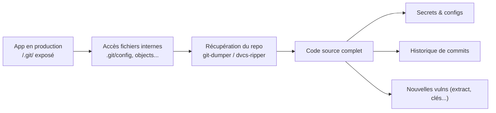

# 🗄️ Insecure Source Code Management

> [!info] **En 1 phrase**
> Insecure Source Code Management = un dossier SCM (`.git`, `.svn`, `.hg`...) laissé **exposé en production** permet de **réassembler le code source complet** de l'application et de piller secrets, configs et historique de commits.
>
> Source principale : **[PayloadsAllTheThings (swisskyrepo)](https://github.com/swisskyrepo/PayloadsAllTheThings/blob/master/Insecure%20Source%20Code%20Management/README.md)**

---

## 🎯 Concept



> [!info] 💡 **Pourquoi ça marche**
> Les outils de versioning (Git, SVN, Mercurial, Bazaar) stockent **tout le code** dans un dossier caché (`.git/`, `.svn/`, `.hg/`, `.bzr/`) qui est souvent déployé tel quel en production. Le serveur web le sert alors comme du contenu statique.

---

## 📂 Les dossiers SCM à tester

| SCM | Dossier | Dépot (repo) | Notes |
|---|---|---|---|
| Git | `/.git/` | `/.git/` | Le plus répandu, exploitation simple sans listage |
| SVN | `/.svn/` | `/.svn/` | Structure `wcdb` / fichiers base |
| Mercurial | `/.hg/` | `/.hg/` | |
| Bazaar | `/.bzr/` | `/.bzr/` | |

```text
http://target.com/.git/
http://target.com/.svn/
```

---

## 🧪 Méthodologie

1. **Recon** : détecter les dossiers SCM (manuellement, ou wordlists / crawlers).
2. **Vérifier les réponses HTTP** : un `200`/`403` (vs `404`) sur `/.git/` est un signal — un `403` peut encore laisser les **fichiers individuels lisibles** (contourner `.htaccess` / règles reverse proxy).
3. **Réassembler le repo** avec un outil dédié.

```bash
# Exemple de règle NGINX qui renvoie 403 au lieu de 404 sur /.git
# location /.git { deny all; }
```

> [!warning] ⚠️ **Pas besoin de listage**
> En Git, on n'a pas besoin de lister `/.git/` : si **chaque fichier est lisible individuellement**, l'outil reconstruit le repo complet à partir des objets et des refs.

---

## 🛠️ Outils & dumps

```bash
# git-dumper — reconstruit un repo Git exposé
git-dumper http://target.com/.git/ ./dump_git

# dvcs-ripper — multi-SCM (Git, SVN, Mercurial, Bazaar)
rip-git.pl -v -u http://target.com/.git/
rip-svn.pl -v -u http://target.com/.svn/
rip-hg.pl  -v -u http://target.com/.hg/
rip-bzr.pl -v -u http://target.com/.bzr/

# Une fois le repo local : fouiller l'historique
git log --all --oneline
git log -p --all | grep -iE "password|secret|key|token"
git reflog
git fsck --unreachable          # objets orphelins / commits effacés
```

---

## 🗄️ Impact & escalade

| Impact | Détail |
|---|---|
| **Source code leak** | Toute la logique applicative → recherche de vulns (cf. [[External Variable Modification|🌐 External Variable Modification]]) |
| **Secrets** | `config.php`, `.env`, clés API, tokens OAuth, credentials DB → cf. [[API Key Leaks|🔑 API Key Leaks]] |
| **Historique de commits** | Anciens secrets jamais vraiment supprimés, endpoints supprimés, vulns corrigées encore identifiables |
| **Compte devs / CI** | Identifiants de services, tokens CI/CD, clés SSH de déploiement |

---

## 🔍 Détection & Défense

| Mesure | Détail |
|---|---|
| **Ne pas déployer les dossiers SCM** | Exclure `.git/`, `.svn/`, `.hg/` des artefacts de build/déploiement |
| **Blocage serveur** | `location ~ /\.(git|svn|hg) { deny all; return 404; }` (404 plutôt que 403 pour ne rien révéler) |
| **Rotation des secrets** | Tout secret déjà exposé dans un commit = **compromis** → rotation systématique |
| **Historique propre** | Nettoyer les secrets de l'historique (`filter-repo`) AVANT qu'ils ne fuient |
| **Scanner** | Scan proactif de l'exposition `/.git/` (nuclei, git-dumper en audit) |
| **`.gitignore` / build** | Ne pas embarquer les dossiers de dev dans le bundle de prod |

---

## ⚠️ Tips & Pièges

> [!tip] 💡 **Wordlists**
> Utiliser des wordlists de **chemins cachés** pour découvrir `/.git/` : ffuf/feroxbuster avec wordlist dédiée, ou des templates nuclei (`http/exposed-git`).

> [!warning] ⚠️ **Pièges**
> - Un `403` sur `/.git/` **ne protège pas** : les fichiers individuels restent souvent accessibles (exclusion récursive incomplète) → toujours essayer git-dumper.
> - **Google / GitHub search** peut révéler des dossiers SCM indexés : `inurl:/.git/`, recherche de `index.php` dans le code exposé.
> - Le **`.git/config`** seul peut déjà fuiter : URL du remote, tokens embarqués dans l'URL, identité des devs.
> - L'exposition peut être **partielle** (un seul fichier) : chaque objet Git est exploitable indépendamment.

---

## 🔗 Liens

- [[API Key Leaks|🔑 API Key Leaks]]
- [[Insecure Management Interface|🛠️ Insecure Management Interface]]
- [[02 - Scan & Énumération|🔎 Scan]]
- → [[03 - Exploitation Web|🌍 Exploitation Web]]
- 📚 Source : [PayloadsAllTheThings — Insecure Source Code Management](https://github.com/swisskyrepo/PayloadsAllTheThings/blob/master/Insecure%20Source%20Code%20Management/README.md)
