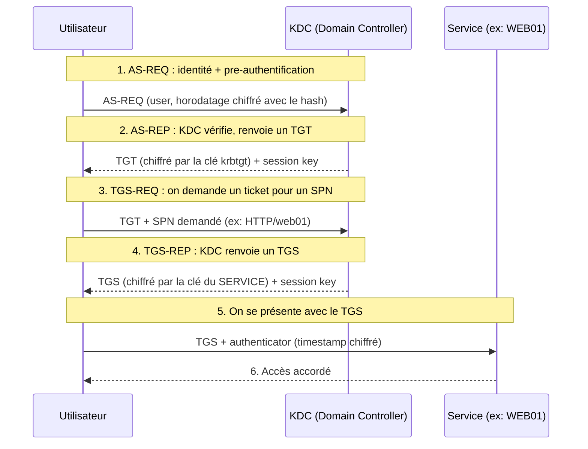

# Kerberos — Le protocole

> [!info] **En 1 phrase**
> Kerberos est le protocole d'authentification d'Active Directory : l'utilisateur obtient des **tickets**
> (TGT puis TGS) pour prouver son identité auprès des services, **sans jamais envoyer son mot de passe**.

---

## Concept

---

## Comment ça marche

| Étape       | Ce qui se passe                                                                  | Chiffré par             |
| ----------- | -------------------------------------------------------------------------------- | ----------------------- |
| **AS-REQ**  | L'utilisateur envoie son nom + un **pre-auth** (timestamp chiffré avec son hash) | Clé de l'utilisateur    |
| **AS-REP**  | Le KDC renvoie un **TGT** (Ticket Granting Ticket)                               | Clé de **krbtgt**       |
| **TGS-REQ** | On présente le TGT + le **SPN** du service voulu                                 | Clé de krbtgt (session) |
| **TGS-REP** | Le KDC renvoie un **TGS** pour ce service précis                                 | Clé du **service**      |
| **Service** | Le service vérifie le TGS et accorde l'accès                                     | —                       |

> [!danger] **Les 2 clés à retenir**
> - **krbtgt** : la clé du compte krbtgt chiffre les **TGT**. La voler = **Golden Ticket**.
> - **Service (SPN)** : la clé du compte de service chiffre les **TGS**. La voler = **Silver Ticket** / Kerberoast.
> Le protocole lui-même est robuste : **ce sont les clés/hashes mal protégés qu'on attaque**.

---

## Détection & Défense

- Activer le **logging avancé** Kerberos (événement 4769 : "Kerberos Service Ticket requested")
- Surveiller les demandes de tickets **anormales** (beaucoup de TGS différents en peu de temps = Kerberoast)
- Changer le mot de passe **krbtgt** 2 fois si compromis
- Restreindre les SPN sur des comptes **utilisateurs** (préférer des comptes "gMSA")

---

## Liens

- [[Pass-the-Ticket et Overpass-the-Hash| Pass-the-Ticket / Overpass]]
- [[Golden Ticket| Golden Ticket]]
- [[Silver Ticket| Silver Ticket]]
- [[Kerberoasting| Kerberoasting]]
- [[AS-REP Roasting| AS-REP Roasting]]
- → Note complète : [[05 - Active Directory| Active Directory]]
