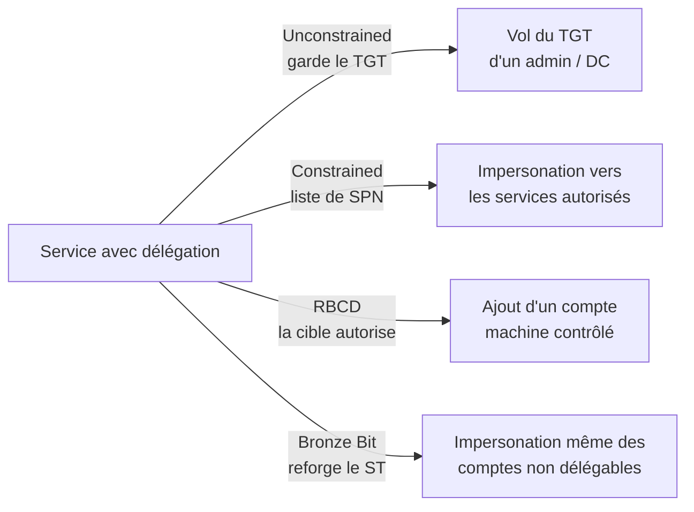

# Kerberos Delegation

> [!info] **En 1 phrase**
> La délégation Kerberos permet à un service d'**agir au nom d'un utilisateur** ;
> mal configurée, elle permet de s'impersonner **n'importe qui** (souvent un admin) vers un service.

> [!warning] **4 variantes, 4 façons d'abuser**
> - **Unconstrained** : le service **garde le TGT** de l'utilisateur → vol du TGT d'un admin/DC (coerce).
> - **Constrained** : impersonation vers une **liste de SPN** (S4U2Self/S4U2Proxy).
> - **RBCD** : la **cible** autorise un compte → ajout d'un compte machine contrôlé.
> - **Bronze Bit** : reforge d'un ST non-forwardable → bypass des comptes protégés.

---

## Index des fiches

| Attaque | Principe | Exploit clé | Prérequis | Fiche |
|---|---|---|---|---|
| **Unconstrained** | Le service copie le TGT en mémoire | `Rubeus monitor` + coerce → vol TGT → DCSync | SYSTEM sur la machine | [[Kerberos - Unconstrained Delegation\| Unconstrained]] |
| **Constrained** | Impersonation vers une liste de SPN | `getST.py -impersonate Administrator` | Hash/mot de passe du service | [[Kerberos - Constrained Delegation\| Constrained]] |
| **RBCD** | La cible autorise un compte machine | `addcomputer` + `rbcd` → ST admin | GenericWrite sur la cible | [[Kerberos - RBCD (Resource-Based Constrained Delegation)\| RBCD]] |
| **Bronze Bit** | Reforge d'un ST non-forwardable | `getST.py -force-forwardable` | CVE-2020-17049 non patchée | [[Kerberos - Bronze Bit\| Bronze Bit]] |

> [!info] **Pourquoi c'est dangereux**
> La délégation est conçue pour des scénarios légitimes (un service web qui parle à une API au nom
> de l'utilisateur). Mais **le service détient la clé pour se faire passer pour les autres** → si le
> service est compromis (ou mal configuré), c'est un compte à fort impact.

---

> [!info] **Sources**
> - [InternalAllTheThings — Kerberos Delegation (Unconstrained/Constrained/RBCD/Bronze Bit)](https://github.com/swisskyrepo/InternalAllTheThings/tree/main/docs/active-directory)
> - [Wagging the Dog: Abusing RBCD — Elad Shamir](https://shenaniganslabs.io/2019/01/28/Wagging-the-Dog.html)

**Liens :** [[Kerberos - Unconstrained Delegation| Unconstrained]] · [[Kerberos - Constrained Delegation| Constrained]] · [[Kerberos - RBCD (Resource-Based Constrained Delegation)| RBCD]] · [[Kerberos - Bronze Bit| Bronze Bit]] · [[Coerce - PrinterBug et PetitPotam| Coerce]] · [[Kerberos - Le protocole| Kerberos]]
