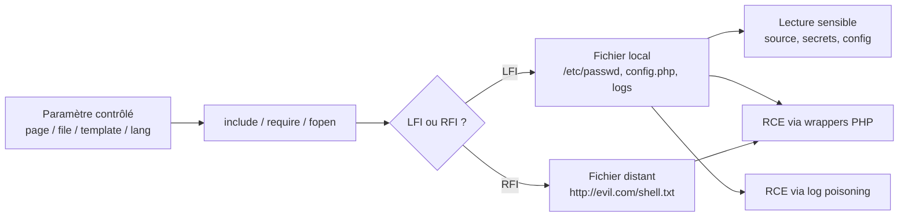

# 📂 LFI / RFI & Path Traversal — Hub & Index

> [!info] **En 1 phrase**
> LFI (Local File Inclusion) = amener le serveur à **inclure un fichier local** (`include()`),
> RFI = inclure un fichier **externe** qu'on contrôle, Path Traversal = **lire** un fichier hors
> de la racine web. LFI peut déboucher sur **RCE** via les wrappers PHP ou le **log poisoning** ;
> RFI est quasi toujours un RCE direct.

---

## 🎯 Concept



> [!info] 💡 **La différence clé**
> - **Path Traversal** = **lecture brute** d'un fichier (`../../../etc/passwd`).
> - **File Inclusion** = **include()** → le fichier est **interprété** → potentiel de **RCE**.
> - Un point d'inclusion = un plus gros potentiel qu'un simple traversal.

---

## 🗂️ Les fiches dédiées

| Fiche | Principe | Impact |
|---|---|---|
| [[Path Traversal\|🛣️ Path Traversal]] | Remonter hors docroot (`../`) pour **lire** un fichier | Lecture de sources, secrets, configs |
| [[LFI - Local File Inclusion\|📂 LFI]] | `include()` d'un fichier **local** | Lecture + **RCE** (wrappers PHP, log poisoning) |
| [[RFI - Remote File Inclusion\|🌐 RFI]] | `include()` d'un fichier **distant** contrôlé | RCE quasi direct (si `allow_url_include = On`) |

---

## ⚔️ LFI vs RFI

| Critère | LFI | RFI |
|---|---|---|
| Fichier inclus | **Local** (disque du serveur) | **Distant** (URL qu'on contrôle) |
| Condition PHP | `allow_url_include` **pas nécessaire** | `allow_url_include = On` (Off par défaut depuis PHP 5) |
| Impact immédiat | Lecture / source / RCE conditionnel | RCE quasi direct |
| Difficulté | Moyenne (connaître les chemins, wrappers) | Faible si activé, souvent bloqué par la config |
| Fréquence | Très fréquent | Rare (désactivé par défaut) |

```php
<?php
$file = $_GET['page'];
include($file);   // vulnérable : LFI / RFI
?>
```

> [!warning] ⚠️ **LFI ≠ Path Traversal**
> Le Path Traversal exploite un mécanisme de **lecture** de fichier. La File Inclusion exécute un
> **include()** : c'est ce qui permet d'atteindre la **RCE** (le fichier inclus est interprété
> comme du PHP).

---

## 🔍 Détection & Défense

| Réponse | Détail |
|---|---|
| **Supprimer les paramètres de fichiers** | Ne jamais exposer `page=`, `file=`, `template=` depuis l'input ; utiliser des **ID** (index/entier) mappés côté serveur |
| **Allow-list** | N'accepter que des noms de fichiers **connus**, jamais de chemin utilisateur |
| **Canonicalisation** | `realpath()` + vérifier que le résultat **commence par** le dossier autorisé ; rejeter `..` |
| **Désactiver les wrappers** | `allow_url_include = Off` (défaut) ; restreindre via `open_basedir` |
| **Moindre privilège** | L'utilisateur web ne doit **pas** pouvoir lire `/etc/shadow`, les logs, `.env` |
| **Surveillance** | Logs des patterns `../`, `php://`, `data://`, `etc/passwd` dans les requêtes |

---

## 🧪 Labs

- PortSwigger — File path traversal : https://portswigger.net/web-security/all-labs#file-path-traversal
- PortSwigger — File inclusion : https://portswigger.net/web-security/all-labs#file-inclusion
- Root-Me — LFI / LFI Double encoding / RFI / PHP Filters : https://www.root-me.org/

---

> [!info] 📚 **Sources**
> - [PayloadsAllTheThings — File Inclusion](https://github.com/swisskyrepo/PayloadsAllTheThings/tree/master/File%20Inclusion)
> - [PayloadsAllTheThings — Directory & Path Traversal](https://github.com/swisskyrepo/PayloadsAllTheThings/blob/master/Directory%20and%20Path%20Traversal/README.md)

➡️ **Liens :** [[Path Traversal|🛣️ Path Traversal]] · [[LFI - Local File Inclusion|📂 LFI]] · [[RFI - Remote File Inclusion|🌐 RFI]] · [[Injection SQL|💾 SQLi]] · [[SSRF|🌐 SSRF]] · [[Injection de commandes|🐚 Injection de commandes]] · [[03 - Exploitation Web|🌍 Exploitation Web]] · [[Bibliothèque technique|🏠 Index]]
