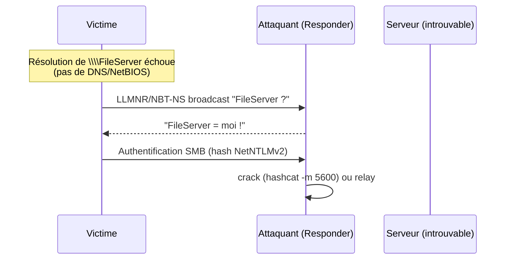

# LLMNR / NBT-NS Poisoning

> [!info] **En 1 phrase**
> On répond à la place de la "vraie" machine pour des requêtes de résolution LLMNR/NBT-NS,
> et les machines nous envoient leurs **hashes NetNTLMv2** (qu'on cracke ou relay).

---

## Concept



> [!info] **Pourquoi ça marche**
> LLMNR (mDNS) et NBT-NS sont des protocoles de résolution **non authentifiés** (broadcast).
> Une machine qui ne trouve pas un nom par DNS **demande au réseau** → on peut **répondre en premier**.

---

## Comment ça marche

1. **Écouter** les requêtes LLMNR/NBT-NS/mDNS sur le réseau local (Responder).
2. Quand une machine demande un nom non résolu, **répondre** en se présentant comme ce nom.
3. La machine s'authentifie auprès de nous (SMB) → envoie son **hash NetNTLMv2**.
4. **Cracker** le hash ou **relayer** l'authentification vers une autre machine.

---

## Exploitation

```bash
# 1. Lancer Responder (sur le réseau local de la victime)
sudo responder -I eth0 -wrf

# 2. Fichier de sortie : logs + hashes NetNTLMv2
cat /usr/share/responder/logs/*.txt

# 3. Cracker
hashcat -m 5600 netntlmv2.txt rockyou.txt

# 3bis. OU relayer (voir NTLM Relay) - désactiver SMB dans Responder.conf
```

> [!warning] **Méthode classique pour déclencher une résolution**
> Un partage inexistant (ex : `\\DC01\missing`), un ping vers un nom, une app qui cherche un serveur de fichiers → la victime fait une requête de résolution.

---

## Détection & Défense

| Réponse | Détail |
|---|---|
| **Désactiver LLMNR/NBT-NS** | GPO : NbtOptions=2, Disable LLMNR → coupe le vecteur |
| **SMB Signing** | Obligatoire partout → bloque le relay (mais pas le cracking) |
| **Network Access** | Restreindre les machines qui peuvent s'authentifier entre elles |
| **Surveillance** | Beaucoup de réponses multicast vers une seule machine = suspicion |

---

## Tips & Pièges

> [!tip] **Le pairing Responder + Relay**
> Pour relayer : mets `SMB = Off` et `HTTP = Off` dans `/etc/responder/Responder.conf` sinon Responder "mange" le hash avant le relay.

> [!warning] **Piège** : dans les réseaux modernes (LLMNR désactivé), cette attaque échoue. C'est pourquoi l'énumération du **réseau** reste essentielle avant de tenter.

---

## Liens

- [[NTLM Relay| NTLM Relay]]
- [[Password Cracking| Password Cracking]]
- [[Pass-the-Hash| Pass-the-Hash]]
- → Note complète : [[05 - Active Directory| Active Directory]] / [[07 - Wireless, MITM & Social Engineering| Wireless/MITM]]
