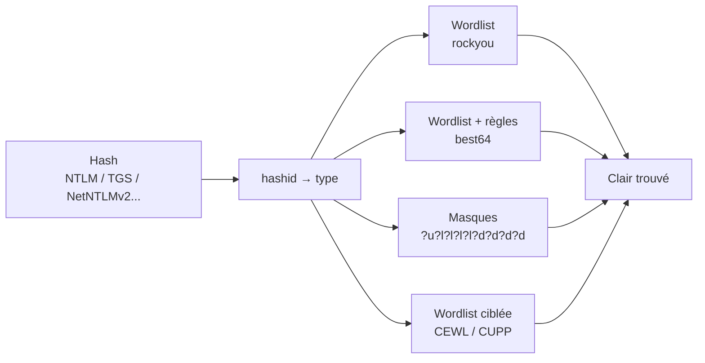

# Password Cracking

> [!info] **En 1 phrase**
> Retrouver le **mot de passe en clair** à partir d'un hash (offline) en testant des candidats —
> la performance est au GPU, l'intelligence dans les **règles** et les **masques**.

---

## Concept



> [!info] **Les vitesses (idées)**
> MD5/NTLM : des milliards de tests/s sur GPU. bcrypt/Argon2 : des milliers. Le **type de hash**
> décide la stratégie (dictionnaire d'abord, jamais de brute-force pur sur les lents).

---

## Exploitation

```bash
# Identifier
hashid '5f4dcc3b5aa765d61d8327deb882cf99'

# Modes courants : MD5=0, NTLM=1000, NetNTLMv2=5600, Kerberoast=13100, AS-REP=18200, WPA=22000
hashcat -m 1000 -a 0 hash.txt rockyou.txt
hashcat -m 1000 -a 0 hash.txt rockyou.txt -r /usr/share/hashcat/rules/best64.rule
hashcat -m 1000 -a 3 hash.txt '?u?l?l?l?l?l?d?d?d?d'
hashcat -m 1000 -a 6 wordlist.txt '?d?d?d'      # hybrid : word + 3 chiffres

# John (CPU, formats)
john --format=nt --wordlist=rockyou.txt hash.txt
john --show hash.txt

# Wordlist ciblée sur la victime
cewl http://192.168.1.10 -w mots_site.txt
cupp -i
```

---

## Détection & Défense

| Réponse | Détail |
|---|---|
| **Hash salts + lents** | bcrypt/Argon2 (rend le cracking coûteux) |
| **Politique de mdp** | Longueur + rotation + interdire les patterns connus |
| **MFA** | Neutralise même un mdp cracké |
| **Surveillance** | Volumes de CPU/GPU suspects, Potfile leaks |

---

## Tips & Pièges

> [!tip] **Ne pas toujours cracker**
> Un hash **NTLM/NetNTLMv2** se **rejoue** directement (PtH). Le crack ne sert que si on a besoin
> du clair (SSH, autres protocoles).

> [!warning] **Piège** : WPA/Argon2/bcrypt sont lents → ne lance pas `-a 3` complet dessus. Vise une **wordlist ciblée** + règles.

---

## Liens

- [[Kerberoasting| Kerberoasting]] (source de hashes TGS)
- [[AS-REP Roasting| AS-REP Roasting]]
- [[LLMNR-NBT-NS Poisoning| LLMNR Poisoning]] (source de NetNTLMv2)
- [[Pass-the-Hash| Pass-the-Hash]]
- → Note complète : [[08 - Password Cracking| Password Cracking]]
