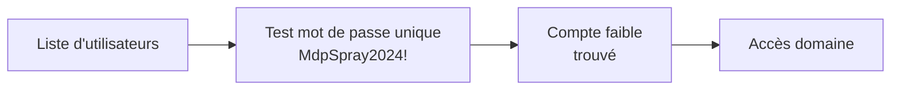

# 🌧️ Password Spraying

> [!info] **En 1 phrase**
> Password Spraying = tester **1 mot de passe** contre **beaucoup de comptes** (au lieu de beaucoup
> de mots de passe contre 1 compte) — l'art de **ne pas déclencher le lockout**.

---

## 🎯 Concept



> [!info] 💡 **Pourquoi le "spray" et pas le brute-force**
> AD verrouille un compte après ~5 échecs. Brute-forcer UN compte = lockout (bruyant, détecté).
> Tester un mdp commun sur TOUS les comptes = 1 essai par compte = rarement lockout.

---

## ⚙️ Comment ça marche

1. **Récupérer une liste d'utilisateurs** : RID brute, LDAP, BloodHound, emails OSINT.
2. **Choisir un mot de passe** réaliste pour la politique (ex : `Automne2026!`).
3. **Tester** ce mot de passe sur chaque compte, **espacé** (ex : 1 fois par heure).
4. Recommencer avec un autre mot de passe (2-3 max par engagement !).

---

## 🛠️ Exploitation

```bash
# NetExec - spray sur une liste d'utilisateurs
nxc smb 192.168.1.10 -u users.txt -p 'Automne2026!' --continue-on-success

# Sur plusieurs machines / protocoles
nxc winrm 192.168.1.0/24 -u users.txt -p 'Automne2026!' --continue-on-success

# Avec Kerberos (ne déclenche pas le lockout en théorie, mais pareil niveau logs)
kerbrute passwordspray -d corp.local users.txt 'Automne2026!'
```

---

## 🔍 Détection & Défense

| Réponse | Détail |
|---|---|
| **Verrouillage intelligent** | Smart Lockout (verrouille l'IP/proxy au lieu du compte) |
| **MFA partout** | Neutralise le spray même avec le bon mdp |
| **Surveillance** | 4625 (échec) avec même nom d'utilisateur variable et même mot de passe = pattern |
| **Honeypot** | Comptes "canary" dans la liste des users |

---

## ⚠️ Tips & Pièges

> [!tip] 💡 **La temporalité**
> Espace de 15-30 min entre chaque mot de passe. 2-3 mots de passe max : au-delà, tu ressembles à un brute-forceur.

> [!warning] ⚠️ **Piège** : si tu trouves un compte, **arrête le spray** sur les autres (plus le droit) et connecte-toi directement.

---

## 🔗 Liens

- [[Kerberos - Le protocole|👑 Kerberos]]
- [[LLMNR-NBT-NS Poisoning|🎙️ LLMNR/NBT-NS Poisoning]]
- [[Pass-the-Hash|🔑 Pass-the-Hash]]
- → Note complète : [[05 - Active Directory|👑 Active Directory]]
