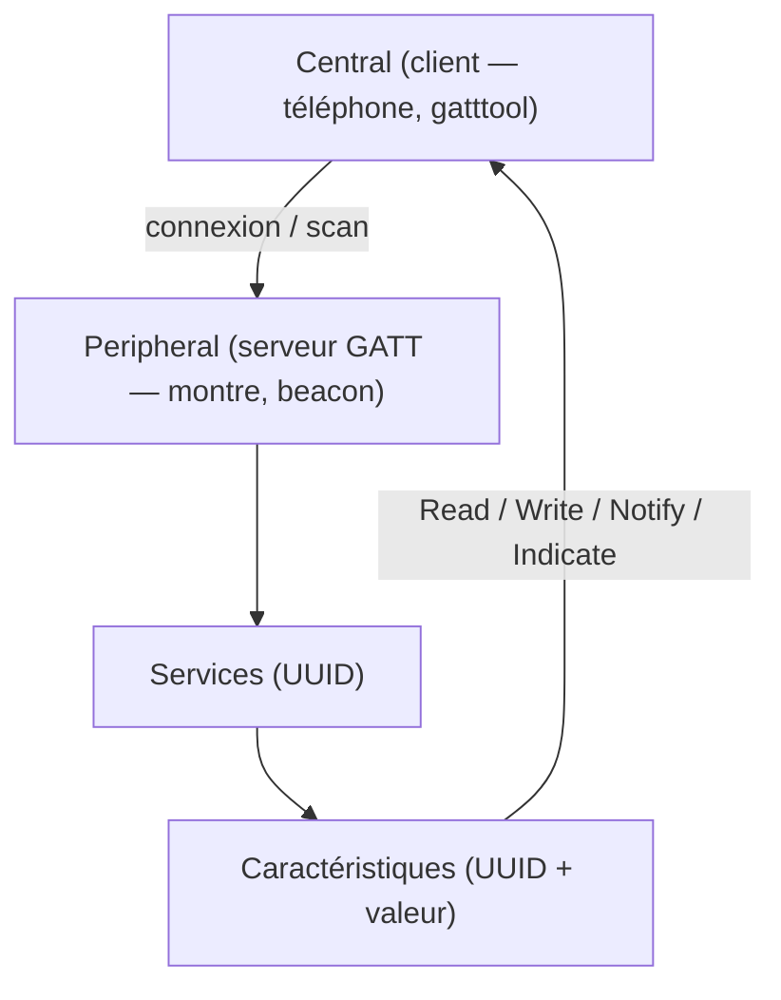

# 🎧 Protocole Bluetooth (BLE)

> [!info] **En 1 phrase**
> Le **Bluetooth Low Energy (BLE)** parle via le modèle **GATT** (services → caractéristiques) :
> un attaquant peut **énumérer**, **lire**, **écrire** et **sniffer** ces caractéristiques —
> souvent sans authentification — pour exfiltrer des données ou prendre le contrôle d'un objet.

---

## 🔧 Le protocole en bref



- **GATT** (Generic Attribute Profile) définit l'échange de données client/serveur.
- **Services** = ensemble de fonctionnalités ; **Caractéristiques** = attributs contenant une valeur logique.
- UUID standards (`00001801-…`) vs **UUID customs** (`4b796c6f-…`) : les customs cachent souvent les données sensibles (flags de CTF, commandes).

---

## 🛠️ Outils

- [bettercap](https://github.com/bettercap/bettercap)
- [bluez/gatttool](https://manpages.debian.org/unstable/bluez/gatttool.1.en.html)
- [expliot_framework/expliot](https://expliot.readthedocs.io/en/latest/index.html)
- [hackgnar/bleah](https://github.com/hackgnar/bleah)
- [praetorian-inc/caeruleus](https://github.com/praetorian-inc/caeruleus)
- [securing/gattacker](https://github.com/securing/gattacker)
- [whad-team/whad-client](https://github.com/whad-team/whad-client)

---

## ⚙️ Configuration Bluetooth (Kali)

```powershell
sudo apt-get install bluetooth blueman bluez
sudo systemctl start bluetooth
sudo hciconfig hci0 up
```

Énumérer les devices :

```powershell
sudo hcitool lescan
00:1A:7D:DA:71:06 Ph0wn Beacon
25:55:84:20:73:70 (unknown)
```

> [!CAUTION]
> `apt` ne fournit pas une version récente de bluez — recompile-le :

```powershell
wget https://www.kernel.org/pub/linux/bluetooth/bluez-5.18.tar.xz
dpkg --get-selections | grep -v deinstall | grep bluez
tar xvf bluez-5.18.tar.xz
sudo apt-get install libglib2.0-dev libdbus-1-dev libusb-dev libudev-dev libical-dev systemd libreadline-dev
.configure --enable-library
make -j8 && sudo make install
sudo cp attrib/gatttool /usr/local/bin/
```

---

## 📋 Cheatsheet BLE (méthodes classiques vs Caeruleus)

| Cas d'usage | Méthode classique | Avec Caeruleus |
|---|---|---|
| Découvrir les devices proches | `hcitool lescan` · `bettercap ble.recon` · `bluetoothctl scan on` | `caeruleus scan` |
| Lister (et lire) services/caractéristiques | `bettercap ble.enum <mac>` | `caeruleus enumerate -b <mac> --values` |
| Session interactive | `gatttool -I` · `bluetoothctl` (menu GATT) | `caeruleus shell -b <mac>` |
| Lire un handle | `gatttool --char-read-hnd 0x0013` | `caeruleus read -b <mac> -a 0x0013` |
| Écrire un handle | `gatttool -b de:ad:be:ef:be:f1 --char-write-req -a 0x002c -n $(echo -n "some value" | xxd -ps)` | `caeruleus write -b de:ad:be:ef:be:f1 -a 0x002c --req -s "some value"` |
| Capturer les notifications | Logger de notifications Bleak custom | `caeruleus listen -b <mac> -a <handle>` |
| Données exposées sans auth | Scripts d'audit Bleak custom | `caeruleus recon` / `caeruleus assess ...` |
| Fuzzer une caractéristique | Write fuzzers custom / boofuzz | `caeruleus fuzz write -b <mac> -a <handle>` |
| Params de connexion, MTU | `hcitool con` · `btmgmt con-info` | `caeruleus conn-params -b <mac>` |
| Puissance / reset adaptateur | `btmgmt power` · `hciconfig reset` · `rfkill` | `caeruleus doctor` · `caeruleus adapter power cycle` |

---

## 🔎 Énumérer services et caractéristiques

Avec bettercap :

```powershell
sudo bettercap -eval "net.recon off; events.stream off; ble.recon on"
ble.show
ble.enum 04:52:de:ad:be:ef
```

Avec expliot :

```powershell
run ble.generic.scan -a <mac address> -s
run ble.generic.scan -a <mac address> -c
```

Avec bleah :

```powershell
sudo bleah -b $MAC -e
```

Avec gatttool (shell interactif : `sudo gatttool -b $MAC -I`) :

```powershell
MAC=30:AE:A4:2A:54:8A

$ gatttool -b $MAC --primary
attr handle = 0x0001, end grp handle = 0x0005 uuid: 00001801-0000-1000-8000-00805f9b34fb
attr handle = 0x0014, end grp handle = 0x001c uuid: 00001800-0000-1000-8000-00805f9b34fb
attr handle = 0x0028, end grp handle = 0xffff uuid: 000000ff-0000-1000-8000-00805f9b34fb

$ gatttool -b $MAC --characteristics
handle = 0x0002, char properties = 0x20, char value handle = 0x0003, uuid = 00002a05-0000-1000-8000-00805f9b34fb
handle = 0x0015, char properties = 0x02, char value handle = 0x0016, uuid = 00002a00-0000-1000-8000-00805f9b34fb
```

> Les UUID commençant par `00001801` / `00001800` sont des **valeurs standard** de la norme ;
> l'autre (`000000ff-…`) est un **service custom** — c'est souvent là que se cache le flag / le contrôle.

---

## 📖 Lire des données

```powershell
sudo gatttool -b $MAC -I
[00:1A:7D:DA:71:06][LE]> connect
```

Lister puis lire les caractéristiques :

```powershell
[00:1A:7D:DA:71:06][LE]> characteristics
handle: 0x000b, char properties: 0x0a, char value handle: 0x000c, uuid: 4b796c6f-5265-6e49-7342-61644a656469

[00:1A:7D:DA:71:06][LE]> char-read-hnd 0x000c
Characteristic value/descriptor: 44 65 63 72 79 70 74 20 74 68 65 20 6d 65 73 73 61 67 65 2c 20 77 72 69 74 65 20 74 68 65 20 64 65 63 72 79 70 74 65 64 20 76 61 6c 75 65 20 61 6e 64 20 72 65 61 64 20 62 61 63 6b 20 74 68 65 20 72 65 73 70 6f 6e 73 65 20 74 6f 20 66 6c 61 67 2e 20 45 6e 63 72 79 70 74 65 64 20 6d 65 73 73 61 67 65 3a 20 63 34 64 33 32 38 36 35 37 61 39 64 62 33 64 66 65 39 31 64 33 36 36 36 62 39 34 31 62 33 36 31
```

One-liner pour lire et décoder en ASCII :

```powershell
gatttool -b $MAC --char-read -a 0x002a|awk -F':' '{print $2}'|tr -d ' '|xxd -r -p;printf '\n'
```

---

## 🔔 Lire notifications / indications

```powershell
gatttool -b $MAC -a 0x0040 --char-write-req --value=0100 --listen
gatttool -b $MAC -a 0x0044 --char-write-req --value=0200 --listen
```

> Écrire `0x0100` sur le **Client Characteristic Configuration Descriptor (CCCD)** active les notifications (0x01) ou indications (0x02) de la caractéristique.

---

## ✍️ Écrire des données

Avec bettercap :

```powershell
ble.recon on
ble.write 04:52:de:ad:be:ef 234bfbd5e3b34536a3fe723620d4b78d ffffffffffffffff
```

Avec gatttool :

```powershell
$ gatttool -b $MAC --char-write-req -a 0x002c -n $(echo -n "12345678901234567890"|xxd -ps)

$ gatttool -b $MAC -a 0x0050 --char-write-req --value=$(echo -n 'hello' | xxd -p)

# dans le shell gatttool
[00:1A:7D:DA:71:06][LE]> char-write-req 0x000c 476f6f64205061646177616e21212121
[00:1A:7D:DA:71:06][LE]> char-read-hnd 0x000c
Characteristic value/descriptor: 43 6f 6e [...] 2e
```

> `char-write` = Write Command (pas de réponse attendue) ; `char-write-req` = Write Request (le serveur répond).

---

## 🏷️ Changer le MAC Bluetooth

```powershell
bdaddr -r 11:22:33:44:55:66
gatttool -I -b E8:77:6D:8B:09:96 -t random
```

> Utile pour se faire passer pour un device connu ou échapper à un filtre MAC.

---

## 📡 Sniffer une communication BLE

### Avec Ubertooth (il en faut **3**)

```powershell
ubertooth-btle -U 0 -A 37 -f  -c bulb_37.pcap
ubertooth-btle -U 1 -A 38 -f  -c bulb_38.pcap
ubertooth-btle -U 2 -A 39 -f  -c bulb_39.pcap
```

> Le BLE saute sur 3 canaux publicitaires (37, 38, 39) : **1 ubertooth par canal** pour ne rien rater.

### Avec un BBC Micro:Bit

- [WEAPONIZING THE BBC MICRO:BIT — Damien Cauquil / Virtualabs — DEF CON 25](https://media.defcon.org/DEF%20CON%2025/DEF%20CON%2025%20presentations/DEF%20CON%2025%20-%20Damien-Cauquil-Weaponizing-the-BBC-MicroBit.pdf)

### Avec le HCI log d'Android

> Active le **log HCI Bluetooth** dans les Options développeur : un hook capture tous les paquets HCI dans un fichier (souvent `/sdcard/btsnoop_hci.log` ou `/sdcard/oem_log/btsnoop/`).

```powershell
adb devices
adb pull /sdcard/oem_log/btsnoop/<your log file>.log
adb pull /sdcard/btsnoop_hci.log
adb bugreport filename
```

---

## 🏴 CTF d'entraînement

- [BLE HackMe](https://www.microsoft.com/store/apps/9N7PNVS9J1B7) — fonctionne avec nRF Connect (Android)
- [hackgnar/ble_ctf](https://github.com/hackgnar/ble_ctf) — Capture The Flag Bluetooth Low Energy

---

## 🔍 Détection & Défense

| Réponse | Détail |
|---|---|
| **Authentification / pairing** | Vérifier qu'aucune caractéristique sensible n'est lisible en clair sans bonding |
| **Chiffrement (LE Secure Connections)** | Force le chiffrement des échanges sensibles |
| **Restreindre les writes** | Une caractéristique commande doit exiger une auth et des permissions |
| **Désactiver les notifications** | Ne pas exposer le CCCD en écriture libre (exfiltration active) |
| **Détection de scans massifs** | Les périphériques peuvent logger les connexions/scan suspects (Flipper, ubertooth) |

## ⚠️ Tips & Pièges

- **Les UUID customs** (`000000ff-…`, `4b796c6f-…`) sont tes meilleurs amis : c'est là que sont les commandes/flags, pas dans les UUID standard.
- `char-read-hnd` retourne de l'**hex** : décodé en ASCII, c'est souvent le message en clair.
- Pour **écrire en hex** : `$(echo -n "text" | xxd -ps)` fait le travail.
- Active toujours **notifications ET indications** si l'une échoue (certaines caractéristiques n'émettent qu'en indication).
- BLE saute de canal : **3 Ubertooth** ou un sniffer couvrant les 3 canaux publicitaires, sinon le trafic est fragmenté.
- Pense à `-t random` avec gatttool : beaucoup de devices utilisent des adresses **LE random**, pas publiques.
- Le **MTU** et les paramètres de connexion (`hcitool con`, `btmgmt con-info`) peuvent révéler des comportements de device faibles.

---

> [!info] 📚 **Sources**
> - [HardwareAllTheThings — Bluetooth](https://github.com/swisskyrepo/HardwareAllTheThings/blob/main/docs/protocols/bluetooth.md)
> - [Caeruleus — BLE Security Testing (Praetorian)](https://www.praetorian.com/blog/ble-testing-caeruleus/)
> - [WHAD — documentation](https://whad.readthedocs.io/en/stable/)

➡️ Liens : [[13 - Hardware & IoT|⚙️ Hardware & IoT]] · [[Hardware - UART|🔌 UART]] · [[Attaques WiFi (WPA2 et PMKID)|📡 WiFi]] · [[Hardware - RFID et NFC|🏷️ RFID/NFC]]
