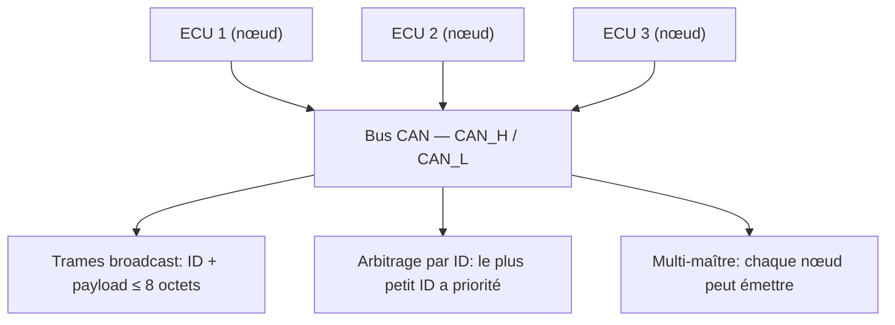
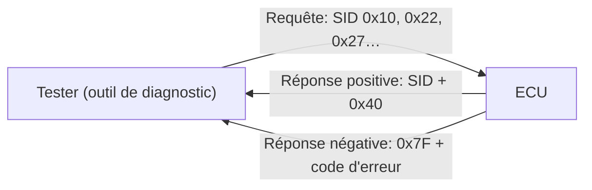

# 🚗 CAN Bus (Controller Area Network)

> [!info] **En 1 phrase**
> Le **bus CAN** est le protocole série **multi-maître** et orienté **message** des systèmes
> embarqués (automobile, industrie) : les calculateurs (**ECU**) échangent en temps réel
> sur **2 fils**, sans contrôleur central, via des trames **broadcast** identifiées par un **ID**.

---

## 🔧 Le protocole en bref

Le CAN (Controller Area Network) est un protocole de communication série **haute intégrité**,
conçu pour l'échange de données en temps réel dans les systèmes embarqués. Tous les nœuds
communiquent sur le **même réseau**, ce qui simplifie le câblage mais expose aussi tout le trafic.



> [!info] 💡 **À retenir pour l'offensif**
> - **Pas d'authentification** : n'importe quel nœud peut envoyer des trames valides → **injection de trames**.
> - La trame n'est pas adressée : tout le monde lit tout → **sniffing trivial**.
> - Un seul **ID** de contrôleur absorbé peut faire tomber le réseau → **DoS**.

---

## 🛠️ Interagir avec le bus (Python)

```bash
pip install python-can
pip install python-can-utils
```

```python
import can

bus = can.Bus()
while True:
    msg = can.Message(3, data=[0 for _ in range(8)])
    bus.send(msg)
```

> Visualisation temps réel : [Tbruno25/can-explorer](https://github.com/Tbruno25/can-explorer)

---

## 💻 SocketCAN (Linux)

Le noyau Linux expose le CAN comme une interface réseau (`can0`) — les outils réseaux
classiques fonctionnent alors dessus.

```bash
sudo modprobe can
sudo ip link set can0 up type can bitrate 500000
candump can0                                  # écouter tout le trafic
candump can0 -L > capture.log                  # enregistrer les trames
cansend can0 123#DEADBEEF                      # envoyer une trame ID=0x123, payload DEADBEEF
```

---

## 📊 Wireshark

Wireshark dissèque nativement les trames CAN (`can`, `canfd`, `sockcan`) :

- Importer une capture via SocketCAN / `candump` et filtre `can`.
- Filtre sur un ID : `can.id == 0x123`.
- Pratique pour **rejouer** des séquences après une analyse.

---

## 🩺 UDS (Unified Diagnostic Services)

> L'UDS est le protocole de diagnostic des **ECU** automobiles : diagnostic, mise à jour de
> firmware, tests de routine… C'est l'API officielle pour **parler à une voiture**.

![[Images/HardwareAllTheThings/uds-message-frame-can-bus.svg]]



Implémentations :

- [pylessard/python-udsoncan](https://github.com/pylessard/python-udsoncan) — implémentation Python du standard **ISO-14229**.
- [driftregion/iso14229](https://github.com/driftregion/iso14229) — client/serveur ISO 14229 en C pour systèmes embarqués.

### Table des SID

| SID (Requête) | SID (Réponse) | Service UDS | Détails |
|---|---|---|---|
| 0x10 | 0x50 | Contrôle de session de diagnostic | Choisit les services UDS disponibles |
| 0x11 | 0x51 | Reset ECU | Reset ECU (hard, key off, soft) |
| 0x27 | 0x67 | Accès sécurité | Autorise les services sensibles via authentification |
| 0x28 | 0x68 | Contrôle de communication | Active/désactive l'envoi/réception de messages de l'ECU |
| 0x29 | 0x69 | Authentification | Authentification avancée vs 0x27 (échange basé PKI) |
| 0x3E | 0x7E | Tester present | Heartbeat périodique pour rester dans la session |
| 0x83 | 0xC3 | Accès aux paramètres de timing | Lire/modifier les paramètres de timing client/serveur |
| 0x84 | 0xC4 | Transmission de données sécurisée | Données chiffrées via ISO 15764 |
| 0x85 | 0xC5 | Contrôle des réglages DTC | Active/désactive la détection d'erreurs |
| 0x86 | 0xC6 | Réponse sur événement | L'ECU traite une requête si un événement survient |
| 0x87 | 0xC7 | Contrôle de lien | Régler le baudrate d'accès diagnostic |
| 0x22 | 0x62 | Lire données par identifiant | Lire des données (VIN, capteurs…) |
| 0x23 | 0x63 | Lire données par adresse | Lire la mémoire physique (comprendre le firmware) |
| 0x24 | 0x64 | Lire données d'échelle par identifiant | Info sur la mise à l'échelle des identifiants |
| 0x2A | 0x6A | Lire données par identifiant périodique | Broadcast des données à un rythme lent/moyen/rapide/stop |
| 0x2C | 0x6C | Définir dynamiquement un identifiant | Définir un paramètre pour 0x22/0x2A à la volée |
| 0x2E | 0x6E | Écrire données par identifiant | Programmer des variables de l'ECU |
| 0x3D | 0x7D | Écrire mémoire par adresse | Écrire en mémoire de l'ECU |
| 0x14 | 0x54 | Effacer les informations de diagnostic | Supprimer les DTC enregistrés |
| 0x19 | 0x59 | Lire les informations DTC | Lire les DTC et infos associées |
| 0x2F | 0x6F | Contrôle entrée/sortie par identifiant | Piloter les entrées/sorties analogiques et numériques |
| 0x31 | 0x71 | Contrôle de routine | Lancer/arrêter des routines (self-test, effacement flash) |
| 0x34 | 0x74 | Demande de téléchargement | Débuter l'ajout de logiciel/données (emplacement/taille) |
| 0x35 | 0x75 | Demande d'upload | Lire un logiciel/données de l'ECU |
| 0x36 | 0x76 | Transfert de données | Transfert réel après 0x74/0x75 |
| 0x37 | 0x77 | Fin de transfert | Stopper le transfert de données |
| 0x38 | 0x78 | Transfert de fichier | Upload/download de fichiers vers/depuis l'ECU |
| 0x7F | — | Réponse négative | 0x7F + code = la requête n'a pas pu être traitée |

---

## 🔍 Détection & Défense

| Réponse | Détail |
|---|---|
| **Authentification des nœuds** | Le CAN ne connaît ni identité ni signature → mesures de niveau supérieur |
| **Isolation des réseaux** | Séparer les sous-réseaux (moteur / confort / télématique) limite l'impact |
| **IDoS / filtrage de trames** | Firewalls CAN (ex: garde anti-IDs d'injection) |
| **Sécuriser l'UDS en production** | Sessions de diagnostic désactivées ou protégées par accès sécurité 0x27 |
| **Chiffrement applicatif** | Les protocoles haute couche peuvent chiffrer (ex: SecOC, TLS) |
| **Surveillance réseau** | Détection d'IDs anormaux, de taux d'émission incohérents |

## ⚠️ Tips & Pièges

- **Le bus CAN est broadcast** : ne te fie jamais à un ID pour l'authenticité d'une trame.
- Le **bitrate** doit matcher le réseau (souvent 500 kbit/s en auto, 125 kbit/s en industrie) sinon rien ne se lit.
- Il faut une **terminaison 120 Ω** aux deux extrémités du bus pour une lecture fiable.
- La trame classique transporte **8 octets max** (CAN FD : 64) — les payloads plus gros sont fragmentés par la couche applicative.
- **Rejouer une trame** fonctionne souvent sans aucun défi d'authentification.
- L'UDS 0x27 peut être **bruteforcé** (Seed & Key faibles) ; 0x2E / 0x34-0x36 permettent d'écrire du firmware si l'accès sécurité est franchi.

---

> [!info] 📚 **Sources**
> - [HardwareAllTheThings — CAN](https://github.com/swisskyrepo/HardwareAllTheThings/blob/main/docs/protocols/can.md)
> - [iDoka/awesome-canbus](https://github.com/iDoka/awesome-canbus)
> - [UDS SID Table (rfwireless-world)](https://www.rfwireless-world.com/Terminology/UDS-SID-Table.html)
> - [UDS Explained (csselectronics)](https://www.csselectronics.com/pages/uds-protocol-tutorial-unified-diagnostic-services)

➡️ Liens : [[13 - Hardware & IoT|⚙️ Hardware & IoT]] · [[Hardware - UART|🔌 UART]] · [[Hardware - Dump et Analyse de Firmware|💾 Dump de firmware]] · [[Hardware - JTAG et SWD|🔧 JTAG/SWD]]
