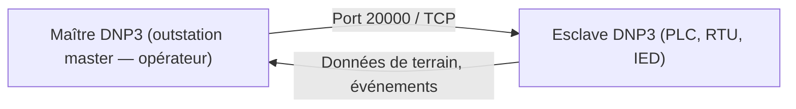

# 🏗️ Protocole DNP3

> [!info] **En 1 phrase**
> **DNP3** (Distributed Network Protocol) est le protocole **ICS/SCADA** de télécommande
> des infrastructures critiques (électricité, eau, gaz) : il écoute sur le **port 20000**
> et se scanne/énumère avec Nmap et des simulateurs maître.

---

## 🔧 Le protocole en bref



- Protocole **supervisory** historique pour le pilotage à distance de l'infrastructure critique.
- Basé sur un modèle **maître → outstation (esclave)**, avec des objets de données (points, événements, commandes).
- Souvent exposé en interne (voire accessible en réseau) sans chiffrement — idéal pour l'énumération.

---

## 🎯 Discovery

### Clients / simulateurs DNP3

- [DNP3 Client Master Simulator](https://sourceforge.net/projects/dnp3-client-master-simulator/)
- [DNP3 Simulator](https://github.com/dnp3/dnp3-simulator)

### Scan Nmap

Script : [dnp3-enumerate.nse](https://github.com/Z-0ne/ICS-Discovery-Tools/blob/master/dnp3-enumerate.nse)

```bash
nmap -sT --script dnp3-enumerate.nse -p 20000 <target_ip>
```

---

## 🔧 Génération de trafic

- [DNP3 Crafter](https://github.com/hpcn-uam/DNP3Crafter) — forger des trames DNP3 personnalisées (tests, injections, fuzzing).

---

## 🔍 Détection & Défense

| Réponse | Détail |
|---|---|
| **Ne pas exposer 20000/TCP** | Le port par défaut DNP3 ne doit jamais être joignable depuis l'IT/Internet |
| **Segmentation réseau** | Isoler le réseau SCADA de la DMZ et de l'Internet |
| **Authentification / session** | DNP3 SA (Secure Authentication) obligatoire si le protocole est chiffré |
| **Surveillance des trames** | Détecter les énumérations et commandes illégales (audit des masters) |
| **Patch des IED/RTU** | Les implémentations DNP3 ont un historique de vulns applicatives |

## ⚠️ Tips & Pièges

- DNP3 n'est **pas authentifié** par défaut : un acteur réseau peut lire et injecter des commandes maîtres.
- Le script `dnp3-enumerate.nse` liste les **objets DNP3** supportés par la cible (registres, points).
- N'oublie pas : certains déploiements utilisent **DNP3 sur série** (RS-232/485) en plus du TCP.
- Les commandes DNP3 peuvent **pilotées des équipements réels** : en redteam, commence par l'énumération passive avant d'injecter.

---

> [!info] 📚 **Sources**
> - [HardwareAllTheThings — DNP3](https://github.com/swisskyrepo/HardwareAllTheThings/blob/main/docs/protocols/dnp3.md)

➡️ Liens : [[13 - Hardware & IoT|⚙️ Hardware & IoT]] · [[Protocole Modbus|🏭 Modbus]] · [[Protocole MMS|⚡ MMS]] · [[Injection de commandes|💻 Injection de commandes]]
