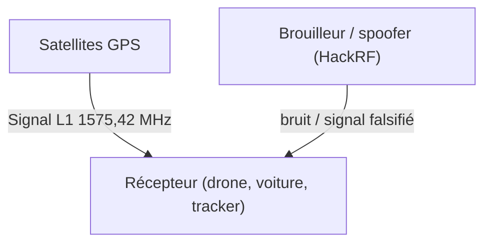

# Protocole GPS

> [!info] **En 1 phrase**
> Le **GPS** fournit la position via des signaux satellite en **clair** et non authentifiés
> (messages **NMEA** par liaison série) : on peut donc **brouiller** (jamming) ou **spoofer**
> une fausse position à un drone, une voiture, un tracker ou un smartphone.

---

## Le protocole en bref



- Le récepteur calcule sa position à partir du **temps d'arrivée** des signaux satellite (triangulation).
- Le signal civil (L1 C/A) est **public, non chiffré et non authentifié** → facile à imiter.
- Le résultat est exposé par les récepteurs via le protocole **NMEA** (trames texte sur une liaison série).

---

## NMEA 0183

Le protocole le plus répandu côté récepteur : des **phrases ASCII** `$<type>,<données>*<checksum>`.

```text
$GPGGA,123519,4807.038,N,01131.000,E,1,08,0.9,545.4,M,46.9,M,,*47
$GPRMC,123519,A,4807.038,N,01131.000,E,022.4,084.4,230394,003.1,W*6A
```

- **GGA** : position, altitude, qualité de la fix, nombre de satellites.
- **RMC** : position + vitesse + cap + date (recommended minimum).
- Injectables sur le **bus série** (UART, USB-série) d'un récepteur : si l'appareil fait confiance au NMEA, on peut lui mentir directement **sans radio**.

---

## Attaques GPS

### Brouillage (Jamming)

- Émettre du **bruit** sur L1 (ou les autres bandes GNSS) → le récepteur **perd la fix**.
- Simple et efficace : un petit émetteur suffit à neutraliser une zone.

### Spoofing (fausse position)

- Émettre des **signaux GPS falsifiés** → le récepteur calcule une **position arbitraire**.
- Exemples : détourner un drone, tromper un tracker, fausser des péages / systèmes de cartographie.

### Meaconing (rejeu)

- **Rejouer** une capture de signaux GPS réels à un autre endroit/moment → fausse localisation avec un signal **authentique** (déroutant pour la défense).

### Injection NMEA

- Injecter des **trames NMEA artisanales** directement sur la liaison série du récepteur.

---

## Outils & hardware

- [osqzss/gps-sdr-sim](https://github.com/osqzss/gps-sdr-sim) — générer des signaux GPS (IQ bruts) pour le spoofing.
- **HackRF One / bladeRF** — SDR pour émettre le signal généré sur L1.
- **gpsd** + `gpsfake` — simuler/injecter des trames NMEA localement.
- **u-center** (u-blox), **CGPS-Config** — outils de config des récepteurs.
- Récepteurs USB bon marché (u-blox NEO-6/8, BN-880) : écouter l'UART ou l'USB-série pour lire NMEA.

---

## Détection & Défense

| Réponse | Détail |
|---|---|
| **Authentifier la position** | GNSS authentiqué (Galileo OSNMA, GPS-SPS auth) |
| **Détecter les anomalies** | Sauts de position incohérents, fix soudaine, nombre de satellites anormal |
| **Multi-capteurs** | Croiser GPS + cellulaire + WiFi + IMU : le spoofing GPS seul ne trompe plus tout |
| **Détection de brouillage** | Surveiller le C/N0 (rapport signal/bruit) des satellites |
| **Surveiller le NMEA** | Valider checksums et cohérence temporelle sur la liaison série |

## Tips & Pièges

- Le **GPS civil est en clair** : impossible à brouiller sans le savoir, donc tout le monde peut le spoof avec un SDR.
- **Jamming ≠ spoofing** : le bruit bloque, le spoofing *trompe*. Le spoofing est plus dangereux car silencieux.
- L'injection **NMEA série** contourne toute la radio : vérifie toujours la liaison UART d'un device GPS (voir la fiche UART).
- `gps-sdr-sim` génère des IQ bruts qu'il faut **moduler et émettre** (HackRF) : l'émetteur doit être assez proche de la cible.
- Vérifie le **C/N0** (Signal to Noise Ratio) : en spoofing, il monte anormalement fort.
- Le GPS est utilisé partout (drones, voitures, trackers, smart grids) : un test de spoofing sur un vrai drone est **dangereux** — fais-le en lab.

---

> [!info] **Sources**
> - [HardwareAllTheThings — GPS](https://github.com/swisskyrepo/HardwareAllTheThings/blob/main/docs/protocols/gps.md)

Liens : [[13 - Hardware & IoT| Hardware & IoT]] · [[Hardware - UART| UART]] · [[Protocole SS7| SS7]] · [[Attaques WiFi (WPA2 et PMKID)| WiFi]]
