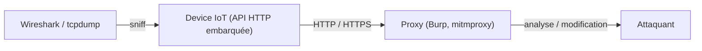

# 🌍 Protocole HTTP (IoT)

> [!info] **En 1 phrase**
> Les objets connectés exposent des **APIs HTTP embarquées** (panneaux de config, firmware,
> télémétrie) : un **proxy** (Burp, mitmproxy) et un **sniffer** (Wireshark, tcpdump)
> suffisent pour les analyser et les attaquer — souvent sans aucune authentification.

---

## 🔧 Le protocole en bref

- Les devices IoT embarquent des **serveurs HTTP miniatures** (config, firmware, capteurs) — rarement durcis.
- HTTPS : certs **self-signed** ou pining faible → MITM aisé avec un proxy.

---

## 🛠️ Outils

### Proxies HTTPS

- **Burp Suite** — proxy HTTP/HTTPS, repeater, intruder, extender.
- **MITM Proxy (mitmproxy)** — proxy Python scriptable, parfait pour automatiser les devices.
- **Fiddler** — proxy Windows.

### Sniffers réseau

- **Wireshark** — analyse complète des échanges (USB, WiFi, Ethernet).
- **tcpdump** — capture CLI légère, à embarquer sur les devices eux-mêmes (BusyBox).

---

## 💡 Usage orienté IoT / embedded

- **Interposer un proxy** : configurer le device pour pointer vers ton proxy (si réseau) ou faire un **ARP spoofing** sur le segment.
- **Analyse du firmware** : récupérer les endpoints HTTP dans le firmware dumpé (voir la fiche Dump de firmware).
- **API embarquées** : tester les endpoints `/config`, `/update`, `/debug`, `/cgi-bin/…` — souvent accessibles sans auth.
- **Téléchargement de firmware** : intercepter la mise à jour OTA pour l'analyser ou la détourner.
- **Certificats self-signed** : installer ton CA dans le device (si possible) ou neutraliser la validation.

---

## 🔍 Détection & Défense

| Réponse | Détail |
|---|---|
| **Authentifier les APIs embarquées** | Beaucoup de devices n'exigent aucun login sur leurs endpoints |
| **Valider les mises à jour** | Signature + chiffrement des OTA (pas un simple GET HTTPS) |
| **Désactiver les services de debug** | `/debug`, `/shell`, telnet/SSH de test souvent laissés actifs |
| **HSTS + certs valides** | Limiter le MITM sur HTTPS (pinning pour les devices sensibles) |
| **Surveiller le trafic** | Détecter les connexions inhabituelles depuis un device |

## ⚠️ Tips & Pièges

- Cette fiche reste **orientée IoT/embedded** : pour les techniques Web générales (XSS, SSRF, injection SQL…), va voir les fiches **Web** du vault.
- Un device qui "n'a pas d'interface web" expose quand même souvent **un petit HTTP** sur son IP locale.
- Le **tcpdump embarqué** (BusyBox) est ton meilleur ami pour voir ce que le device envoie vers son cloud.
- Attention aux **endpoints `POST /firmware`** : télécharger une image modifiée sur un device peut le **bricker** (et servir de pivot).
- HTTPS self-signed : installe ton CA dans le device ou patche la validation dans le firmware avant le flash.

---

> [!info] 📚 **Sources**
> - [HardwareAllTheThings — HTTP](https://github.com/swisskyrepo/HardwareAllTheThings/blob/main/docs/protocols/http.md)

➡️ Liens : [[13 - Hardware & IoT|⚙️ Hardware & IoT]] · [[Protocole MQTT|📨 MQTT]] · [[Protocole UPnP|🏠 UPnP]] · [[Hardware - Dump et Analyse de Firmware|💾 Dump de firmware]]
