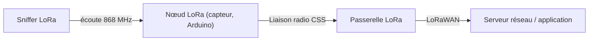

# 📡 Protocole LoRa / LoRaWAN

> [!info] **En 1 phrase**
> **LoRa** est la liaison radio **basse consommation longue portée** (Chirp Spread Spectrum)
> des capteurs IoT : pour l'attaquer, on **écoute les fréquences EU**, on brute-force
> **fréquence + spreading factor**, et on lit les paquets (et leur **RSSI**) avec un simple Arduino + module LoRa.

---

## 🔧 Le protocole en bref



- LoRa = couche **physique** (radio CSS, Chirp Spread Spectrum) ; **LoRaWAN** = protocole réseau MAC sur cette couche.
- En Europe, bande ISM **868 MHz** (868.1 / 867.1 / 868.3…).
- **Spreading Factor (SF)** de 7 à 12 : plus SF est haut, plus le signal est robuste mais lent.
- Portée typique : plusieurs **kilomètres** en champ libre — le trafic est écoutable de loin.

---

## 🛠️ Récepteur LoRa avec Arduino (868.1 MHz, SF 10)

Librairie : [sandeepmistry/arduino-LoRa](https://github.com/sandeepmistry/arduino-LoRa)

```c
#include <SPI.h>
#include <LoRa.h>

void setup() {
  Serial.begin(9600);
  while (!Serial);

  Serial.println("LoRa Receiver");

  if (!LoRa.begin(868.1E6)) {
    Serial.println("Starting LoRa failed!");
    while (1);
  }
  LoRa.setSpreadingFactor(10);
}

void onReceive(int packetSize) {

  Serial.print("packet recv\n");

  for (int i = 0; i < packetSize; i++) {
    Serial.print((char)LoRa.read());
  }
}

void loop() {
  LoRa.receive();
  LoRa.onReceive(onReceive); 
}
```

---

## 🔓 Bruteforce des fréquences EU et du spreading factor

Le code de la source balaye les fréquences EU et les SF (attention : le tableau `freq[5]`
contient 6 valeurs — duplique ou corrige selon ta cible) :

```c
#include <SPI.h>
#include <LoRa.h>

float freq[5] = { 868.3E6, 868.5E6, 867.1E6, 867.5E6, 867.7E6, 867.9E6 }; 

void setup() {
  Serial.begin(9600);
  while (!Serial);

  Serial.println("LoRa Receiver");

  if (!LoRa.begin(868.1E6)) {
    Serial.println("Starting LoRa failed!");
    while (1);
  }
  LoRa.setSpreadingFactor(10);
}

void onReceive(int packetSize) {

  Serial.print("packet recv\n");

  for (int i = 0; i < packetSize; i++) {
    Serial.print((char)LoRa.read());
  }
}

void loop() {
  
  LoRa.receive();
  LoRa.onReceive(onReceive);
  delay(5000);
  While(1) {
    int i;
    for(i=0; i < 5 ; i++)
    {
      
      LoRa.setFrequency(freq[i]);
      int j;
      for(j=7; j <= 12; j++)
      {
       
        LoRa.setSpreadingFactor(i);
        delay(5000);
      }
    }
  }
}
```

---

## 📶 Afficher le RSSI des paquets

> Le **RSSI** (Received Signal Strength Indication) est la puissance du signal reçu en mW, mesurée en **dBm**.

- Le RSSI est une **valeur négative** : plus elle est proche de **0**, meilleur est le signal.
- **RSSI minimum ≈ -120 dBm** (faible), **-30 dBm** = signal fort.

```c
#include <SPI.h>
#include <LoRa.h>

void setup() {
  Serial.begin(9600);
  while (!Serial);

  Serial.println("LoRa Receiver");

  if (!LoRa.begin(867.1E6)) {
    Serial.println("Starting LoRa failed!");
    while (1);
  }
  LoRa.setSpreadingFactor(8);
}

void onReceive(int packetSize) {
 Serial.print("packet recv\n");
 int rssi = LoRa.packetRssi();
 Serial.print(rssi);
}

void loop() {
  LoRa.receive();
  LoRa.onReceive(onReceive);
  delay(1000);
}
```

> Le RSSI sert à **localiser** un nœud émetteur (triangulation) et à juger de la portée de ton sniff.

---

## 🔍 Détection & Défense

| Réponse | Détail |
|---|---|
| **Chiffrement LoRaWAN (AES-128)** | La couche radio n'est pas chiffrée de base ; LoRaWAN l'est (clés AppKey/NwkSKey) |
| **Authentification des nœuds** | Join procedure (Join Request/Accept) + devEUI/appEUI |
| **Détection de replays** | LoRaWAN a un compteur de trames (FCnt) pour détecter les rejeux |
| **Clés par device** | Ne pas partager les clés réseau entre devices |
| **Limiter l'écoute radio** | Impossible à empêcher physiquement : la protection est uniquement applicative |

## ⚠️ Tips & Pièges

- **Balaye fréquence + SF** : un paquet n'est reçu que si les deux matchent exactement.
- En Europe, concentre-toi sur **863–870 MHz** (bande ISM), les plages 868.1–868.5 et 867.1–867.9 sont les plus utilisées.
- SF élevé = plus sensible mais plus **lent** : utile pour recevoir des nœuds lointains.
- Le **RSSI** est négatif : -30 dBm (très proche) à -120 dBm (à la limite). Il permet de **géolocaliser grossièrement** l'émetteur.
- Sans les **clés LoRaWAN**, tu lis des paquets **chiffrés** — l'analyse du trafic (timing, tailles, RSSI) reste très riche.
- La bande 868 MHz est partagée avec d'autres (Sigfox…) : filtre bien ton récepteur.

---

> [!info] 📚 **Sources**
> - [HardwareAllTheThings — LoRa](https://github.com/swisskyrepo/HardwareAllTheThings/blob/main/docs/protocols/lora.md)

➡️ Liens : [[13 - Hardware & IoT|⚙️ Hardware & IoT]] · [[Attaques WiFi (WPA2 et PMKID)|📡 WiFi]] · [[Hardware - UART|🔌 UART]] · [[Hardware - RFID et NFC|🏷️ RFID/NFC]]
