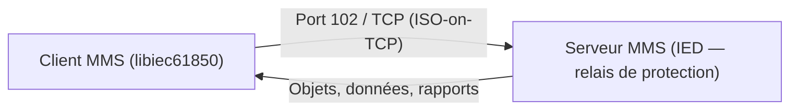

# ⚡ Protocole MMS (IEC 61850)

> [!info] **En 1 phrase**
> **MMS** (Manufacturing Message Specification) est le protocole applicatif du standard
> **IEC 61850** des sous-stations électriques : il écoute sur le **port 102** (TPKT/COTP)
> et s'énumère, s'explore et se fuzze avec des clients dédiés et des scripts Nmap.

---

## 🔧 Le protocole en bref



- **MMS** = couche applicative ISO 9506 utilisée par **IEC 61850** (automatisation des **sous-stations électriques**).
- Transporte sur **ISO-on-TCP** (TPKT + COTP), port **102**.
- Modèle de données : logical devices, logical nodes (PDIS, PTRC…), objets de données — lecture/écriture, rapport d'événements, contrôle.

---

## 🎯 Discovery

### Clients MMS

- [mz-automation/libiec61850](https://github.com/mz-automation/libiec61850)
- [robidev/iec61850_open_server](https://github.com/robidev/iec61850_open_server)

### Scan Nmap

Script : [mms-identify.nse](https://github.com/atimorin/scada-tools/blob/master/mms-identify.nse)

```bash
nmap -d --script mms-identify.nse --script-args='mms-identify.timeout=500' -p 102 <target_host>
```

---

## 🔎 Explorer MMS

- [Client MMS — tutorial](https://libiec61850.com/documentation/iec-61850-client-tutorial/) — exemple de client libiec61850.
- [Serveur MMS — tutorial](https://libiec61850.com/documentation/iec-61850-server-tutorial/) — exemple de serveur libiec61850.

---

## 💥 Fuzzing MMS

- [fkie-cad/61850-fuzzing](https://github.com/fkie-cad/61850-fuzzing) — fuzzer les implémentations IEC 61850 / MMS (malformed MMS PDU).

---

## 🔍 Détection & Défense

| Réponse | Détail |
|---|---|
| **Ne pas exposer le port 102** | Le port MMS des IED ne doit pas être joignable depuis l'IT/Internet |
| **Segmentation réseau** | Isolation des sous-stations (zones IEC 62443) |
| **Authentification** | Les implémentations MMS modernes supportent TLS/authentication |
| **Surveillance du trafic** | Détecter les énumérations (mms-identify) et requêtes anormales |
| **Patch des IED** | Les serveurs MMS embarqués ont des vulns historiques (fuzzing finds) |

## ⚠️ Tips & Pièges

- MMS parle **ISO-on-TCP sur 102** : si rien ne répond, vérifie que COTP/TPKT est bien dans Wireshark (`mms` dissector).
- `mms-identify.nse` identifie le device (vendor, modèle, version) — précieux pour trouver des CVE.
- IEC 61850 embarque beaucoup de **protocoles** (MMS, GOOSE, SV) : seul MMS est TCP classique, **GOOSE/SV sont multicast L2**.
- La manipulation de MMS peut **commuter des disjoncteurs** (contrôle) : en redteam, préfère l'énumération passive.

---

> [!info] 📚 **Sources**
> - [HardwareAllTheThings — MMS](https://github.com/swisskyrepo/HardwareAllTheThings/blob/main/docs/protocols/mms.md)

➡️ Liens : [[13 - Hardware & IoT|⚙️ Hardware & IoT]] · [[Protocole Modbus|🏭 Modbus]] · [[Protocole DNP3|🏗️ DNP3]] · [[Injection de commandes|💻 Injection de commandes]]
