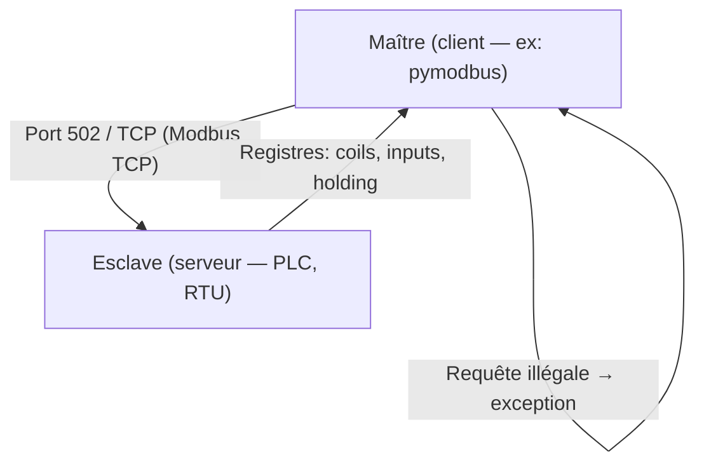

# 🏭 Protocole Modbus

> [!info] **En 1 phrase**
> **Modbus** est le protocole **ICS/SCADA** le plus répandu pour interroger des capteurs et
> automates (PLC) : un **maître** lit/écrit des **registres** sur des **esclaves** —
> et il est généralement **exposé sans aucune authentification**.

---

## 🔧 Le protocole en bref



- **Modbus RTU** : série (RS-232/485), binaire compact.
- **Modbus TCP** : sur Ethernet, port **502**, basé sur les registres.
- Types de données : **Coils** (bits R/W), **Discrete Inputs** (bits R), **Holding Registers** (16 bits R/W), **Input Registers** (16 bits R).
- **Aucune authentification ni chiffrement** par défaut : la plupart des installations sont exploitées telles quelles.

---

## 🎯 Discovery

### Clients Modbus

- [QModBus](https://sourceforge.net/projects/qmodbus/)
- [pymodbus](https://github.com/riptideio/pymodbus)
- [Modbus Tools](https://www.modbustools.com/)

### Scan Nmap

```bash
nmap --script modbus-discover.nse --script-args='modbus-discover.aggressive=true' -p 502 <host>
```

---

## 🔌 Connexion à un esclave

```python
from pymodbus.client import ModbusTcpClient

client = ModbusTcpClient('<IP_Address_of_Target>')
client.write_coil(1, True)
result = client.read_coils(1, 1)
print(result.bits[0])
client.close()
```

### Pentest Modbus

- [smod](https://github.com/0x0mar/smod) — framework de pentest Modbus (fuzzing, attaques, bruteforce des fonctions).

---

## 🧪 Simulateurs (lab)

- **Simulateur d'esclave** : [Diagslave](https://www.modbusdriver.com/diagslave.html) · [ModbusPal](https://modbuspal.sourceforge.net/)
- **Simulateur de maître** : [modpoll](https://www.modbusdriver.com/modpoll.html)

---

## 🔍 Détection & Défense

| Réponse | Détail |
|---|---|
| **Authentification & autorisation** | Modbus n'authentifie rien : à protéger au niveau réseau |
| **Ne pas exposer le port 502 sur Internet** | La majorité des scans ICS trouve des PLC joignables sans filtre |
| **Segmentation réseau / DMZ** | Séparer le réseau industriel de l'IT |
| **Detection des commandes illégales** | Journaliser les requêtes anormales (read/write à outrance, fonctions rares) |
| **Patch des PLC/RTU** | Beaucoup de modèles ont des vulns connues (stack overflow, firmware) |

## ⚠️ Tips & Pièges

- Commence par un **scan passif de registres** (read holding/input) avant d'écrire : une écriture peut **stopper une chaîne de production**.
- Le **port 502** est la cible classique, mais Modbus RTU transite aussi sur **série** (RS-485) → souvent accessible via une passerelle/convertiseur.
- Les valeurs 16 bits sont souvent en **big-endian**, mais certains PLC utilisent du little-endian ou des mots inversés — vérifie l'encoding.
- `smod` est parfait pour fuzzer les fonctions (1-127) : les exceptions Modbus 0x01-0x04 révèlent le type d'équipement.
- En redteam, **une simple lecture** (pas d'écriture) suffit souvent à cartographier l'usine sans déclencher d'alarme.

---

> [!info] 📚 **Sources**
> - [HardwareAllTheThings — Modbus](https://github.com/swisskyrepo/HardwareAllTheThings/blob/main/docs/protocols/modbus.md)

➡️ Liens : [[13 - Hardware & IoT|⚙️ Hardware & IoT]] · [[Hardware - UART|🔌 UART]] · [[Injection de commandes|💻 Injection de commandes]] · [[SSRF|🌐 SSRF]]
