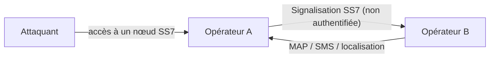
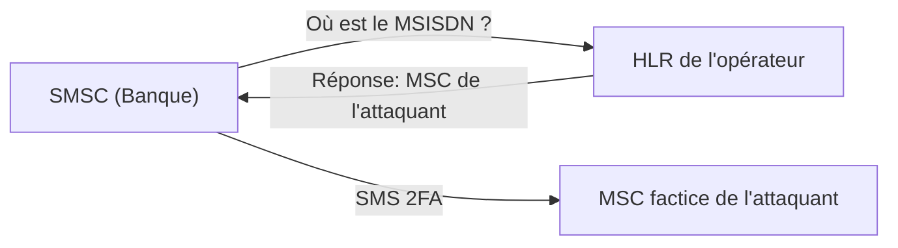
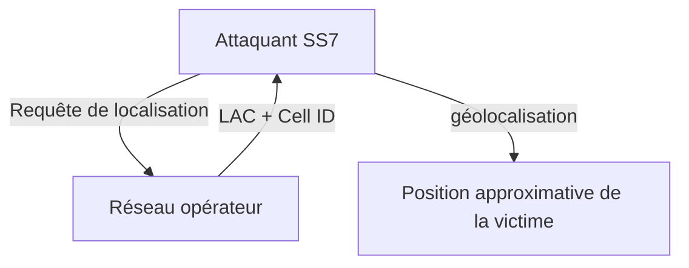

# ☎️ SS7 (Signaling System No. 7)

> [!info] **En 1 phrase**
> **SS7** est le réseau de signalisation **télécom** qui relie les opérateurs (pour les SMS,
> le roaming, la localisation) — et son manque d'authentification permet d'**intercepter les
> SMS de 2FA**, de **spoofer** l'émetteur et de **localiser** n'importe quel abonné.

---

## 🔧 Le protocole en bref

- SS7 = architecture de signalisation inter-opérateurs (SMS, itinérance, gestion d'abonnés).
- Protocoles de niveau applicatif : **MAP** (Mobile Application Part), **INAP**, **CAP**, transport sur **SCTP/M3UA**.
- La signalisation entre opérateurs fait **confiance** à l'expéditeur : pas d'authentification des messages.

---

## 🛠️ Outils

- [P1sec/SigFW](https://github.com/P1sec/SigFW) — firewall de signalisation open source (filtrage SS7/Diameter, antispoof, antisniff).
- [0xc0decafe/ss7MAPer](https://github.com/0xc0decafe/ss7MAPer) — toolkit de (pen-)test des messages **SS7 MAP**.
- [SigPloiter/SigPloit](https://github.com/SigPloiter/SigPloit) — framework d'exploitation de la signalisation télécom : **SS7, GTP, Diameter & SIP**.

---

## 📱 Interception des SMS 2FA

SS7 transporte les **SMS**. Un attaquant peut **enregistrer le MSISDN** (numéro) d'une victime
sur un **MSC** factice. Le **HLR** de l'opérateur de la victime — sorte d'annuaire téléphonique
des MSISDN, opérateurs et **SMSC** — met à jour la localisation vers le MSC de l'attaquant.

> Quand la banque envoie son code 2FA, le SMSC demande la localisation au HLR, qui répond
> **MSC de l'attaquant** — le vrai opérateur transfère donc le SMS vers le MSC factice.
> Le code de vérification **n'atteint jamais le téléphone** de la victime.

---

## 🕵️ SMS Spoofing

Une des attaques les plus simples et accessibles : **aucun accès au réseau SS7 n'est requis**.

> Le champ **"from"** d'un SMS **n'est pas authentifié** : n'importe qui peut y insérer un
> **mot alphanumérique quelconque**.

- Réalisable à moindre coût via des **passerelles SMS** accessibles sur le web clair.
- Selon SOS Intelligence, la plupart de ces services **manquent de contrôle anti-abus**.
- Résultat : des SMS de phishing "officiels" (banque, opérateur, impôts…) envoyés à la victime — à l'instar d'un e-mail de phishing.

---

## 📍 Localisation d'un abonné

Dans le réseau SS7 d'un opérateur, on peut interroger le **LAC** (Location Area Code) et le
**Cell ID** d'un abonné — et en déduire une **localisation relativement précise**.

- Nécessite souvent de connaître l'**IMEI** ou l'**IMSI** de l'abonné.
- Le **MSISDN seul** peut ne pas suffire pour cette requête.

---

## 🔍 Détection & Défense

| Réponse | Détail |
|---|---|
| **Firewalls de signalisation** | SigFW / pare-feu SS7-Diameter filtrent les messages anormaux |
| **Validation d'identité (STP)** | Vérifier l'origine des messages MAP entre opérateurs |
| **Antispoofing** | Rejeter les MSISDN/localisations illogiques (sauts géographiques) |
| **Vérifier l'itinérance** | Alertes sur les changements de localisation brutaux |
| **Chiffrement / authentification** | Migrer vers **Diameter** et SIGTRAN sécurisés, M3UA sécurisé |

## ⚠️ Tips & Pièges

- L'interception 2FA nécessite un **accès SS7** (nœud compromis, courtier d'accès) : le spoofing SMS, lui, est accessible à tous.
- Le champ **"from"** peut contenir n'importe quel texte alphanumérique → parfait pour du phishing hyper crédible.
- La localisation via **LAC + Cell ID** donne une position **approximative** (pas du GPS), mais suffisante pour du ciblage.
- L'**IMEI/IMSI** sont souvent nécessaires pour les requêtes de localisation précises — MSISDN seul est insuffisant.
- SigPloit couvre aussi **GTP, Diameter et SIP** : ne te limite pas au SS7 pur.

---

> [!info] 📚 **Sources**
> - [HardwareAllTheThings — SS7](https://github.com/swisskyrepo/HardwareAllTheThings/blob/main/docs/protocols/signaling-system-7.md)
> - [ss7MAPer — un toolkit de pentest SS7 (Daniel Mende)](https://insinuator.net/2016/02/ss7maper-a-ss7-pen-testing-toolkit/)
> - [Exposing The Flaw In Our Phone System (Veritasium)](https://youtu.be/wVyu7NB7W6Y)

➡️ Liens : [[13 - Hardware & IoT|⚙️ Hardware & IoT]] · [[Protocole GPS|🛰️ GPS]] · [[Account Takeover|🔓 Account Takeover]] · [[SSRF|🌐 SSRF]]
