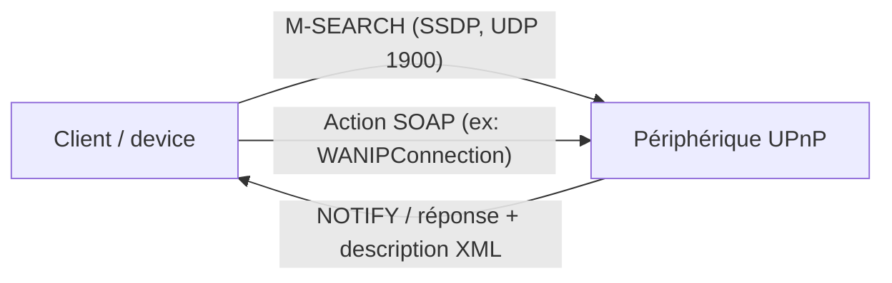

# 🏠 Protocole UPnP (SSDP)

> [!info] **En 1 phrase**
> **UPnP** permet aux devices d'**auto-découverte** (SSDP) et de **contrôle mutuel** (SOAP) :
> mal configuré, il expose des services, permet du **SSRF** via SOAP, et ouvre des ports
> sur les routeurs (via WANIPConnection) — un terrain de jeu classique pour l'offensif IoT.

---

## 🔧 Le protocole en bref



- **UPnP** = suite de protocoles pour que les devices se **découvrent** et se **contrôlent** mutuellement (réseau local).
- **SSDP** (Simple Service Discovery Protocol) : découverte via **multicast UDP 239.255.255.250:1900**.
- Chaque device expose un **XML de description** (services + actions SOAP) à la couche contrôle.

---

## 🎯 Discovery (M-SEARCH)

Le device s'annonce (NOTIFY) et répond aux requêtes de découverte :

```http
M-SEARCH * HTTP/1.1
HOST: 239.255.255.250:1900
MAN: "ssdp:discover"
MX: 1
ST: ssdp:all
```

```bash
# Scan Nmap des devices UPnP
nmap -sU -p 1900 --script upnp-info <target>
```

> Outils : **nmap `upnp-info`**, `upnpscan`, Miranda (interactif UPnP/SOAP).

---

## 💥 Attaques UPnP

### SSRF via UPnP (contrôle SOAP)

> L'action SOAP `WANIPConnection:1` (ex: `AddPortMapping`, `SetDefaultConnectionService`)
> fait agir le **routeur** à ta place : c'est un vecteur de **SSRF** — le routeur appelle une
> URL/port interne que tu ne peux pas joindre directement.

```xml
<u:AddPortMapping xmlns:u="urn:schemas-upnp-org:service:WANIPConnection:1">
  <NewRemoteHost></NewRemoteHost>
  <NewExternalPort>4444</NewExternalPort>
  <NewProtocol>TCP</NewProtocol>
  <NewInternalPort>80</NewInternalPort>
  <NewInternalClient>192.168.1.100</NewInternalClient>
</u:AddPortMapping>
```

### Ouverture de ports (port mapping)

- Depuis le LAN, un device peut demander au routeur d'**ouvrir des ports externes** → rebond vers le réseau interne.
- Souvent utilisé dans les **attaques aux routeurs** (DNS rebinding, pages malveillantes qui manipulent l'UPnP local).

### Abus d'un service mal sécurisé

- Services UPnP exposés par erreur **sur le WAN** (routeurs, NAS, TV, imprimantes) → contrôle complet à distance.

---

## 🔍 Détection & Défense

| Réponse | Détail |
|---|---|
| **Désactiver UPnP sur les routeurs** | La plupart des usages légitimes n'en ont pas besoin |
| **Filtrer SSDP / 1900** | Ne pas laisser SSDP traverser les zones / le WAN |
| **Authentification des actions SOAP** | Beaucoup de services UPnP acceptent les actions sans contrôle |
| **Valider les requêtes SSRF** | Le contrôle UPnP ne doit pas atteindre des ressources internes arbitraires |
| **Patcher / durcir les devices** | Les implémentations UPnP ont un historique de vulns (buffer overflow, XML) |

## ⚠️ Tips & Pièges

- **SSDP écoute en UDP 1900 multicast** : scanne-le avec `nmap -sU` — beaucoup de devices répondent sans aucune auth.
- `M-SEARCH` avec `ST: ssdp:all` liste **tous** les devices UPnP du réseau en une requête.
- L'action SOAP sur `WANIPConnection:1` est l'**arme classique** : `AddPortMapping` ouvre un port du routeur → rebond interne.
- Un device UPnP **exposé sur le WAN** est un beau vecteur de **SSRF** et de contrôle à distance.
- Le XML de description (`<rootDesc>`) révèle les **services et URLs de contrôle** : pars-le avant d'envoyer des actions SOAP.

---

> [!info] 📚 **Sources**
> - [HardwareAllTheThings — UPnP](https://github.com/swisskyrepo/HardwareAllTheThings/blob/main/docs/protocols/upnp.md)

➡️ Liens : [[13 - Hardware & IoT|⚙️ Hardware & IoT]] · [[SSRF|🌐 SSRF]] · [[Protocole HTTP (IoT)|🌍 HTTP (IoT)]] · [[Protocole MQTT|📨 MQTT]]
