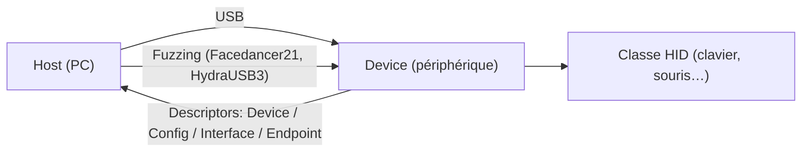
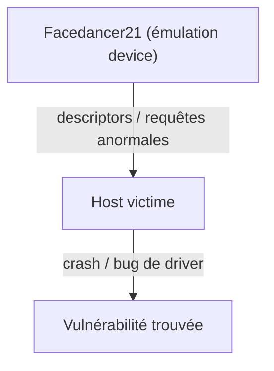

# 🔌 Protocole USB

> [!info] **En 1 phrase**
> L'**USB** est le bus série universel des périphériques : chaque device expose des **descriptors**
> (Device / Configuration / Interface / Endpoint) qui décrivent son **HID** et ses fonctions —
> et le **fuzzing USB** (Facedancer, HydraUSB3) permet de tester les drivers d'un host.

---

## 🔧 Le protocole en bref

- **Types** : USB 2.0 (480 Mbit/s), USB 3.x (jusqu'à 20 Gbit/s), **USB Type-C** (nouveau connecteur réversible).
- **Descriptors** : le host interroge le device (Device Descriptor → Configuration → Interface → Endpoint) pour savoir *ce qu'il est*.
- **HID** (Human Interface Device) : classe standard des claviers/souris — la base des attaques **BadUSB / HID injection**.
- Les trames USB se dissèquent dans **Wireshark** (avec usbmon sous Linux).

---

## 🛠️ Outils d'interaction

- `lsusb -v` : afficher les descriptors USB sous Linux.
- Wireshark + `usbmon` : capturer le trafic USB.
- Bibliothèques : **PyUSB** / **libusb** pour piloter des devices custom.

---

## 💥 Fuzzing USB

> Fuzzer les **drivers USB du host** en émulant un device malveillant qui envoie des
> descriptors / transactions anormales.

- [HydraBus/HydraUSB3](https://hydrabus.com/hydrausb3-v1-0-specifications) — plateforme d'analyse et fuzzing USB.
- [goodfet/Facedancer21](https://goodfet.sourceforge.net/hardware/facedancer21/) — carte permettant d'**écrire des devices USB en Python côté host** : un poste peut **fuzzer les drivers USB** d'un autre host.

---

## ⚠️ Attaques USB courantes

- **BadUSB / Rubber Ducky** : clavier HID rogue → frappe de commandes en tant que périphérique de confiance.
- **HID injection** : exploiter la classe HID (clavier) pour exécuter du code sur le host.
- **USB Drop / autorun** : piéger un device perdu pour inciter au branchement.
- **Fuzzing de drivers** : descriptors malformés → buffer overflow dans les drivers de l'OS.
- **Chip-off NVM** : récupérer le firmware / les données de la NVM d'un device après extraction physique du chip.

---

## 🔍 Détection & Défense

| Réponse | Détail |
|---|---|
| **Restreindre les devices USB** | Policy de contrôle : whitelist de VID/PID |
| **Protéger les ports** | Scellements physiques, port locks |
| **Pas d'USB perso sur les postes sensibles** | Règle d'or en environnement corporate |
| **Désactiver l'autorun / HID non sollicité** | Empêcher l'exécution automatique depuis un device branché |
| **Test des drivers** | Fuzzing + hardening des pilotes USB (patches vendors) |

## ⚠️ Tips & Pièges

- Le **Device Descriptor** ment souvent : un device se déclare clavier alors qu'il exfiltre des données.
- `lsusb -v` est ton premier outil pour identifier une classe (HID = 0x03, Storage = 0x08…).
- Le **fuzzing USB** émule des devices : le crash est côté **host**, pas côté périphérique.
- Facedancer21 et HydraUSB3 nécessitent un **host de contrôle** séparé du host victime.
- Sous Linux, la capture USB passe par **usbmon** (`sudo modprobe usbmon`) puis Wireshark sur l'interface `usbmon0`/`usbmon1`.

---

> [!info] 📚 **Sources**
> - [HardwareAllTheThings — USB](https://github.com/swisskyrepo/HardwareAllTheThings/blob/main/docs/protocols/usb.md)
> - [HydraUSB3 v1.0 Specifications](https://hydrabus.com/hydrausb3-v1-0-specifications)
> - [Cracking With Automated USB Fuzz (Nullcon Goa 2023)](https://youtu.be/4uHg6toV69k)
> - [Hands On with Chip Off Non-Volatile Memory (TrustedSec)](https://trustedsec.com/blog/hands-on-with-chip-off-non-volatile-memory)

➡️ Liens : [[13 - Hardware & IoT|⚙️ Hardware & IoT]] · [[Hardware - Dump et Analyse de Firmware|💾 Dump de firmware]] · [[Injection de commandes|💻 Injection de commandes]] · [[Hardware - I2C et SPI|🔗 I2C/SPI]]
