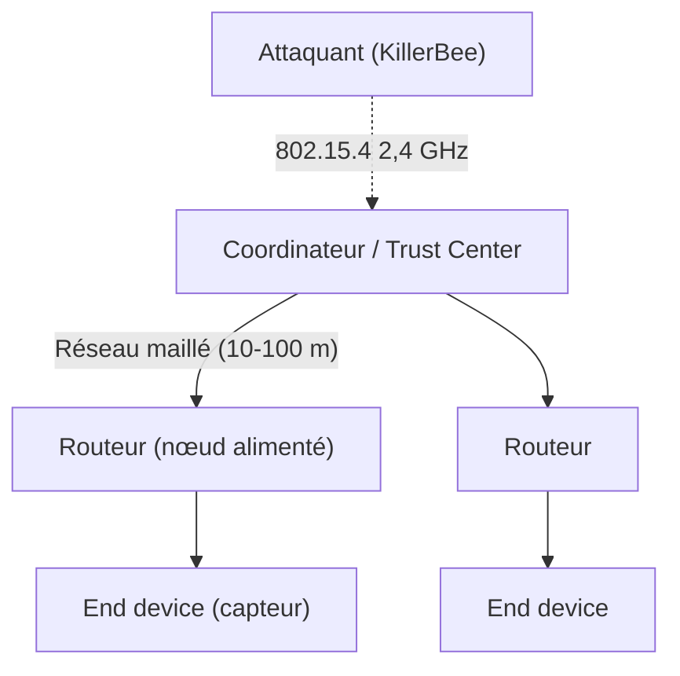
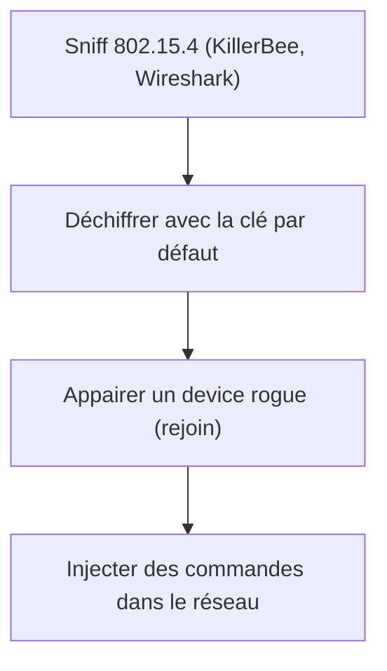

# 🏠 Protocole Zigbee

> [!info] **En 1 phrase**
> **Zigbee** est le standard radio **IEEE 802.15.4** basse consommation des objets (domotique,
> capteurs, industrie) — et sa **clé de lien réseau par défaut** (`ZigBeeAlliance09`) est
> **publique**, ce qui permet de déchiffrer les communications d'un réseau mal sécurisé.

---

## 🔧 Le protocole en bref



- Zigbee = suite de protocoles **haut niveau** basée sur **IEEE 802.15.4** (radio 2,4 GHz).
- Conçu pour la **domotique**, la collecte médicale, le contrôle industriel : communication **bidirectionnelle** entre capteurs et contrôleurs.
- **Portée courte** : 10 à 100 mètres — réseau **maillé** (mesh).
- Sécurité en couches : **AES-128**, clés de lien, clés réseau, **Trust Center**.

---

## 🛠️ Outils

- [riverloopsec/killerbee](https://github.com/riverloopsec/killerbee) — toolkit de recherche en sécurité IEEE 802.15.4 / ZigBee (sniff, injection, dev env).
- [APIMote](https://www.attify-store.com/products/apimote) — hardware de recherche ZigBee pour évaluer la sécurité des réseaux 802.15.4/ZigBee (usage autorisé).
- [Cognosec/SecBee](https://github.com/Cognosec/SecBee) (archivé) — outil de test des implémentations ZigBee.

---

## 🔑 Default Trust Center Link Key

> Zigbee empile des couches de sécurité dont l'**AES-128** pour sécuriser le trafic.
> La **Default Trust Center Link Key** est une clé cryptographique **prédéfinie** qui protège le
> **processus d'adhésion** d'un nouveau device : le device et le Trust Center l'utilisent pour
> chiffrer leur communication d'appairage.

Pour le profil **"Home Automation"**, la clé de lien Trust Center par défaut est :

```text
ZigBeeAlliance09
En hex : 5A:69:67:42:65:65:41:6C:6C:69:61:6E:63:65:30:39
```

L'utiliser dans **Wireshark** :

```text
Edit > Preferences > Protocols > Zigbee NWK > New
→ écrire la clé au format hexadécimal
```

> Exemple réel : [CVE-2020-28952 — Athom Homey, clés statiques et connues](https://yougottahackthat.com/blog/1260/athom-homey-security-static-and-well-known-keys-cve-2020-28952)

---

## 💥 Attaque type



1. **Sniffer** le trafic 802.15.4 sur 2,4 GHz.
2. Si le réseau n'a pas changé ses clés : **déchiffrer** avec `ZigBeeAlliance09`.
3. **Joindre le réseau** en tant que device rogue ou **rejouer / injecter** des trames.

---

## 🔍 Détection & Défense

| Réponse | Détail |
|---|---|
| **Changer la Trust Center Link Key** | La clé par défaut `ZigBeeAlliance09` est publique et jamais unique |
| **Appairage sécurisé** | Utiliser des clés installées par canal sûr (touchlink, scan QR…) plutôt que la clé publique |
| **Clés de lien par paire de devices** | Éviter une clé réseau unique partagée |
| **Mettre à jour les firmwares** | Les vulns de type clés statiques (CVE-2020-28952) sont corrigées par patch |
| **Surveillance radio** | Détecter les rejoin / injections inhabituelles sur les canaux 802.15.4 |

## ⚠️ Tips & Pièges

- La clé par défaut correspond au profil **Home Automation** — d'autres profils (Smart Energy…) peuvent avoir des clés différentes.
- **Zigbee NWK** déchiffre les trames réseau ; la couche **APS** peut nécessiter la clé de lien (ou réseau) séparée.
- Tous les paquets ne sont pas chiffrés avec la clé Trust Center : après l'appairage, le réseau roule avec une **Network Key** distincte.
- KillerBee utilise des dongles **802.15.4** (Atmel RZUSBStick, API Mote…) : le hardware fait partie de l'attaque.
- En Wireshark, commence par `Edit > Preferences > Protocols > Zigbee NWK` avant d'ouvrir la capture.

---

> [!info] 📚 **Sources**
> - [HardwareAllTheThings — Zigbee](https://github.com/swisskyrepo/HardwareAllTheThings/blob/main/docs/protocols/zigbee.md)
> - [AN1233: Zigbee Security — Silabs](https://www.silabs.com/documents/public/application-notes/an1233-zigbee-security.pdf)
> - [Zigbee Security 101 (Payatu)](https://payatu.com/blog/zigbee-security-101/)

➡️ Liens : [[13 - Hardware & IoT|⚙️ Hardware & IoT]] · [[Attaques WiFi (WPA2 et PMKID)|📡 WiFi]] · [[Hardware - UART|🔌 UART]] · [[Hardware - RFID et NFC|🏷️ RFID/NFC]]
